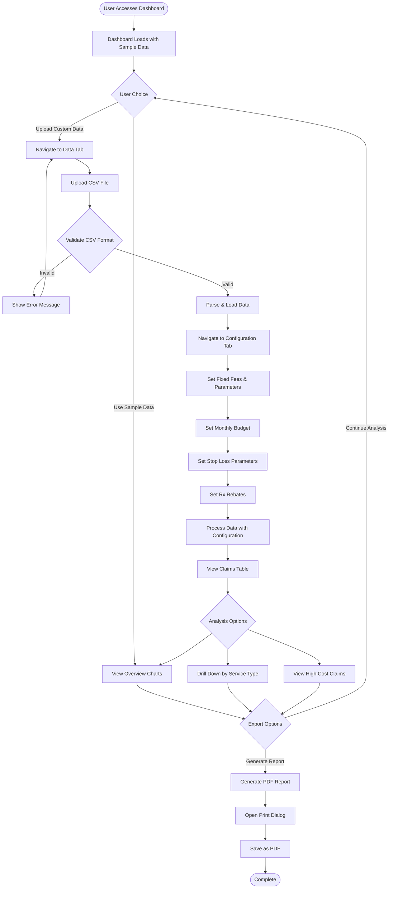
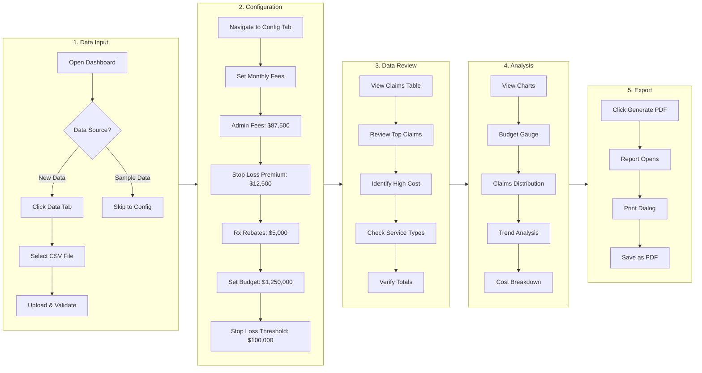
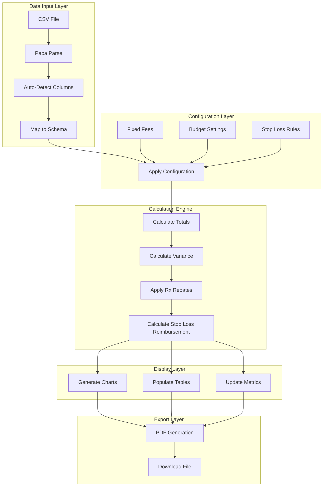
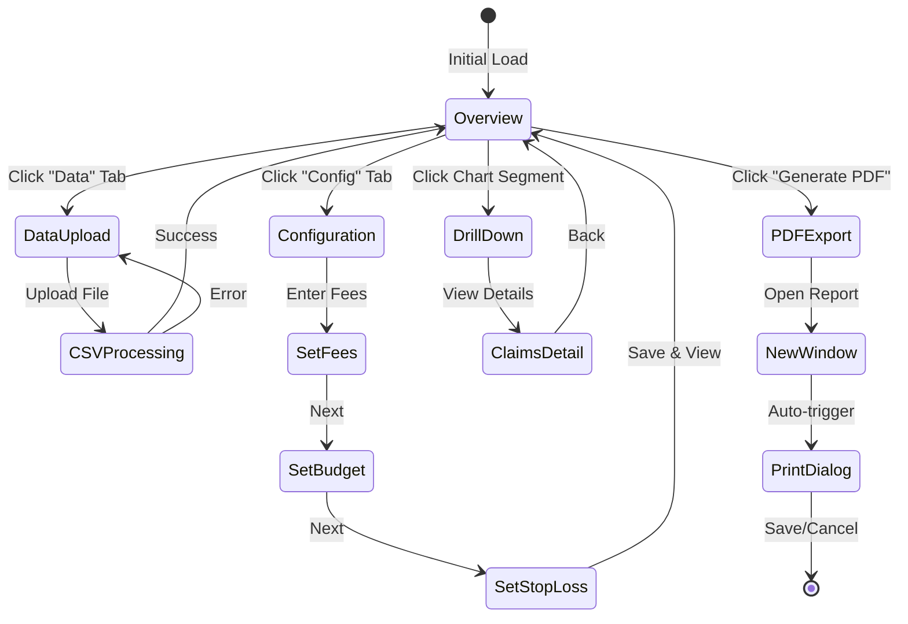
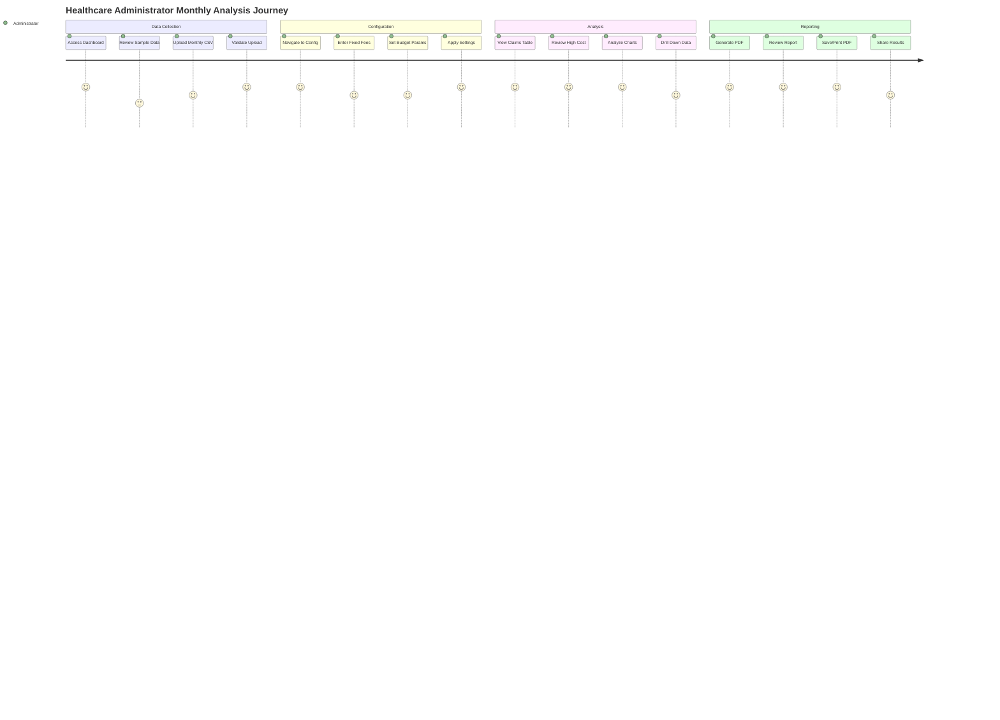
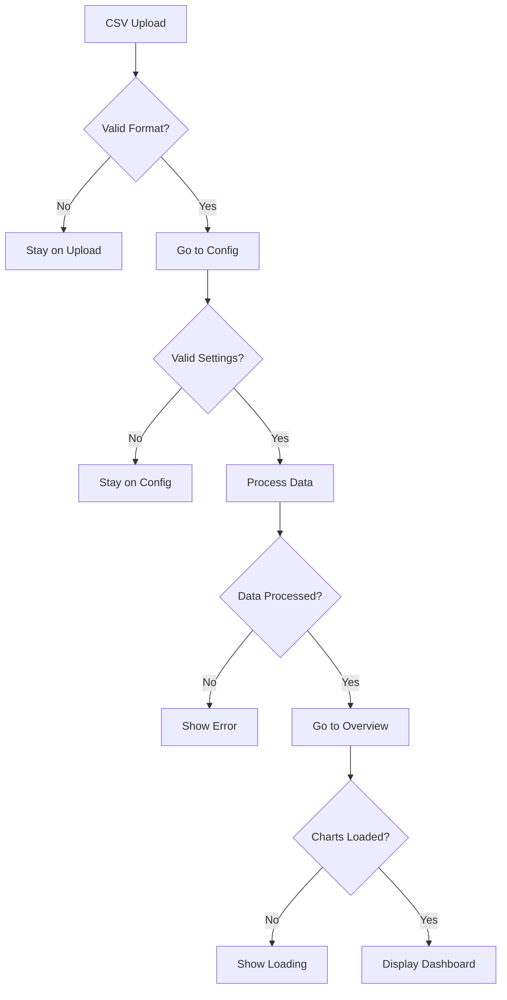

# Healthcare Analytics Dashboard - Complete Development Documentation

## Project Overview
A comprehensive healthcare analytics dashboard built with React, featuring claims data visualization, budget tracking, and PDF reporting capabilities.

## User Journey & Workflow

### Primary User Flow



### Detailed Step-by-Step Workflow



### Data Processing Flow



### Component Navigation Flow



## Workflow Implementation Details

### Step 1: CSV Upload Process
```javascript
// User clicks upload → Triggers file input
<input type="file" accept=".csv" onChange={handleFileUpload} />

// File processing workflow
const handleFileUpload = (event) => {
  const file = event.target.files[0];
  
  // Step 1: Parse CSV
  Papa.parse(file, {
    header: true,
    complete: (results) => {
      // Step 2: Auto-detect columns
      const processedData = results.data.map(row => ({
        ClaimantNumber: row.ClaimantNumber || row.MemberID || row.ID,
        Medical: parseFloat(row.Medical || row.MedicalClaims || 0),
        Rx: parseFloat(row.Rx || row.Pharmacy || 0),
        Total: parseFloat(row.Total || (medical + rx))
      }));
      
      // Step 3: Update state → Redirect to Config
      setUploadedData(processedData);
      setActiveTab('config'); // Auto-navigate
    }
  });
};
```

### Step 2: Configuration Flow
```javascript
// Configuration workflow
const configurationFlow = {
  // Step 1: User enters fixed fees
  monthlyFees: {
    adminFees: 87500,      // User input
    stopLossPremium: 12500, // User input
    rxRebates: 5000        // User input
  },
  
  // Step 2: Set budget parameters
  budgetParams: {
    monthlyBudget: 1250000,
    stopLossThreshold: 100000,
    reimbursementRate: 90,
    targetLossRatio: 85
  },
  
  // Step 3: Apply to data
  applyConfiguration: () => {
    recalculateAllMetrics();
    setActiveTab('overview'); // Navigate to results
  }
};
```

### Step 3: Data Table View
```javascript
// Table display workflow
const tableViewFlow = {
  // Show processed claims
  displayClaims: () => claimsData.map(claim => ({
    ...claim,
    isHighCost: claim.Total >= configData.stopLossThreshold,
    netCost: calculateNetCost(claim)
  })),
  
  // Sort and filter options
  sortBy: 'Total', // Highest first
  filterBy: 'ServiceType',
  
  // Navigate to charts
  viewCharts: () => setActiveTab('overview')
};
```

### Step 4: Chart Analysis Flow
```javascript
// Chart interaction workflow
const chartFlow = {
  // Initial view
  overview: {
    budgetGauge: showBudgetUtilization(),
    claimsPie: showClaimsDistribution()
  },
  
  // Drill-down capability
  onChartClick: (segment) => {
    filterDataByServiceType(segment);
    showDetailedView();
  },
  
  // Export trigger
  onExportClick: () => generatePDFReport()
};
```

## User Experience Journey Map

### Persona: Healthcare Administrator



## Navigation Architecture

### Tab-Based Navigation Structure
```
Dashboard Root
│
├── Overview Tab (Default)
│   ├── Metrics Cards
│   ├── Gauge Charts
│   ├── Distribution Charts
│   └── Claims Summary Table
│
├── Data Tab
│   ├── CSV Upload Area
│   ├── File Validation
│   ├── Preview Uploaded Data
│   └── Success/Error Messages
│
├── Configuration Tab
│   ├── Monthly Fees Section
│   │   ├── Admin Fees Input
│   │   ├── Stop Loss Premium Input
│   │   └── Rx Rebates Input
│   │
│   ├── Budget Settings Section
│   │   ├── Monthly Budget Input
│   │   ├── Stop Loss Threshold Input
│   │   └── Reimbursement Rate Input
│   │
│   └── Summary Display
│       ├── Annual Projections
│       └── Save Button → Returns to Overview
│
└── PDF Export (Overlay)
    ├── Generate Report Button
    ├── New Window Opens
    ├── Print Dialog
    └── Save Options
```

## Automated Workflow Triggers

### Smart Navigation
1. **After CSV Upload Success** → Auto-navigate to Configuration Tab
2. **After Configuration Save** → Auto-navigate to Overview Tab
3. **After Chart Click** → Auto-navigate to Detailed View
4. **After PDF Generate** → Auto-open Print Dialog

### Validation Gates


## Development Timeline & Version History

### Initial Request & Core Requirements
- **Goal**: Create a healthcare dashboard to visualize experience data
- **Tech Stack**: React, Apache ECharts, Tailwind CSS
- **Key Features Requested**:
  - Claims data visualization
  - Budget vs actual tracking
  - CSV data upload capability
  - Configuration page for fees and parameters
  - PDF export functionality

### Stakeholder Feedback & Enhanced Requirements

Following the initial development, the team provided comprehensive feedback requesting significant enhancements to better serve their healthcare analytics needs:

#### Detailed Analytics Requirements
- **Enhanced Data Breakdowns**: More detailed breakdowns including enrollment by plan type, member demographics, and service category granularity
- **Customizable Exhibits**: Updated and fully customizable visual exhibits that can be tailored to different stakeholder needs and reporting cycles
- **Actionable Reporting**: Clear, actionable reporting that provides specific insights and recommendations rather than just data visualization

#### Advanced Financial Analytics
- **Predictive vs. Actual Analysis**: Ability to compare predicted outcomes against actual results, including variance analysis and trend forecasting
- **PMPM/PPM Cost Displays**: Per Member Per Month and Per Participant per Month cost calculations with drill-down capabilities
- **Loss Ratio Analysis**: Comprehensive loss ratios calculated both with and without stop loss impact, providing multiple perspectives on plan performance

#### User Experience & Workflow
- **Simplified Data Uploads**: Easy, intuitive data upload process with better validation and error handling
- **Progressive Feature Development**: Tool should start simple and intuitive, with more advanced features added incrementally over time based on user adoption and feedback

#### Implementation Philosophy
The team emphasized a **phased approach** to development:
1. **Phase 1**: Core functionality with simple, intuitive interface
2. **Phase 2**: Enhanced analytics and customization options
3. **Phase 3**: Advanced predictive modeling and comprehensive reporting suite

This feedback shaped the development roadmap to focus on user-centric design while building toward comprehensive healthcare analytics capabilities.

### Version 1-10: Initial Dashboard Setup

#### Features Implemented:
1. **Core Dashboard Structure**
   - React functional component with hooks
   - State management for tabs and data
   - Apache ECharts integration via CDN
   
2. **Data Model**:
   ```javascript
   // Claims Data Structure
   {
     ClaimantNumber: number,
     ServiceType: string, // 'Inpatient', 'Outpatient', 'Emergency', 'Pharmacy'
     ICDCode: string,
     MedicalDesc: string,
     LaymanTerm: string,
     Medical: number,
     Rx: number,
     Total: number
   }
   
   // Budget Data Structure
   {
     month: string,
     medicalClaims: number,
     rxClaims: number,
     adminFees: number,
     stopLossFees: number,
     totalExpenses: number,
     budget: number
   }
   ```

3. **Initial Visualizations**:
   - Gauge charts for budget utilization and loss ratio
   - Pie chart for claims distribution by service type
   - Sample data with 20 claims records

### Version 11-20: Enhanced Features & Bug Fixes

#### Issues Encountered:
- Charts not rendering in Budget and Claims tabs
- Missing chart implementations

#### Solutions Implemented:
1. **Added Missing Chart Implementations**:
   - Budget trend chart (line + bar combination)
   - Expense breakdown pie chart
   - Top 10 highest claims horizontal bar chart
   - Claims distribution by cost band

2. **Enhanced Interactivity**:
   - Click on pie chart segments to drill down
   - Hover effects on all charts
   - Dynamic tooltips with detailed information

3. **Key Metrics Cards**:
   - Total Claims with count
   - Budget Status (Under/Over)
   - Average Monthly Expense
   - Medical/Rx Split percentage
   - High Cost Claims counter

### Version 21-30: Data Upload & Configuration Features

#### Major Additions:

1. **CSV Upload Page**:
   ```javascript
   // Flexible column detection
   - ClaimantNumber or MemberID or ID
   - Medical or MedicalClaims or MedicalCost
   - Rx or RxClaims or Pharmacy or PharmacyCost
   - ServiceType (optional)
   - Month/Year (optional)
   ```

2. **Configuration Page**:
   - **Monthly Fees Section**:
     - Administrative Fees
     - Stop Loss Premium
     - Rx Rebates
   - **Budget & Stop Loss Section**:
     - Monthly Budget
     - Stop Loss Threshold
     - Stop Loss Reimbursement Rate (%)
     - Target Loss Ratio (%)

3. **Dynamic Calculations**:
   - Stop loss reimbursements
   - Rx rebate applications
   - Real-time budget variance updates

### Version 31-40: PDF Export Implementation Journey

#### Multiple Attempts & Challenges:

1. **First Attempt: External Libraries**
   - Tried html2canvas + jsPDF
   - Issues: Libraries not loading, syntax errors
   - Error: "PDF libraries are still loading"

2. **Second Attempt: React State Print View**
   - Created showPrintView state
   - Issues: Blank screen, state management problems
   - Error: "Unexpected token" syntax errors

3. **Third Attempt: Style Tag Issues**
   ```jsx
   // Problematic code
   <style jsx>{`...`}</style> // Caused syntax errors
   
   // Fixed with
   <style dangerouslySetInnerHTML={{ __html: printStyles }} />
   ```

4. **Final Solution: Window.open() Method**
   ```javascript
   const generatePrintReport = () => {
     const reportWindow = window.open('', '_blank');
     const reportHTML = `<!DOCTYPE html>...`;
     reportWindow.document.write(reportHTML);
     reportWindow.document.close();
     setTimeout(() => reportWindow.print(), 500);
   };
   ```

### Version 41-42: Final Fixes & Simplification

#### Complete Rewrite:
Due to persistent syntax errors and complexity issues, performed complete rewrite with:

1. **Simplified Structure**:
   - Removed problematic print view state
   - Cleaned up component hierarchy
   - Simplified tab structure to 3 tabs (Overview, Data, Config)

2. **Working Features**:
   - Clean dashboard layout
   - Functional charts
   - CSV upload
   - Configuration settings
   - PDF export via new window

## Technical Architecture & Production Considerations

### Current Development Stack
```json
{
  "frontend": {
    "framework": "React 18+",
    "styling": "Tailwind CSS",
    "charts": "Apache ECharts 5.4.3",
    "dataProcessing": "Lodash, Papa Parse",
    "stateManagement": "React Hooks"
  },
  "buildTools": "CDN-based (Development)",
  "deployment": "Static hosting (Development)"
}
```

### ⚠️ Production Architecture Gap Analysis

**Current Status**: Development-grade frontend application  
**Production Requirements**: See [Architecture Review Document](./architecture-review.md) for comprehensive analysis

#### Critical Missing Components:
- **Backend API Layer**: No server-side infrastructure
- **Database**: No data persistence layer
- **Authentication**: No user management or security
- **Security**: HIPAA compliance requirements not addressed
- **Infrastructure**: No production deployment strategy

#### Required Production Stack:
```javascript
const productionStack = {
  frontend: {
    framework: "React 18 with TypeScript",
    buildTool: "Vite or Webpack",
    stateManagement: "Zustand or Redux Toolkit",
    deployment: "CDN + Container orchestration"
  },
  backend: {
    runtime: "Node.js 18+ LTS",
    framework: "Express.js or Fastify",
    database: "PostgreSQL with Prisma ORM",
    authentication: "JWT + OAuth2",
    security: "HIPAA compliance measures"
  },
  infrastructure: {
    containerization: "Docker + Kubernetes",
    monitoring: "Prometheus + Grafana",
    cicd: "GitHub Actions",
    cloud: "AWS/Azure/GCP"
  }
};
```

## Technical Implementation Details

### Dependencies Used:
```json
{
  "react": "^18.x",
  "lodash": "^4.x",
  "papaparse": "^5.x",
  "tailwindcss": "^3.x",
  "echarts": "^5.4.3" // Loaded via CDN
}
```

### Key Functions:

#### 1. CSV Upload Handler:
```javascript
const handleFileUpload = (event) => {
  Papa.parse(file, {
    header: true,
    dynamicTyping: true,
    skipEmptyLines: true,
    complete: (results) => {
      // Auto-detect columns and process data
    }
  });
};
```

#### 2. Statistics Calculation:
```javascript
const totalStats = {
  claims: {
    totalMedical: _.sumBy(claimsData, 'Medical'),
    totalRx: _.sumBy(claimsData, 'Rx'),
    totalClaims: _.sumBy(claimsData, 'Total'),
    highCostClaims: claimsData.filter(c => c.Total >= threshold).length
  },
  budget: {
    totalBudget: _.sumBy(budgetData, 'budget'),
    totalExpenses: _.sumBy(budgetData, 'totalExpenses'),
    totalVariance: budget - expenses
  }
};
```

#### 3. Chart Initialization:
```javascript
useEffect(() => {
  if (echartsLoaded && window.echarts) {
    const chart = window.echarts.init(chartRef.current);
    chart.setOption(chartOptions);
    window.addEventListener('resize', () => chart.resize());
  }
}, [echartsLoaded, activeTab]);
```

## Features Summary

### Completed Features:
✅ Dashboard with multiple views (Overview, Budget, Claims)  
✅ Interactive charts using Apache ECharts  
✅ CSV data upload with flexible column detection  
✅ Configuration page for fees and budgets  
✅ Real-time calculations and updates  
✅ Key metrics cards  
✅ Drill-down capability on charts  
✅ High-cost claims highlighting  
✅ PDF report generation  
✅ Responsive design  

### Data Visualizations:
1. **Gauge Charts**: Budget utilization, Loss ratio
2. **Pie Charts**: Claims by service type, Expense breakdown
3. **Bar Charts**: Top claims, Claims by cost band
4. **Line Charts**: Budget trend over time
5. **Combined Charts**: Medical vs Rx claims stacked bars

### Configuration Parameters:
- **Monthly Budget**: Default $1,250,000
- **Stop Loss Threshold**: Default $100,000
- **Stop Loss Reimbursement**: Default 90%
- **Admin Fees Monthly**: Default $87,500
- **Stop Loss Premium**: Default $12,500
- **Rx Rebates**: Default $5,000
- **Target Loss Ratio**: Default 85%

## Lessons Learned

### What Worked:
1. **Simple is Better**: Complex state management caused more issues than benefits
2. **Native Solutions**: Browser print functionality more reliable than external PDF libraries
3. **Incremental Development**: Building features one at a time helped identify issues
4. **Lodash for Data**: Simplified aggregations and transformations
5. **ECharts Flexibility**: Excellent for complex healthcare visualizations

### Challenges Overcome:
1. **Syntax Errors**: JSX requires careful attention to closing tags and structure
2. **State Management**: Over-engineering with multiple states caused issues
3. **Library Loading**: CDN approach worked better than npm for ECharts
4. **PDF Generation**: Window.open() more reliable than in-component rendering
5. **Data Flexibility**: Auto-detection of CSV columns improved user experience

## Final Implementation Notes

### File Structure:
```
HealthcareDashboard.jsx
├── State Management
│   ├── activeTab
│   ├── uploadedData
│   └── configData
├── Data Processing
│   ├── claimsData (default or uploaded)
│   ├── budgetData (generated)
│   └── totalStats (calculated)
├── UI Components
│   ├── Header with PDF button
│   ├── Metrics Cards
│   ├── Tabbed Interface
│   └── Charts Container
└── Utilities
    ├── formatCurrency()
    ├── handleFileUpload()
    └── generatePrintReport()
```

### Performance Considerations:
- Charts initialized only when tab is active
- Debounced resize handlers
- Conditional rendering based on data availability
- Lazy loading of ECharts library

## Usage Instructions

### Basic Usage:
1. Dashboard loads with sample data
2. View Overview tab for summary and charts
3. Navigate to Data tab to upload CSV
4. Use Config tab to adjust parameters
5. Click "Generate PDF Report" for printed reports

### CSV Format Requirements:
- **Required**: Claims amount data (Medical, Rx, Total)
- **Optional**: ServiceType, ICDCode, Diagnosis info
- **Flexible**: Column names auto-detected
- **Format**: Standard CSV with headers

### PDF Export:
1. Click "Generate PDF Report" button
2. New window opens with formatted report
3. Print dialog appears automatically
4. Select "Save as PDF" as destination
5. Save to desired location

## Future Enhancement Possibilities

1. **Additional Visualizations**:
   - Heat maps for geographic distribution
   - Sankey diagrams for claim flow
   - Time series forecasting

2. **Advanced Analytics**:
   - Predictive modeling for claims
   - Anomaly detection
   - Trend analysis

3. **Integration Options**:
   - API connections for real-time data
   - Database integration
   - Export to Excel
   - Email report scheduling

4. **UI/UX Improvements**:
   - Dark mode
   - Custom themes
   - Mobile optimization
   - Accessibility enhancements

## Conclusion

The Healthcare Analytics Dashboard evolved through 42+ iterations, transforming from a basic visualization tool to a comprehensive analytics platform. Despite numerous technical challenges, particularly with PDF generation and state management, the final implementation provides a robust, user-friendly solution for healthcare claims analysis and budget tracking.

The project demonstrates the importance of iterative development, the value of simplification when complexity causes issues, and the effectiveness of leveraging existing browser capabilities over external dependencies when possible.

---

*Documentation compiled from development versions 1-42*  
*Final working version: Simplified architecture with window.open() PDF generation*  
*Total development iterations: 42+*  
*Key technologies: React, ECharts, Lodash, Papa Parse, Tailwind CSS*