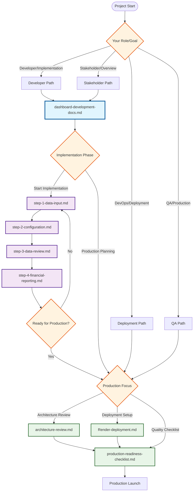

# Healthcare Dashboard - Documentation Navigation Flowchart

## Overview

This document provides a comprehensive navigation map for all documentation related to the Healthcare Analytics Dashboard project. It shows the relationships between documents and guides you through the optimal reading paths based on your role and objectives.

## Document Categories & Relationships

## Document Relationship Matrix

| Document | Type | Dependencies | Leads To | Purpose |
|----------|------|--------------|----------|---------|
| **dashboard-development-docs.md** | Core Hub | None | All others | Central documentation, version history, stakeholder feedback |
| **step-1-data-input.md** | Implementation | Core Docs | Step 2 | Data upload and validation layer |
| **step-2-configuration.md** | Implementation | Step 1 | Step 3 | Configuration and parameter setup |
| **step-3-data-review.md** | Implementation | Step 2 | Step 4 | Data validation and review interface |
| **step-4-financial-reporting.md** | Implementation | Step 3 | Production Docs | Final reporting and PDF export |
| **architecture-review.md** | Production | Core Docs | Checklist | Technical assessment and gaps |
| **production-readiness-checklist.md** | Production | Architecture Review | Deployment | Pre-production requirements |
| **Render-deployment.md** | Production | Checklist | Launch | Deployment configuration guide |

## Navigation Paths by User Role

### 🔧 **Developers & Implementation Team**

**Primary Path:**
1. 📖 `dashboard-development-docs.md` - Understand project scope and history
2. 🔄 `step-1-data-input.md` - Implement data upload functionality
3. ⚙️ `step-2-configuration.md` - Build configuration interface
4. 🔍 `step-3-data-review.md` - Create data validation layer
5. 📊 `step-4-financial-reporting.md` - Implement reporting features

**Production Preparation:**
6. 🏗️ `architecture-review.md` - Understand production requirements
7. ✅ `production-readiness-checklist.md` - Complete production tasks

### 📈 **Stakeholders & Product Managers**

**Primary Path:**
1. 📖 `dashboard-development-docs.md` - Project overview and user journey
2. 📊 `step-4-financial-reporting.md` - Understand final deliverables
3. ✅ `production-readiness-checklist.md` - Review timeline and requirements

**Deep Dive (Optional):**
- 🔄 Implementation steps (1-3) for detailed understanding
- 🏗️ `architecture-review.md` for technical context

### 🚀 **DevOps & Deployment Team**

**Primary Path:**
1. 🏗️ `architecture-review.md` - Understand technical architecture
2. ✅ `production-readiness-checklist.md` - Review infrastructure requirements
3. 🌐 `Render-deployment.md` - Configure deployment

**Context Building:**
- 📖 `dashboard-development-docs.md` - Project overview

### 🧪 **QA & Testing Team**

**Primary Path:**
1. 📖 `dashboard-development-docs.md` - Understand user flows
2. 🔄 `step-1-data-input.md` through 📊 `step-4-financial-reporting.md` - Test scenarios
3. ✅ `production-readiness-checklist.md` - QA requirements

## Implementation Sequence Flow

```mermaid
flowchart LR
    subgraph "Phase 1: Foundation"
        A[Core Docs Review] --> B[Step 1: Data Input]
    end
    
    subgraph "Phase 2: Configuration"
        B --> C[Step 2: Configuration]
    end
    
    subgraph "Phase 3: Validation"
        C --> D[Step 3: Data Review]
    end
    
    subgraph "Phase 4: Reporting"
        D --> E[Step 4: Financial Reporting]
    end
    
    subgraph "Phase 5: Production"
        E --> F[Architecture Review]
        F --> G[Production Checklist]
        G --> H[Deployment Guide]
    end
    
    classDef phase1 fill:#ffebee,stroke:#c62828
    classDef phase2 fill:#f3e5f5,stroke:#7b1fa2
    classDef phase3 fill:#e8eaf6,stroke:#303f9f
    classDef phase4 fill:#e0f2f1,stroke:#388e3c
    classDef phase5 fill:#fff3e0,stroke:#f57c00
    
    class A,B phase1
    class C phase2
    class D phase3
    class E phase4
    class F,G,H phase5
```

## Cross-Document References

### Key Connections

**From Core Documentation:**
- User journey flows reference all step documents
- Version history connects to architecture review findings
- Stakeholder feedback influences production checklist priorities

**Between Implementation Steps:**
- Step 1 output becomes Step 2 input (CSV data structure)
- Step 2 configuration drives Step 3 validation logic
- Step 3 validated data feeds Step 4 reporting calculations

**Production Documents Interdependency:**
- Architecture review identifies gaps addressed in production checklist
- Production checklist requirements inform deployment configuration
- Deployment guide implements architecture review recommendations

## Quick Reference Guide

### 🎯 **I want to...**

| Goal | Start Here | Then Read |
|------|------------|-----------|
| Understand the project | `dashboard-development-docs.md` | Implementation steps 1-4 |
| Implement features | `step-1-data-input.md` | Sequential through step 4 |
| Prepare for production | `architecture-review.md` | Production checklist → Deployment |
| Deploy the application | `production-readiness-checklist.md` | Render deployment guide |
| Review user experience | `dashboard-development-docs.md` | Step 3 (data review) → Step 4 (reporting) |
| Assess security/compliance | `architecture-review.md` | Production checklist (HIPAA section) |

### 📋 **Document Status Summary**

| Document | Completeness | Dependencies Met | Ready for Use |
|----------|--------------|------------------|---------------|
| dashboard-development-docs.md | ✅ Complete | ✅ None | ✅ Yes |
| step-1-data-input.md | ✅ Complete | ✅ Core docs | ✅ Yes |
| step-2-configuration.md | ✅ Complete | ✅ Step 1 | ✅ Yes |
| step-3-data-review.md | ✅ Complete | ✅ Step 2 | ✅ Yes |
| step-4-financial-reporting.md | ✅ Complete | ✅ Step 3 | ✅ Yes |
| architecture-review.md | ✅ Complete | ✅ Core docs | ✅ Yes |
| production-readiness-checklist.md | ✅ Complete | ✅ Architecture review | ✅ Yes |
| Render-deployment.md | ✅ Complete | ✅ Production checklist | ✅ Yes |

## Navigation Tips

### 💡 **For Efficient Reading:**

1. **Start with your role-specific path** - Don't try to read everything at once
2. **Follow the sequential flow** for implementation documents (Steps 1-4)
3. **Use the matrix** to understand document relationships before diving deep
4. **Reference the quick guide** when you need specific information
5. **Check cross-references** to ensure you're not missing critical connections

### 🔄 **Feedback Loops:**

- Implementation challenges may require revisiting architecture review
- Production checklist items may influence implementation step modifications
- Deployment issues may reveal gaps in the production checklist
- User testing may require updates to step-by-step implementation guides

---

*This navigation flowchart is designed to maximize efficiency and ensure comprehensive understanding of the Healthcare Dashboard documentation ecosystem.*