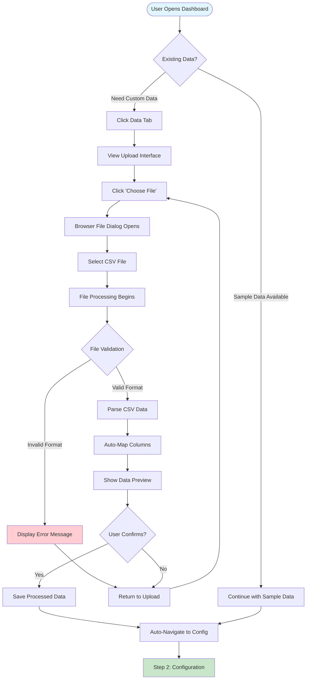

# Step 1: Data Input Layer - Complete Implementation Guide

## Overview

The Data Input Layer is the foundation of the Healthcare Analytics Dashboard, responsible for ingesting, validating, and processing CSV data files containing healthcare claims information. This step ensures data quality and prepares the information for analysis and visualization.

## Objectives

- **Primary Goal**: Enable users to upload CSV files with healthcare claims data
- **Data Quality**: Validate and normalize incoming data
- **Flexibility**: Support various CSV formats with auto-detection
- **User Experience**: Provide clear feedback and guidance
- **Integration**: Seamlessly connect to Step 2 (Configuration)
- **Security**: Implement secure file upload with validation and sanitization
- **Compliance**: Ensure HIPAA-compliant data handling for healthcare information

## User Flow Diagram



## Technical Requirements

### File Format Support
- **Primary**: CSV files (.csv)
- **Encoding**: UTF-8 (primary), ASCII (fallback)
- **Size Limit**: 10MB maximum
- **Row Limit**: 10,000 claims maximum

### Required Data Columns
```javascript
// Minimum required data structure
const requiredFields = {
  claimantIdentifier: {
    aliases: ['ClaimantNumber', 'MemberID', 'ID', 'PatientID'],
    type: 'string',
    required: true
  },
  medicalAmount: {
    aliases: ['Medical', 'MedicalClaims', 'MedicalCost', 'MedicalAmount'],
    type: 'number',
    required: true,
    default: 0
  },
  rxAmount: {
    aliases: ['Rx', 'RxClaims', 'Pharmacy', 'PharmacyCost', 'RxAmount'],
    type: 'number',
    required: true,
    default: 0
  }
};

// Optional enhancement fields
const optionalFields = {
  serviceType: {
    aliases: ['ServiceType', 'ClaimType', 'Service'],
    type: 'string',
    default: 'General'
  },
  icdCode: {
    aliases: ['ICDCode', 'ICD10', 'DiagnosisCode'],
    type: 'string',
    default: ''
  },
  description: {
    aliases: ['MedicalDesc', 'Description', 'Diagnosis'],
    type: 'string',
    default: ''
  },
  claimDate: {
    aliases: ['ClaimDate', 'ServiceDate', 'Date'],
    type: 'date',
    default: null
  }
};
```

## Implementation Details

### 1. Upload Interface Component

```jsx
const DataUploadTab = ({ onDataUpload, onError }) => {
  const [dragOver, setDragOver] = useState(false);
  const [uploading, setUploading] = useState(false);
  const [preview, setPreview] = useState(null);
  const fileInputRef = useRef(null);

  const handleFileUpload = async (file) => {
    // Validation
    if (!file) {
      onError('No file selected');
      return;
    }

    if (file.type !== 'text/csv' && !file.name.endsWith('.csv')) {
      onError('Please select a CSV file');
      return;
    }

    if (file.size > 10 * 1024 * 1024) {
      onError('File size must be less than 10MB');
      return;
    }

    setUploading(true);
    
    try {
      const processedData = await processCSVFile(file);
      setPreview(processedData.preview);
      
      // Show preview and confirmation
      if (processedData.isValid) {
        onDataUpload(processedData.data);
      } else {
        onError(processedData.errors.join(', '));
      }
    } catch (error) {
      onError(`Failed to process file: ${error.message}`);
    } finally {
      setUploading(false);
    }
  };

  return (
    <div className="p-6">
      <h2 className="text-2xl font-bold mb-4">Data Upload</h2>
      
      {/* Drop Zone */}
      <div 
        className={`border-2 border-dashed rounded-lg p-8 text-center transition-colors ${
          dragOver ? 'border-blue-400 bg-blue-50' : 'border-gray-300'
        }`}
        onDragOver={(e) => {
          e.preventDefault();
          setDragOver(true);
        }}
        onDragLeave={() => setDragOver(false)}
        onDrop={(e) => {
          e.preventDefault();
          setDragOver(false);
          const file = e.dataTransfer.files[0];
          handleFileUpload(file);
        }}
      >
        {uploading ? (
          <UploadingIndicator />
        ) : (
          <>
            <div className="mb-4">
              <svg className="w-12 h-12 mx-auto text-gray-400" fill="none" stroke="currentColor" viewBox="0 0 24 24">
                <path strokeLinecap="round" strokeLinejoin="round" strokeWidth={2} d="M7 16a4 4 0 01-.88-7.903A5 5 0 1115.9 6L16 6a5 5 0 011 9.9M15 13l-3-3m0 0l-3 3m3-3v12" />
              </svg>
            </div>
            <p className="text-lg mb-2">Drop your CSV file here</p>
            <p className="text-gray-500 mb-4">or</p>
            <button 
              className="bg-blue-500 text-white px-6 py-2 rounded hover:bg-blue-600"
              onClick={() => fileInputRef.current?.click()}
            >
              Choose File
            </button>
            <input 
              ref={fileInputRef}
              type="file" 
              accept=".csv" 
              className="hidden"
              onChange={(e) => handleFileUpload(e.target.files[0])}
            />
          </>
        )}
      </div>

      {/* CSV Format Guidelines */}
      <CSVFormatGuide />
      
      {/* Data Preview */}
      {preview && <DataPreviewTable data={preview} />}
    </div>
  );
};
```

### 2. CSV Processing Engine

```javascript
const processCSVFile = (file) => {
  return new Promise((resolve, reject) => {
    Papa.parse(file, {
      header: true,
      dynamicTyping: true,
      skipEmptyLines: true,
      complete: (results) => {
        try {
          const processedData = validateAndTransformData(results.data);
          resolve(processedData);
        } catch (error) {
          reject(error);
        }
      },
      error: (error) => {
        reject(new Error(`CSV parsing failed: ${error.message}`));
      }
    });
  });
};

const validateAndTransformData = (rawData) => {
  const errors = [];
  const warnings = [];
  const transformedData = [];
  
  // Check if data exists
  if (!rawData || rawData.length === 0) {
    throw new Error('CSV file is empty or contains no valid data');
  }

  // Detect column mappings
  const columnMappings = detectColumnMappings(rawData[0]);
  
  if (!columnMappings.claimantId) {
    errors.push('Missing required claimant identifier column');
  }
  
  if (!columnMappings.medical && !columnMappings.rx) {
    errors.push('Missing required medical or pharmacy cost columns');
  }

  // Process each row
  rawData.forEach((row, index) => {
    try {
      const transformedRow = transformRow(row, columnMappings, index + 2); // +2 for header and 1-based indexing
      if (transformedRow) {
        transformedData.push(transformedRow);
      }
    } catch (rowError) {
      warnings.push(`Row ${index + 2}: ${rowError.message}`);
    }
  });

  // Validation results
  const isValid = errors.length === 0 && transformedData.length > 0;
  
  return {
    isValid,
    data: transformedData,
    errors,
    warnings,
    preview: transformedData.slice(0, 10), // First 10 rows for preview
    summary: {
      totalRows: transformedData.length,
      totalMedical: transformedData.reduce((sum, row) => sum + (row.Medical || 0), 0),
      totalRx: transformedData.reduce((sum, row) => sum + (row.Rx || 0), 0),
      columnMappings
    }
  };
};
```

### 3. Column Auto-Detection

```javascript
const detectColumnMappings = (headerRow) => {
  const mappings = {};
  const headers = Object.keys(headerRow);
  
  // Define detection patterns
  const patterns = {
    claimantId: /^(claimant|member|patient|id|number).*$/i,
    medical: /^(medical|med|inpatient|outpatient|hospital).*$/i,
    rx: /^(rx|pharmacy|pharm|drug|medication).*$/i,
    serviceType: /^(service|claim|type|category).*$/i,
    icdCode: /^(icd|diagnosis|code).*$/i,
    description: /^(desc|description|diagnosis|condition).*$/i,
    total: /^(total|amount|cost|sum).*$/i,
    date: /^(date|service|claim).*date.*$/i
  };

  // Match headers to patterns
  headers.forEach(header => {
    const cleanHeader = header.trim();
    
    for (const [field, pattern] of Object.entries(patterns)) {
      if (pattern.test(cleanHeader) && !mappings[field]) {
        mappings[field] = cleanHeader;
      }
    }
  });

  // Fallback to exact matches if patterns fail
  if (!mappings.claimantId) {
    const candidates = ['ClaimantNumber', 'MemberID', 'ID', 'PatientID'];
    mappings.claimantId = headers.find(h => candidates.includes(h));
  }

  if (!mappings.medical) {
    const candidates = ['Medical', 'MedicalClaims', 'MedicalCost'];
    mappings.medical = headers.find(h => candidates.includes(h));
  }

  if (!mappings.rx) {
    const candidates = ['Rx', 'RxClaims', 'Pharmacy', 'PharmacyCost'];
    mappings.rx = headers.find(h => candidates.includes(h));
  }

  return mappings;
};

const transformRow = (row, mappings, rowNumber) => {
  const transformed = {};
  
  // Required fields
  transformed.ClaimantNumber = row[mappings.claimantId];
  if (!transformed.ClaimantNumber) {
    throw new Error('Missing claimant identifier');
  }

  transformed.Medical = parseFloat(row[mappings.medical] || 0);
  transformed.Rx = parseFloat(row[mappings.rx] || 0);
  
  if (isNaN(transformed.Medical)) transformed.Medical = 0;
  if (isNaN(transformed.Rx)) transformed.Rx = 0;
  
  transformed.Total = transformed.Medical + transformed.Rx;
  
  // Optional fields
  transformed.ServiceType = row[mappings.serviceType] || 'General';
  transformed.ICDCode = row[mappings.icdCode] || '';
  transformed.MedicalDesc = row[mappings.description] || '';
  transformed.LaymanTerm = generateLaymanTerm(transformed.MedicalDesc, transformed.ICDCode);
  
  // Date handling
  if (mappings.date && row[mappings.date]) {
    try {
      transformed.ClaimDate = new Date(row[mappings.date]);
    } catch {
      transformed.ClaimDate = null;
    }
  }

  return transformed;
};
```

### 4. Data Validation Rules

```javascript
const validationRules = {
  claimantNumber: {
    required: true,
    type: 'string',
    minLength: 1,
    validate: (value) => {
      if (typeof value !== 'string' && typeof value !== 'number') {
        throw new Error('Claimant number must be a string or number');
      }
      return String(value);
    }
  },
  
  medicalAmount: {
    required: false,
    type: 'number',
    min: 0,
    validate: (value) => {
      const num = parseFloat(value);
      if (isNaN(num) || num < 0) {
        throw new Error('Medical amount must be a positive number');
      }
      return num;
    }
  },
  
  rxAmount: {
    required: false,
    type: 'number',
    min: 0,
    validate: (value) => {
      const num = parseFloat(value);
      if (isNaN(num) || num < 0) {
        throw new Error('Rx amount must be a positive number');
      }
      return num;
    }
  },
  
  serviceType: {
    required: false,
    type: 'string',
    allowedValues: ['Inpatient', 'Outpatient', 'Emergency', 'Pharmacy', 'General'],
    validate: (value) => {
      if (!value) return 'General';
      const allowed = ['Inpatient', 'Outpatient', 'Emergency', 'Pharmacy', 'General'];
      return allowed.includes(value) ? value : 'General';
    }
  }
};

const validateDataQuality = (data) => {
  const issues = [];
  
  // Check for duplicate claimant numbers
  const claimantNumbers = data.map(row => row.ClaimantNumber);
  const duplicates = claimantNumbers.filter((num, index) => claimantNumbers.indexOf(num) !== index);
  if (duplicates.length > 0) {
    issues.push(`Duplicate claimant numbers found: ${[...new Set(duplicates)].join(', ')}`);
  }
  
  // Check for outliers
  const totals = data.map(row => row.Total);
  const mean = totals.reduce((sum, val) => sum + val, 0) / totals.length;
  const stdDev = Math.sqrt(totals.reduce((sum, val) => sum + Math.pow(val - mean, 2), 0) / totals.length);
  const outlierThreshold = mean + (3 * stdDev);
  
  const outliers = data.filter(row => row.Total > outlierThreshold);
  if (outliers.length > 0) {
    issues.push(`${outliers.length} potential outlier claims detected (>${formatCurrency(outlierThreshold)})`);
  }
  
  // Check data completeness
  const emptyMedical = data.filter(row => !row.Medical || row.Medical === 0).length;
  const emptyRx = data.filter(row => !row.Rx || row.Rx === 0).length;
  
  if (emptyMedical / data.length > 0.8) {
    issues.push('High percentage of empty medical claims (>80%)');
  }
  
  if (emptyRx / data.length > 0.8) {
    issues.push('High percentage of empty Rx claims (>80%)');
  }
  
  return {
    isValid: issues.length === 0,
    issues,
    dataQualityScore: Math.max(0, 100 - (issues.length * 20))
  };
};
```

## Sample CSV Formats

### Format 1: Standard Claims File
```csv
ClaimantNumber,Medical,Rx,ServiceType,ICDCode,MedicalDesc
12345,1500.00,250.00,Inpatient,Z51.11,Encounter for antineoplastic chemotherapy
12346,750.00,0.00,Outpatient,M54.5,Low back pain
12347,0.00,125.50,Pharmacy,E11.9,Type 2 diabetes mellitus
```

### Format 2: Alternative Column Names
```csv
MemberID,MedicalClaims,PharmacyCost,ClaimType,DiagnosisCode,Description
M001,2500.00,300.00,Emergency,S72.001A,Fracture of unspecified part of neck
M002,450.00,75.00,Outpatient,H25.9,Unspecified age-related cataract
M003,0.00,200.00,Pharmacy,F32.9,Major depressive disorder
```

### Format 3: Minimal Required Fields
```csv
ID,Medical,Rx
1001,850.00,125.00
1002,1200.00,0.00
1003,0.00,95.50
```

## Error Handling Scenarios

### 1. File Format Errors
```javascript
const handleFileErrors = {
  invalidFormat: {
    message: 'Invalid file format. Please upload a CSV file.',
    userAction: 'Select a .csv file and try again'
  },
  
  fileTooLarge: {
    message: 'File size exceeds 10MB limit.',
    userAction: 'Split your data into smaller files or contact support'
  },
  
  emptyFile: {
    message: 'The CSV file appears to be empty.',
    userAction: 'Check your file and ensure it contains data'
  },
  
  corruptedFile: {
    message: 'Unable to read the CSV file. It may be corrupted.',
    userAction: 'Try re-saving the file in CSV format and upload again'
  }
};
```

### 2. Data Structure Errors
```javascript
const handleDataErrors = {
  missingHeaders: {
    message: 'Required column headers not found.',
    details: 'Looking for: ClaimantNumber/ID, Medical, Rx',
    userAction: 'Ensure your CSV has proper column headers'
  },
  
  noValidRows: {
    message: 'No valid data rows found in the file.',
    userAction: 'Check that your CSV contains claim data below the headers'
  },
  
  tooManyRows: {
    message: 'File contains more than 10,000 rows.',
    userAction: 'Split your data into smaller batches'
  }
};
```

### 3. Data Quality Warnings
```javascript
const handleDataWarnings = {
  highOutliers: {
    message: 'Several unusually high claim amounts detected.',
    action: 'Continue with review in Step 2'
  },
  
  missingData: {
    message: 'Some claims have $0 amounts.',
    action: 'Verify this is expected for your data'
  },
  
  inconsistentFormat: {
    message: 'Column naming varies from standard format.',
    action: 'Auto-mapping applied - please verify in preview'
  }
};
```

## Integration with Step 2

### Data Handoff Protocol
```javascript
// Data structure passed to Configuration step
const handoffData = {
  processedClaims: transformedData,
  metadata: {
    uploadTimestamp: new Date(),
    fileName: originalFile.name,
    rowCount: transformedData.length,
    columnMappings: detectedMappings,
    dataQuality: qualityAssessment
  },
  summary: {
    totalMedical: calculateSum(transformedData, 'Medical'),
    totalRx: calculateSum(transformedData, 'Rx'),
    totalClaims: transformedData.length,
    averageClaimSize: calculateAverage(transformedData, 'Total'),
    serviceTypeDistribution: calculateDistribution(transformedData, 'ServiceType')
  }
};

// Auto-navigation trigger
const handleUploadSuccess = (data) => {
  setUploadedData(data);
  setUploadComplete(true);
  
  // Brief delay for user to see success message
  setTimeout(() => {
    setActiveTab('configuration');
    showConfigurationGuidance();
  }, 2000);
};
```

## Testing Scenarios

### 1. Happy Path Testing
- [ ] Upload standard CSV with all columns
- [ ] Upload minimal CSV with required fields only
- [ ] Upload CSV with alternative column names
- [ ] Verify auto-mapping works correctly
- [ ] Confirm data preview shows accurate information
- [ ] Test auto-navigation to configuration step

### 2. Error Handling Testing
- [ ] Upload non-CSV file
- [ ] Upload empty file
- [ ] Upload file without headers
- [ ] Upload file with missing required columns
- [ ] Upload file exceeding size limit
- [ ] Upload CSV with special characters

### 3. Data Quality Testing
- [ ] Upload CSV with outlier values
- [ ] Upload CSV with negative amounts
- [ ] Upload CSV with duplicate IDs
- [ ] Upload CSV with mixed data types
- [ ] Upload CSV with empty rows

### 4. User Experience Testing
- [ ] Drag and drop functionality
- [ ] Error message clarity
- [ ] Loading state indicators
- [ ] Preview table functionality
- [ ] Format guidance visibility

## Performance Considerations

### File Processing Optimization
```javascript
// Chunk processing for large files
const processLargeFile = async (file) => {
  const CHUNK_SIZE = 1000;
  let processed = [];
  
  return new Promise((resolve) => {
    Papa.parse(file, {
      header: true,
      chunk: (results) => {
        const validRows = results.data
          .filter(row => Object.values(row).some(val => val))
          .map(row => transformRow(row, mappings));
        
        processed = processed.concat(validRows);
        
        // Update progress indicator
        updateProgress(processed.length);
      },
      complete: () => {
        resolve(processed);
      }
    });
  });
};
```

### Memory Management
```javascript
// Clean up large datasets
const optimizeDataForUI = (data) => {
  // Keep full dataset in state but limit what's rendered
  return {
    fullData: data,
    previewData: data.slice(0, 100),
    summaryStats: generateSummaryStats(data)
  };
};
```

## Security & API Considerations

### 🔒 **Production Security Requirements**

#### File Upload Security
```javascript
// Secure file upload implementation
const secureFileUpload = {
  validation: {
    fileType: 'Whitelist CSV MIME types only',
    fileSize: 'Maximum 10MB per file',
    fileName: 'Sanitize filename to prevent path traversal',
    content: 'Scan for malicious content and macros'
  },
  
  processing: {
    sandbox: 'Process files in isolated environment',
    timeout: 'Maximum 30 seconds processing time',
    memory: 'Limit memory usage to prevent DoS',
    cleanup: 'Automatic temporary file cleanup'
  },
  
  encryption: {
    upload: 'HTTPS/TLS 1.3 for file transfer',
    storage: 'AES-256 encryption for temporary storage',
    processing: 'In-memory processing preferred'
  }
};
```

#### HIPAA Compliance Measures
```javascript
const hipaaCompliance = {
  dataHandling: {
    minimization: 'Process only necessary PHI fields',
    encryption: 'Encrypt PHI data at rest and in transit',
    access: 'Role-based access to uploaded data',
    audit: 'Log all file access and processing activities'
  },
  
  retention: {
    temporary: 'Delete uploaded files after processing',
    processed: 'Secure storage with retention policies',
    backup: 'Encrypted backups with access controls'
  },
  
  transmission: {
    secure: 'HTTPS only for all file operations',
    integrity: 'File integrity verification with checksums',
    authentication: 'Multi-factor authentication required'
  }
};
```

### 🔌 **Required API Endpoints**

#### File Upload API
```javascript
// POST /api/v1/claims/upload
const uploadEndpoint = {
  method: 'POST',
  path: '/api/v1/claims/upload',
  authentication: 'Bearer JWT token required',
  contentType: 'multipart/form-data',
  
  request: {
    file: 'CSV file (max 10MB)',
    organizationId: 'UUID - Organization identifier',
    uploadType: 'Enum: [claims, enrollment, budget]'
  },
  
  response: {
    success: {
      uploadId: 'UUID - Tracking identifier',
      fileName: 'Sanitized filename',
      rowCount: 'Number of data rows',
      preview: 'First 10 rows for validation',
      mappings: 'Detected column mappings',
      validationResults: 'Data quality issues'
    },
    error: {
      code: 'Error code',
      message: 'User-friendly error message',
      details: 'Technical details for debugging'
    }
  },
  
  security: {
    rateLimit: '10 uploads per minute per user',
    virusScanning: 'ClamAV or similar',
    contentValidation: 'Schema validation'
  }
};
```

#### File Processing Status API
```javascript
// GET /api/v1/claims/upload/:uploadId/status
const statusEndpoint = {
  method: 'GET',
  path: '/api/v1/claims/upload/:uploadId/status',
  
  response: {
    status: 'Enum: [uploading, processing, completed, failed]',
    progress: 'Percentage 0-100',
    processedRows: 'Number of rows processed',
    errors: 'Array of validation errors',
    warnings: 'Array of data quality warnings'
  }
};
```

#### Data Validation API
```javascript
// POST /api/v1/claims/validate
const validationEndpoint = {
  method: 'POST',
  path: '/api/v1/claims/validate',
  
  request: {
    uploadId: 'UUID from upload response',
    columnMappings: 'User-confirmed mappings',
    validationRules: 'Custom validation rules'
  },
  
  response: {
    isValid: 'Boolean validation result',
    validRows: 'Count of valid data rows',
    invalidRows: 'Count of invalid rows',
    errors: 'Detailed error breakdown',
    transformedData: 'Preview of transformed data'
  }
};
```

### 🛡️ **Security Implementation Checklist**

#### Backend Security
- [ ] **Input Validation**: Comprehensive server-side validation
- [ ] **File Type Checking**: MIME type and extension validation
- [ ] **Virus Scanning**: Integration with antivirus service
- [ ] **Size Limits**: Enforce file size restrictions
- [ ] **Rate Limiting**: Prevent abuse and DoS attacks
- [ ] **Authentication**: JWT-based user authentication
- [ ] **Authorization**: Role-based access control
- [ ] **Audit Logging**: Track all file operations

#### Data Protection
- [ ] **Encryption at Rest**: Database and file storage encryption
- [ ] **Encryption in Transit**: HTTPS/TLS for all communications
- [ ] **Data Masking**: Mask sensitive data in logs
- [ ] **Secure Deletion**: Cryptographic erasure of temporary files
- [ ] **Access Controls**: Principle of least privilege
- [ ] **Data Minimization**: Process only necessary data
- [ ] **Retention Policies**: Automated data lifecycle management

#### Compliance & Monitoring
- [ ] **HIPAA BAA**: Business Associate Agreement in place
- [ ] **SOC2 Controls**: Implement required security controls
- [ ] **Penetration Testing**: Regular security assessments
- [ ] **Vulnerability Scanning**: Automated security scans
- [ ] **Incident Response**: Security incident procedures
- [ ] **Monitoring**: Real-time security monitoring
- [ ] **Alerting**: Automated security alerts

## Success Metrics

### Technical Metrics
- File upload success rate > 95%
- Processing time < 5 seconds for files under 1MB
- Auto-detection accuracy > 90%
- Error message clarity score > 4.5/5

### User Experience Metrics
- Time to successful upload < 2 minutes
- User confusion rate < 5%
- Retry attempts due to errors < 10%
- Step completion rate > 85%

### Security Metrics
- Zero security incidents related to file uploads
- 100% compliance with file validation rules
- Audit log completeness > 99.9%
- Security scan pass rate > 95%

---

## Advanced CSV Ingestion & Mapping Module

### 🎯 **Saved Mapping Profiles System**

#### Profile Management Architecture
```javascript
// Mapping profile database schema
const MappingProfile = {
  id: 'UUID primary key',
  organizationId: 'UUID foreign key',
  profileName: 'String - user-friendly name',
  dataSourceType: 'Enum: [anthem, aetna, cigna, custom]',
  columnMappings: 'JSON object with field mappings',
  validationRules: 'JSON object with custom rules',
  isDefault: 'Boolean - default for this org',
  createdBy: 'UUID user who created profile',
  createdAt: 'Timestamp',
  lastUsedAt: 'Timestamp',
  useCount: 'Integer - popularity tracking'
};

// Example mapping profile JSON structure
const sampleMappingProfile = {
  profileName: "Anthem Medical Claims - Standard",
  dataSourceType: "anthem",
  columnMappings: {
    claimantId: "Member_ID",
    medicalAmount: "Medical_Claims_Amount", 
    rxAmount: "Pharmacy_Claims_Amount",
    serviceType: "Service_Category",
    icdCode: "Primary_Diagnosis_Code",
    description: "Diagnosis_Description",
    claimDate: "Service_Date",
    providerId: "Provider_NPI",
    planCode: "Benefit_Plan_Code"
  },
  validationRules: {
    requiredFields: ["Member_ID", "Medical_Claims_Amount"],
    numericFields: ["Medical_Claims_Amount", "Pharmacy_Claims_Amount"],
    dateFields: ["Service_Date"],
    allowEmptyRx: true,
    allowEmptyMedical: false
  }
};
```

#### Profile Selection UI Component
```javascript
const MappingProfileSelector = ({ onProfileSelect, organizationId }) => {
  const [profiles, setProfiles] = useState([]);
  const [selectedProfile, setSelectedProfile] = useState(null);
  const [showCreateNew, setShowCreateNew] = useState(false);

  useEffect(() => {
    loadSavedProfiles();
  }, [organizationId]);

  const loadSavedProfiles = async () => {
    const response = await fetch(`/api/v1/mapping-profiles?orgId=${organizationId}`);
    const profileData = await response.json();
    setProfiles(profileData.profiles);
    
    // Auto-select default profile if exists
    const defaultProfile = profileData.profiles.find(p => p.isDefault);
    if (defaultProfile) {
      setSelectedProfile(defaultProfile);
      onProfileSelect(defaultProfile);
    }
  };

  const handleProfileSelection = (profile) => {
    setSelectedProfile(profile);
    onProfileSelect(profile);
    
    // Update last used timestamp
    updateProfileUsage(profile.id);
  };

  return (
    <div className="mb-6 p-4 bg-gray-50 rounded-lg">
      <h3 className="text-lg font-semibold mb-3">Select Data Source Mapping</h3>
      
      {profiles.length > 0 ? (
        <div className="space-y-2">
          {profiles.map(profile => (
            <div 
              key={profile.id}
              className={`p-3 border rounded cursor-pointer transition-colors ${
                selectedProfile?.id === profile.id 
                  ? 'border-blue-500 bg-blue-50' 
                  : 'border-gray-200 hover:border-gray-300'
              }`}
              onClick={() => handleProfileSelection(profile)}
            >
              <div className="flex justify-between items-center">
                <div>
                  <h4 className="font-medium">{profile.profileName}</h4>
                  <p className="text-sm text-gray-600">
                    {profile.dataSourceType} • Used {profile.useCount} times
                  </p>
                </div>
                {profile.isDefault && (
                  <span className="bg-green-100 text-green-800 text-xs px-2 py-1 rounded">
                    Default
                  </span>
                )}
              </div>
            </div>
          ))}
          
          <button 
            className="w-full p-3 border-2 border-dashed border-gray-300 rounded text-gray-600 hover:border-gray-400"
            onClick={() => setShowCreateNew(true)}
          >
            + Create New Mapping Profile
          </button>
        </div>
      ) : (
        <div className="text-center py-6">
          <p className="text-gray-600 mb-3">No saved mapping profiles yet</p>
          <button 
            className="bg-blue-500 text-white px-4 py-2 rounded hover:bg-blue-600"
            onClick={() => setShowCreateNew(true)}
          >
            Create First Mapping Profile
          </button>
        </div>
      )}
      
      {showCreateNew && (
        <CreateMappingProfileModal 
          onSave={(newProfile) => {
            setProfiles([...profiles, newProfile]);
            setShowCreateNew(false);
            handleProfileSelection(newProfile);
          }}
          onCancel={() => setShowCreateNew(false)}
        />
      )}
    </div>
  );
};
```

#### Auto-Detection with Learning
```javascript
const intelligentColumnDetection = (csvHeaders, organizationId) => {
  // Load organization's historical mappings for pattern learning
  const historicalMappings = getHistoricalMappings(organizationId);
  
  // Enhanced pattern matching with learning
  const patterns = {
    claimantId: {
      exact: ['member_id', 'claimant_number', 'patient_id'],
      patterns: [/member.*id/i, /claimant.*number/i, /patient.*id/i],
      historical: getHistoricalMatches(historicalMappings, 'claimantId')
    },
    medicalAmount: {
      exact: ['medical_amount', 'medical_claims', 'medical_cost'],
      patterns: [/medical.*amount/i, /medical.*cost/i, /inpatient/i],
      historical: getHistoricalMatches(historicalMappings, 'medicalAmount')
    },
    rxAmount: {
      exact: ['rx_amount', 'pharmacy_cost', 'drug_cost'],
      patterns: [/rx.*amount/i, /pharmacy/i, /drug.*cost/i],
      historical: getHistoricalMatches(historicalMappings, 'rxAmount')
    }
  };

  const detectedMappings = {};
  const confidence = {};

  csvHeaders.forEach(header => {
    const cleanHeader = header.toLowerCase().trim();
    
    for (const [field, matchers] of Object.entries(patterns)) {
      let score = 0;
      
      // Exact match (highest confidence)
      if (matchers.exact.includes(cleanHeader)) {
        score = 100;
      }
      // Pattern match (high confidence)
      else if (matchers.patterns.some(pattern => pattern.test(cleanHeader))) {
        score = 80;
      }
      // Historical match (medium confidence)
      else if (matchers.historical.includes(cleanHeader)) {
        score = 60;
      }
      // Fuzzy string matching (low confidence)
      else {
        score = getFuzzyMatchScore(cleanHeader, matchers.exact);
      }
      
      if (score > 50 && (!detectedMappings[field] || score > confidence[field])) {
        detectedMappings[field] = header;
        confidence[field] = score;
      }
    }
  });

  return { mappings: detectedMappings, confidence };
};
```

### 🔄 **Idempotency & Deduplication Logic**

#### Upload Fingerprinting
```javascript
const generateUploadFingerprint = (file, mappings) => {
  return {
    fileFingerprint: {
      name: file.name,
      size: file.size,
      lastModified: file.lastModified,
      hash: calculateFileHash(file) // SHA-256 hash of content
    },
    dataFingerprint: {
      columnCount: Object.keys(mappings).length,
      columnNames: Object.keys(mappings).sort().join('|'),
      mappingHash: calculateMappingHash(mappings)
    },
    uploadTimestamp: new Date().toISOString()
  };
};

const calculateFileHash = async (file) => {
  const buffer = await file.arrayBuffer();
  const hashBuffer = await crypto.subtle.digest('SHA-256', buffer);
  const hashArray = Array.from(new Uint8Array(hashBuffer));
  return hashArray.map(b => b.toString(16).padStart(2, '0')).join('');
};
```

#### Duplicate Detection System
```javascript
const checkForDuplicateUpload = async (fingerprint, organizationId) => {
  const existingUploads = await db.uploads.findMany({
    where: {
      organizationId,
      fileHash: fingerprint.fileFingerprint.hash,
      createdAt: {
        gte: new Date(Date.now() - 30 * 24 * 60 * 60 * 1000) // Last 30 days
      }
    },
    include: {
      processedData: {
        select: { rowCount: true, totalAmount: true }
      }
    }
  });

  if (existingUploads.length > 0) {
    const exactMatch = existingUploads.find(upload => 
      upload.fileName === fingerprint.fileFingerprint.name &&
      upload.fileSize === fingerprint.fileFingerprint.size
    );

    return {
      isDuplicate: true,
      exactMatch: !!exactMatch,
      previousUploads: existingUploads.map(upload => ({
        id: upload.id,
        fileName: upload.fileName,
        uploadDate: upload.createdAt,
        rowCount: upload.processedData?.rowCount,
        totalAmount: upload.processedData?.totalAmount
      }))
    };
  }

  return { isDuplicate: false };
};
```

#### Smart Deduplication UI
```javascript
const DuplicateDetectionModal = ({ duplicateInfo, onAction }) => {
  const [selectedAction, setSelectedAction] = useState('review');
  
  return (
    <div className="fixed inset-0 bg-black bg-opacity-50 flex items-center justify-center z-50">
      <div className="bg-white rounded-lg max-w-2xl w-full mx-4 p-6">
        <div className="flex items-center mb-4">
          <AlertCircle className="w-6 h-6 text-orange-500 mr-2" />
          <h2 className="text-xl font-semibold">Potential Duplicate Upload Detected</h2>
        </div>
        
        <p className="text-gray-600 mb-4">
          We found {duplicateInfo.previousUploads.length} similar upload(s) from the last 30 days:
        </p>
        
        <div className="space-y-3 mb-6">
          {duplicateInfo.previousUploads.map(upload => (
            <div key={upload.id} className="bg-gray-50 p-3 rounded">
              <div className="flex justify-between items-center">
                <div>
                  <p className="font-medium">{upload.fileName}</p>
                  <p className="text-sm text-gray-600">
                    Uploaded {formatDate(upload.uploadDate)} • {upload.rowCount} rows • {formatCurrency(upload.totalAmount)}
                  </p>
                </div>
                {duplicateInfo.exactMatch && upload.exactMatch && (
                  <span className="bg-red-100 text-red-800 text-xs px-2 py-1 rounded">
                    Exact Match
                  </span>
                )}
              </div>
            </div>
          ))}
        </div>
        
        <div className="space-y-3 mb-6">
          <label className="flex items-center">
            <input 
              type="radio" 
              name="action" 
              value="review"
              checked={selectedAction === 'review'}
              onChange={(e) => setSelectedAction(e.target.value)}
              className="mr-2"
            />
            <span>Review differences and proceed if intentional</span>
          </label>
          
          <label className="flex items-center">
            <input 
              type="radio" 
              name="action" 
              value="replace"
              checked={selectedAction === 'replace'}
              onChange={(e) => setSelectedAction(e.target.value)}
              className="mr-2"
            />
            <span>Replace previous upload with this data</span>
          </label>
          
          <label className="flex items-center">
            <input 
              type="radio" 
              name="action" 
              value="append"
              checked={selectedAction === 'append'}
              onChange={(e) => setSelectedAction(e.target.value)}
              className="mr-2"
            />
            <span>Append as additional data (merge claims)</span>
          </label>
          
          <label className="flex items-center">
            <input 
              type="radio" 
              name="action" 
              value="cancel"
              checked={selectedAction === 'cancel'}
              onChange={(e) => setSelectedAction(e.target.value)}
              className="mr-2"
            />
            <span>Cancel upload and use existing data</span>
          </label>
        </div>
        
        <div className="flex justify-end space-x-3">
          <button 
            className="px-4 py-2 text-gray-600 hover:text-gray-800"
            onClick={() => onAction('cancel')}
          >
            Cancel
          </button>
          <button 
            className="px-4 py-2 bg-blue-500 text-white rounded hover:bg-blue-600"
            onClick={() => onAction(selectedAction)}
          >
            {selectedAction === 'cancel' ? 'Use Existing' : 'Continue'}
          </button>
        </div>
      </div>
    </div>
  );
};
```

#### Advanced Data Reconciliation
```javascript
const reconcileClaimsData = (newData, existingData, action) => {
  switch (action) {
    case 'replace':
      return {
        data: newData,
        changes: {
          type: 'replacement',
          previousRowCount: existingData.length,
          newRowCount: newData.length,
          impact: 'All previous data replaced'
        }
      };
      
    case 'append':
      const mergedData = [...existingData, ...newData];
      const duplicateClaimants = findDuplicateClaimants(mergedData);
      
      return {
        data: mergedData,
        changes: {
          type: 'append',
          addedRows: newData.length,
          totalRows: mergedData.length,
          duplicateWarnings: duplicateClaimants
        }
      };
      
    case 'merge':
      return smartMergeClaimsData(newData, existingData);
      
    default:
      return { data: newData, changes: { type: 'new' } };
  }
};

const smartMergeClaimsData = (newData, existingData) => {
  const mergedMap = new Map();
  
  // Add existing data
  existingData.forEach(claim => {
    mergedMap.set(claim.ClaimantNumber, claim);
  });
  
  // Merge or add new data
  const mergeResults = {
    updated: 0,
    added: 0,
    conflicts: []
  };
  
  newData.forEach(newClaim => {
    const existing = mergedMap.get(newClaim.ClaimantNumber);
    
    if (existing) {
      // Check for conflicts in amounts
      if (existing.Total !== newClaim.Total) {
        mergeResults.conflicts.push({
          claimantNumber: newClaim.ClaimantNumber,
          existing: existing.Total,
          new: newClaim.Total,
          difference: newClaim.Total - existing.Total
        });
      }
      
      // Update with new data (business rule: latest data wins)
      mergedMap.set(newClaim.ClaimantNumber, {
        ...existing,
        ...newClaim,
        updatedAt: new Date()
      });
      mergeResults.updated++;
    } else {
      mergedMap.set(newClaim.ClaimantNumber, newClaim);
      mergeResults.added++;
    }
  });
  
  return {
    data: Array.from(mergedMap.values()),
    changes: {
      type: 'merge',
      ...mergeResults
    }
  };
};
```

### 🔍 **Advanced Validation & Error Recovery**

#### Multi-Pass Validation System
```javascript
const comprehensiveDataValidation = (data, mappings, validationRules) => {
  const validationPasses = [
    { name: 'Structure', validator: validateDataStructure },
    { name: 'Types', validator: validateDataTypes },
    { name: 'Business Rules', validator: validateBusinessRules },
    { name: 'Data Quality', validator: validateDataQuality },
    { name: 'Completeness', validator: validateDataCompleteness }
  ];
  
  const results = {
    overallValid: true,
    passResults: {},
    errorSummary: {},
    warnings: [],
    recommendations: []
  };
  
  validationPasses.forEach(pass => {
    const passResult = pass.validator(data, mappings, validationRules);
    results.passResults[pass.name] = passResult;
    
    if (!passResult.isValid) {
      results.overallValid = false;
      results.errorSummary[pass.name] = passResult.errors;
    }
    
    if (passResult.warnings) {
      results.warnings.push(...passResult.warnings);
    }
    
    if (passResult.recommendations) {
      results.recommendations.push(...passResult.recommendations);
    }
  });
  
  return results;
};
```

#### Error Recovery Mechanisms
```javascript
const autoCorrectCommonIssues = (data, errors) => {
  const correctedData = [...data];
  const corrections = [];
  
  errors.forEach(error => {
    switch (error.type) {
      case 'MISSING_DECIMAL':
        // Attempt to fix amounts missing decimal points
        correctedData.forEach((row, index) => {
          if (error.affectedRows.includes(index)) {
            row.Medical = parseFloat(row.Medical) / 100;
            row.Rx = parseFloat(row.Rx) / 100;
            corrections.push({
              row: index,
              field: 'amounts',
              action: 'Applied decimal correction (divided by 100)'
            });
          }
        });
        break;
        
      case 'INVALID_DATE_FORMAT':
        correctedData.forEach((row, index) => {
          if (error.affectedRows.includes(index)) {
            row.ClaimDate = attemptDateParsing(row.ClaimDate);
            corrections.push({
              row: index,
              field: 'ClaimDate',
              action: 'Standardized date format'
            });
          }
        });
        break;
        
      case 'INCONSISTENT_SERVICE_TYPE':
        const serviceTypeMapping = inferServiceTypeMapping(correctedData);
        correctedData.forEach((row, index) => {
          if (serviceTypeMapping[row.ServiceType]) {
            row.ServiceType = serviceTypeMapping[row.ServiceType];
            corrections.push({
              row: index,
              field: 'ServiceType',
              action: `Standardized to ${row.ServiceType}`
            });
          }
        });
        break;
    }
  });
  
  return { correctedData, corrections };
};
```

## Conclusion

Step 1 establishes a robust foundation for the healthcare dashboard by ensuring reliable data ingestion with intelligent column detection, comprehensive validation, and seamless user experience. The enhanced system includes:

- **Saved Mapping Profiles**: Reusable configurations for different data sources
- **Intelligent Auto-Detection**: Learning-based column mapping with confidence scoring  
- **Idempotency Controls**: Duplicate detection and smart data reconciliation
- **Advanced Validation**: Multi-pass validation with auto-correction capabilities
- **Production Security**: HIPAA-compliant file handling and API endpoints

The flexible architecture accommodates various CSV formats while maintaining data quality standards essential for accurate healthcare analytics, with built-in safeguards against data duplication and processing errors.

Upon successful completion of data upload and validation, users are automatically guided to Step 2 (Configuration) where they can set budget parameters and fee structures for their uploaded claims data.