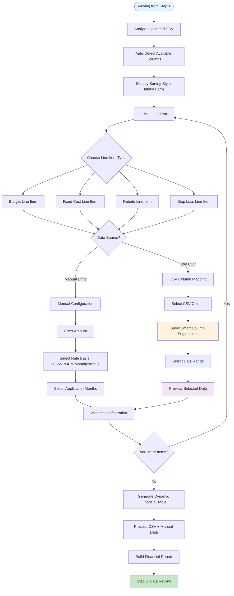

# Step 2: Configuration Layer - Complete Implementation Guide

## Overview

The Configuration Layer provides a flexible, survey-style intake form that combines CSV data with manual entries to build comprehensive financial reporting. Users can dynamically create line items that pull from either uploaded CSV columns or manual calculations, supporting up to 24 months of historical data with complete customization flexibility.

## Objectives

- **Hybrid Data Sources**: Seamlessly combine CSV data with manual entries
- **Dynamic Line Items**: Create unlimited budget, cost, rebate, and reimbursement items
- **Intelligent CSV Mapping**: Auto-detect and suggest relevant columns from uploaded data
- **Flexible Date Ranges**: Select specific months or ranges from available CSV data
- **Excel-like Functionality**: Apply rate basis formulas (PEPM, PMPM, monthly, annual)
- **Real-time Processing**: Generate comprehensive financial tables dynamically

## User Workflow Diagram



## Hybrid Line Item Data Structure

```javascript
// Universal line item schema supporting both CSV and manual data sources
const lineItemSchema = {
  id: "unique_identifier",
  name: "string", // User-defined name (e.g., "Medical Claims", "TPA Fees")
  category: "string", // 'budget', 'fixedCost', 'rebate', 'stopLoss', 'claims'
  dataSource: "string", // 'manual' or 'csv'
  
  // Manual entry fields
  manual: {
    amount: "number",
    rateBasis: "string", // 'pepm', 'pmpm', 'monthly', 'annual'
    application: {
      type: "string", // 'all', 'specific', 'custom', 'quarterly'
      specificMonth: "string", // if type === 'specific'
      startMonth: "string", // if type === 'custom'
      endMonth: "string", // if type === 'custom'
      quarter: "string" // if type === 'quarterly'
    }
  },
  
  // CSV mapping fields
  csv: {
    column: "string", // Selected CSV column name
    dateRange: {
      startMonth: "string", // Start of date range from CSV
      endMonth: "string", // End of date range from CSV
      availableMonths: ["array"] // All available months in CSV
    },
    aggregation: "string", // 'sum', 'average', 'last', 'first'
    preview: {
      sampleData: ["array"], // Preview of selected data
      totalValue: "number",
      monthCount: "number"
    }
  },
  
  // Processed output
  processedValues: {
    monthlyValues: ["array"], // 12-month array of calculated values
    annualTotal: "number",
    notes: "string"
  }
};

// Complete intake form state
const intakeFormState = {
  csvInfo: {
    headers: ["array"], // Available column headers
    monthRange: "string", // e.g., "Jan 2023 - Dec 2024"
    rowCount: "number",
    enrollmentData: {
      employees: ["array"], // Monthly employee counts
      members: ["array"] // Monthly member counts
    }
  },
  
  lineItems: [lineItemSchema], // Array of line items
  
  smartSuggestions: {
    detectedColumns: {
      medical: ["array"], // Suggested medical claim columns
      pharmacy: ["array"], // Suggested pharmacy columns
      dental: ["array"],
      vision: ["array"],
      stopLoss: ["array"],
      administrative: ["array"]
    }
  },
  
  validation: {
    isValid: "boolean",
    errors: ["array"],
    warnings: ["array"]
  }
};
```

## Implementation Details

### 1. Survey-Style Intake Form Component

```jsx
const HybridIntakeForm = ({ 
  uploadedData, 
  onConfigurationComplete, 
  onError 
}) => {
  const [lineItems, setLineItems] = useState([]);
  const [csvInfo, setCsvInfo] = useState(null);
  const [smartSuggestions, setSmartSuggestions] = useState({});
  const [isProcessing, setIsProcessing] = useState(false);

  // Initialize CSV analysis and smart suggestions
  useEffect(() => {
    if (uploadedData?.data) {
      const csvAnalysis = analyzeCSVData(uploadedData);
      setCsvInfo(csvAnalysis);
      
      const suggestions = generateSmartSuggestions(csvAnalysis.headers);
      setSmartSuggestions(suggestions);
      
      // Pre-populate with suggested line items
      const initialItems = createInitialLineItems(suggestions, csvAnalysis);
      setLineItems(initialItems);
    }
  }, [uploadedData]);

  const addLineItem = (category = 'custom') => {
    const newItem = {
      id: generateId(),
      name: '',
      category,
      dataSource: 'manual',
      manual: {
        amount: 0,
        rateBasis: 'monthly',
        application: {
          type: 'all'
        }
      },
      csv: {
        column: '',
        dateRange: {
          startMonth: '',
          endMonth: '',
          availableMonths: csvInfo?.availableMonths || []
        },
        aggregation: 'sum',
        preview: {}
      },
      processedValues: {
        monthlyValues: Array(12).fill(0),
        annualTotal: 0,
        notes: ''
      }
    };
    
    setLineItems(prev => [...prev, newItem]);
  };

  const updateLineItem = (index, updatedItem) => {
    setLineItems(prev => {
      const updated = [...prev];
      updated[index] = updatedItem;
      
      // Recalculate processed values
      updated[index].processedValues = calculateProcessedValues(
        updatedItem, 
        csvInfo
      );
      
      return updated;
    });
  };

  const removeLineItem = (index) => {
    setLineItems(prev => prev.filter((_, i) => i !== index));
  };

  const processIntakeData = async () => {
    setIsProcessing(true);
    
    try {
      // Validate all line items
      const validation = validateLineItems(lineItems);
      if (!validation.isValid) {
        onError(`Validation failed: ${validation.errors.join(', ')}`);
        return;
      }

      // Process hybrid data (CSV + manual)
      const processedData = await processHybridData(lineItems, uploadedData, csvInfo);
      
      // Generate dynamic financial table
      const financialTable = buildDynamicFinancialTable(processedData);
      
      // Pass to next step
      onConfigurationComplete({
        lineItems,
        processedData,
        financialTable,
        csvInfo
      });
      
    } catch (error) {
      onError(`Processing failed: ${error.message}`);
    } finally {
      setIsProcessing(false);
    }
  };

  return (
    <div className="p-6 max-w-6xl mx-auto">
      {/* Header with CSV Info */}
      <IntakeFormHeader csvInfo={csvInfo} uploadedData={uploadedData} />
      
      {/* CSV Analysis Banner */}
      {csvInfo && (
        <CSVInfoBanner 
          csvInfo={csvInfo}
          smartSuggestions={smartSuggestions}
        />
      )}
      
      {/* Line Items Container */}
      <div className="space-y-6">
        <div className="flex justify-between items-center">
          <h3 className="text-lg font-semibold">Financial Configuration</h3>
          <AddLineItemDropdown onAdd={addLineItem} />
        </div>
        
        <div className="space-y-4">
          {lineItems.map((item, index) => (
            <UniversalLineItem
              key={item.id}
              item={item}
              csvInfo={csvInfo}
              smartSuggestions={smartSuggestions}
              onChange={(updated) => updateLineItem(index, updated)}
              onRemove={() => removeLineItem(index)}
            />
          ))}
          
          {lineItems.length === 0 && (
            <EmptyStateMessage onAddFirst={() => addLineItem('budget')} />
          )}
        </div>
      </div>
      
      {/* Preview Table */}
      {lineItems.length > 0 && (
        <PreviewFinancialTable 
          lineItems={lineItems}
          csvInfo={csvInfo}
        />
      )}
      
      {/* Actions */}
      <div className="mt-8 flex justify-between">
        <button 
          onClick={() => setLineItems([])}
          className="px-4 py-2 text-gray-600 border border-gray-300 rounded hover:bg-gray-50"
        >
          Reset All
        </button>
        <button 
          onClick={processIntakeData}
          disabled={lineItems.length === 0 || isProcessing}
          className="px-6 py-2 bg-blue-600 text-white rounded hover:bg-blue-700 disabled:opacity-50"
        >
          {isProcessing ? 'Processing...' : 'Generate Financial Report'}
        </button>
      </div>
    </div>
  );
};
```

### 2. Universal Line Item Component (Core Hybrid System)

```jsx
const UniversalLineItem = ({ 
  item, 
  csvInfo, 
  smartSuggestions, 
  onChange, 
  onRemove 
}) => {
  const [isExpanded, setIsExpanded] = useState(false);
  
  const handleDataSourceChange = (dataSource) => {
    onChange({
      ...item,
      dataSource,
      // Reset fields when switching data sources
      ...(dataSource === 'csv' ? {
        csv: { ...item.csv, column: '', dateRange: { startMonth: '', endMonth: '' } }
      } : {
        manual: { ...item.manual, amount: 0 }
      })
    });
  };

  return (
    <div className="bg-white border rounded-lg p-4 hover:shadow-md transition-shadow">
      {/* Line Item Header */}
      <div className="flex items-center justify-between mb-4">
        <div className="flex items-center space-x-3">
          <CategoryIcon category={item.category} />
          <input
            type="text"
            placeholder="Line Item Name (e.g., Medical Claims, TPA Fees)"
            value={item.name}
            onChange={(e) => onChange({ ...item, name: e.target.value })}
            className="text-lg font-medium bg-transparent border-none focus:outline-none focus:ring-2 focus:ring-blue-500 rounded px-2 py-1"
          />
        </div>
        
        <div className="flex items-center space-x-2">
          <button
            onClick={() => setIsExpanded(!isExpanded)}
            className="text-gray-400 hover:text-gray-600"
          >
            {isExpanded ? <ChevronUpIcon className="w-5 h-5" /> : <ChevronDownIcon className="w-5 h-5" />}
          </button>
          <button
            onClick={onRemove}
            className="text-red-400 hover:text-red-600"
          >
            <TrashIcon className="w-5 h-5" />
          </button>
        </div>
      </div>

      {/* Data Source Toggle */}
      <div className="mb-4">
        <div className="flex space-x-4">
          <label className="flex items-center">
            <input
              type="radio"
              value="manual"
              checked={item.dataSource === 'manual'}
              onChange={() => handleDataSourceChange('manual')}
              className="mr-2"
            />
            <span className="text-sm font-medium">Manual Entry</span>
          </label>
          <label className="flex items-center">
            <input
              type="radio"
              value="csv"
              checked={item.dataSource === 'csv'}
              onChange={() => handleDataSourceChange('csv')}
              className="mr-2"
            />
            <span className="text-sm font-medium">Use CSV Data</span>
          </label>
        </div>
      </div>

      {/* Conditional Configuration Based on Data Source */}
      {item.dataSource === 'manual' ? (
        <ManualConfigurationFields 
          item={item}
          csvInfo={csvInfo}
          onChange={onChange}
        />
      ) : (
        <CSVMappingFields 
          item={item}
          csvInfo={csvInfo}
          smartSuggestions={smartSuggestions}
          onChange={onChange}
        />
      )}

      {/* Expanded Details */}
      {isExpanded && (
        <ExpandedDetails 
          item={item}
          csvInfo={csvInfo}
        />
      )}

      {/* Calculated Preview */}
      <CalculatedPreview item={item} />
    </div>
  );
};
```

### 3. CSV Mapping Fields Component

```jsx
const CSVMappingFields = ({ 
  item, 
  csvInfo, 
  smartSuggestions, 
  onChange 
}) => {
  const [previewData, setPreviewData] = useState([]);
  
  // Get suggested columns based on item name
  const suggestedColumns = getSuggestedColumns(item.name, csvInfo?.headers || [], smartSuggestions);
  
  const handleColumnChange = (column) => {
    const updatedItem = {
      ...item,
      csv: {
        ...item.csv,
        column,
        preview: {}
      }
    };
    
    // Generate preview when column is selected
    if (column && csvInfo) {
      const preview = generatePreviewData(csvInfo.data, column);
      updatedItem.csv.preview = preview;
      setPreviewData(preview.sampleData || []);
    }
    
    onChange(updatedItem);
  };

  const handleDateRangeChange = (field, value) => {
    const updatedItem = {
      ...item,
      csv: {
        ...item.csv,
        dateRange: {
          ...item.csv.dateRange,
          [field]: value
        }
      }
    };
    
    // Regenerate preview with new date range
    if (item.csv.column) {
      const preview = generatePreviewData(
        csvInfo.data, 
        item.csv.column, 
        updatedItem.csv.dateRange.startMonth,
        updatedItem.csv.dateRange.endMonth
      );
      updatedItem.csv.preview = preview;
    }
    
    onChange(updatedItem);
  };

  const setQuickRange = (rangeType) => {
    const ranges = getQuickRanges(csvInfo?.availableMonths || []);
    const range = ranges[rangeType];
    
    if (range) {
      handleDateRangeChange('startMonth', range.start);
      handleDateRangeChange('endMonth', range.end);
    }
  };

  return (
    <div className="space-y-4">
      {/* Column Selection */}
      <div>
        <label className="block text-sm font-medium text-gray-700 mb-2">
          Select CSV Column
        </label>
        <select
          value={item.csv.column}
          onChange={(e) => handleColumnChange(e.target.value)}
          className="w-full px-3 py-2 border border-gray-300 rounded-md focus:ring-2 focus:ring-blue-500 focus:border-blue-500"
        >
          <option value="">Choose a column...</option>
          
          {/* Suggested Columns */}
          {suggestedColumns.length > 0 && (
            <optgroup label="🎯 Suggested Columns">
              {suggestedColumns.map(col => (
                <option key={`suggested-${col}`} value={col}>
                  {col} ✓
                </option>
              ))}
            </optgroup>
          )}
          
          {/* All Available Columns */}
          <optgroup label="📊 All Columns">
            {(csvInfo?.headers || []).map(header => (
              <option key={header} value={header}>
                {header}
              </option>
            ))}
          </optgroup>
        </select>
        
        {/* Smart Suggestion Helper */}
        {suggestedColumns.length > 0 && (
          <div className="mt-1 text-xs text-blue-600">
            💡 Found {suggestedColumns.length} suggested column{suggestedColumns.length > 1 ? 's' : ''} based on "{item.name}"
          </div>
        )}
      </div>

      {/* Date Range Selection */}
      <div>
        <label className="block text-sm font-medium text-gray-700 mb-2">
          Select Date Range
        </label>
        
        {/* Range Inputs */}
        <div className="grid grid-cols-2 gap-3 mb-3">
          <div>
            <label className="block text-xs text-gray-500 mb-1">From</label>
            <select
              value={item.csv.dateRange.startMonth}
              onChange={(e) => handleDateRangeChange('startMonth', e.target.value)}
              className="w-full px-3 py-2 border border-gray-300 rounded-md focus:ring-2 focus:ring-blue-500"
            >
              <option value="">Select start month...</option>
              {(csvInfo?.availableMonths || []).map(month => (
                <option key={month} value={month}>
                  {formatMonthDisplay(month)}
                </option>
              ))}
            </select>
          </div>
          
          <div>
            <label className="block text-xs text-gray-500 mb-1">To</label>
            <select
              value={item.csv.dateRange.endMonth}
              onChange={(e) => handleDateRangeChange('endMonth', e.target.value)}
              className="w-full px-3 py-2 border border-gray-300 rounded-md focus:ring-2 focus:ring-blue-500"
            >
              <option value="">Select end month...</option>
              {(csvInfo?.availableMonths || []).map(month => (
                <option key={month} value={month}>
                  {formatMonthDisplay(month)}
                </option>
              ))}
            </select>
          </div>
        </div>
        
        {/* Quick Range Buttons */}
        <div className="flex flex-wrap gap-2">
          <button
            type="button"
            onClick={() => setQuickRange('last12')}
            className="px-3 py-1 text-xs bg-blue-100 text-blue-700 rounded hover:bg-blue-200"
          >
            Last 12 Months
          </button>
          <button
            type="button"
            onClick={() => setQuickRange('last24')}
            className="px-3 py-1 text-xs bg-blue-100 text-blue-700 rounded hover:bg-blue-200"
          >
            Last 24 Months
          </button>
          <button
            type="button"
            onClick={() => setQuickRange('ytd')}
            className="px-3 py-1 text-xs bg-blue-100 text-blue-700 rounded hover:bg-blue-200"
          >
            Year to Date
          </button>
          <button
            type="button"
            onClick={() => setQuickRange('all')}
            className="px-3 py-1 text-xs bg-blue-100 text-blue-700 rounded hover:bg-blue-200"
          >
            All Available ({csvInfo?.availableMonths?.length || 0} months)
          </button>
        </div>
      </div>

      {/* Data Preview */}
      {item.csv.column && item.csv.dateRange.startMonth && item.csv.dateRange.endMonth && (
        <DataPreviewSection 
          item={item}
          previewData={previewData}
        />
      )}
    </div>
  );
};
```

### 4. Smart Column Detection Engine

```javascript
// Intelligent CSV column detection based on patterns and keywords
const generateSmartSuggestions = (headers) => {
  const suggestions = {
    medical: [],
    pharmacy: [],
    dental: [],
    vision: [],
    stopLoss: [],
    administrative: [],
    enrollment: [],
    dates: []
  };

  // Define detection patterns for each category
  const patterns = {
    medical: {
      keywords: ['medical', 'med', 'inpatient', 'outpatient', 'hospital', 'physician', 'emergency', 'er'],
      phrases: ['medical_claims', 'med_cost', 'hospital_charges', 'physician_fees'],
      excludes: ['pharmacy', 'rx', 'dental', 'vision']
    },
    pharmacy: {
      keywords: ['pharmacy', 'rx', 'drug', 'prescription', 'pharm', 'medication'],
      phrases: ['rx_claims', 'pharmacy_cost', 'drug_cost', 'prescription_cost'],
      excludes: ['medical', 'dental', 'vision']
    },
    dental: {
      keywords: ['dental', 'dent', 'orthodontic', 'oral'],
      phrases: ['dental_claims', 'dental_cost', 'orthodontic_cost'],
      excludes: ['medical', 'pharmacy', 'vision']
    },
    vision: {
      keywords: ['vision', 'optical', 'eye', 'glasses', 'contacts'],
      phrases: ['vision_claims', 'optical_cost', 'eye_care'],
      excludes: ['medical', 'pharmacy', 'dental']
    },
    stopLoss: {
      keywords: ['stop_loss', 'stoploss', 'reimbursement', 'recovery'],
      phrases: ['stop_loss_reimbursement', 'excess_recovery', 'large_claim_recovery'],
      excludes: []
    },
    administrative: {
      keywords: ['admin', 'administrative', 'tpa', 'management', 'fee'],
      phrases: ['admin_fee', 'tpa_fee', 'management_fee', 'administrative_cost'],
      excludes: []
    },
    enrollment: {
      keywords: ['employee', 'member', 'enrollment', 'headcount', 'lives'],
      phrases: ['employee_count', 'member_count', 'covered_lives', 'enrollment'],
      excludes: []
    },
    dates: {
      keywords: ['date', 'month', 'year', 'period', 'time'],
      phrases: ['service_date', 'claim_date', 'month_year', 'period'],
      excludes: []
    }
  };

  headers.forEach(header => {
    const headerLower = header.toLowerCase().replace(/[^a-z0-9]/g, '_');
    
    Object.entries(patterns).forEach(([category, pattern]) => {
      let score = 0;
      
      // Check for exact phrase matches (highest score)
      pattern.phrases.forEach(phrase => {
        if (headerLower.includes(phrase)) {
          score += 10;
        }
      });
      
      // Check for keyword matches
      pattern.keywords.forEach(keyword => {
        if (headerLower.includes(keyword)) {
          score += 5;
        }
      });
      
      // Penalize if excludes are present
      pattern.excludes.forEach(exclude => {
        if (headerLower.includes(exclude)) {
          score -= 3;
        }
      });
      
      // Add to suggestions if score is high enough
      if (score >= 5) {
        suggestions[category].push({
          header,
          score,
          confidence: Math.min(score / 10, 1)
        });
      }
    });
  });

  // Sort suggestions by score
  Object.keys(suggestions).forEach(category => {
    suggestions[category].sort((a, b) => b.score - a.score);
  });

  return suggestions;
};

const getSuggestedColumns = (itemName, headers, smartSuggestions) => {
  if (!itemName || !smartSuggestions) return [];
  
  const itemLower = itemName.toLowerCase();
  const suggestions = [];
  
  // Direct category matching
  Object.entries(smartSuggestions).forEach(([category, columns]) => {
    if (itemLower.includes(category) || category.includes(itemLower)) {
      columns.forEach(col => {
        if (col.confidence >= 0.7) {
          suggestions.push(col.header);
        }
      });
    }
  });
  
  // Fuzzy matching for complex item names
  if (suggestions.length === 0) {
    headers.forEach(header => {
      const similarity = calculateStringSimilarity(itemLower, header.toLowerCase());
      if (similarity > 0.6) {
        suggestions.push(header);
      }
    });
  }
  
  return [...new Set(suggestions)]; // Remove duplicates
};

const calculateStringSimilarity = (str1, str2) => {
  const longer = str1.length > str2.length ? str1 : str2;
  const shorter = str1.length > str2.length ? str2 : str1;
  
  if (longer.length === 0) return 1.0;
  
  const editDistance = levenshteinDistance(longer, shorter);
  return (longer.length - editDistance) / longer.length;
};

const levenshteinDistance = (str1, str2) => {
  const matrix = [];
  
  for (let i = 0; i <= str2.length; i++) {
    matrix[i] = [i];
  }
  
  for (let j = 0; j <= str1.length; j++) {
    matrix[0][j] = j;
  }
  
  for (let i = 1; i <= str2.length; i++) {
    for (let j = 1; j <= str1.length; j++) {
      if (str2.charAt(i - 1) === str1.charAt(j - 1)) {
        matrix[i][j] = matrix[i - 1][j - 1];
      } else {
        matrix[i][j] = Math.min(
          matrix[i - 1][j - 1] + 1,
          matrix[i][j - 1] + 1,
          matrix[i - 1][j] + 1
        );
      }
    }
  }
  
  return matrix[str2.length][str1.length];
};
```

### 5. Hybrid Data Processing Engine

```javascript
// Process hybrid data combining CSV data with manual entries
const processHybridData = async (lineItems, uploadedData, csvInfo) => {
  const processedData = {
    claimsFromCSV: {},
    manualEntries: {},
    combinedData: {},
    monthlyGrid: initializeMonthlyGrid(12)
  };
  
  // Process each line item
  for (const item of lineItems) {
    if (item.dataSource === 'csv') {
      // Extract data from CSV
      const csvData = await extractCSVData(item, uploadedData, csvInfo);
      processedData.claimsFromCSV[item.name] = csvData;
      
      // Apply to monthly grid
      applyCSVDataToGrid(processedData.monthlyGrid, item.name, csvData, item.category);
      
    } else if (item.dataSource === 'manual') {
      // Process manual calculations
      const manualData = calculateManualValues(item, csvInfo);
      processedData.manualEntries[item.name] = manualData;
      
      // Apply to monthly grid
      applyManualDataToGrid(processedData.monthlyGrid, item.name, manualData, item.category);
    }
  }
  
  // Generate combined monthly totals
  processedData.combinedData = generateCombinedData(processedData.monthlyGrid);
  
  return processedData;
};

const extractCSVData = (item, uploadedData, csvInfo) => {
  const { column, dateRange } = item.csv;
  const monthlyValues = {};
  
  // Filter CSV data by date range
  const filteredData = uploadedData.data.filter(row => {
    const rowDate = extractDateFromRow(row, csvInfo.dateColumns);
    return isDateInRange(rowDate, dateRange.startMonth, dateRange.endMonth);
  });
  
  // Extract values by month
  filteredData.forEach(row => {
    const month = extractMonthFromRow(row, csvInfo.dateColumns);
    const value = parseFloat(row[column]) || 0;
    
    if (!monthlyValues[month]) {
      monthlyValues[month] = 0;
    }
    monthlyValues[month] += value;
  });
  
  return {
    monthlyValues,
    totalValue: Object.values(monthlyValues).reduce((sum, val) => sum + val, 0),
    monthCount: Object.keys(monthlyValues).length,
    dataSource: 'csv',
    sourceColumn: column,
    dateRange: dateRange
  };
};

const calculateManualValues = (item, csvInfo) => {
  const { amount, rateBasis, application } = item.manual;
  const monthlyValues = {};
  
  // Get enrollment data for PEPM/PMPM calculations
  const enrollmentData = csvInfo?.enrollmentData || { employees: [], members: [] };
  
  // Calculate base monthly value based on rate basis
  let baseMonthlyValue = amount;
  
  if (rateBasis === 'annual') {
    baseMonthlyValue = amount / 12;
  }
  
  // Apply to specified months based on application settings
  const months = getApplicableMonths(application);
  
  months.forEach(monthIndex => {
    let monthlyValue = baseMonthlyValue;
    
    // Apply rate basis calculations
    if (rateBasis === 'pepm') {
      const employeeCount = enrollmentData.employees[monthIndex] || enrollmentData.employees[0] || 1;
      monthlyValue = amount * employeeCount;
    } else if (rateBasis === 'pmpm') {
      const memberCount = enrollmentData.members[monthIndex] || enrollmentData.members[0] || 1;
      monthlyValue = amount * memberCount;
    }
    
    const monthKey = getMonthKey(monthIndex);
    monthlyValues[monthKey] = monthlyValue;
  });
  
  return {
    monthlyValues,
    totalValue: Object.values(monthlyValues).reduce((sum, val) => sum + val, 0),
    monthCount: Object.keys(monthlyValues).length,
    dataSource: 'manual',
    rateBasis,
    application
  };
};

const getApplicableMonths = (application) => {
  const { type, specificMonth, startMonth, endMonth, quarter } = application;
  
  switch (type) {
    case 'all':
      return Array.from({ length: 12 }, (_, i) => i);
    
    case 'specific':
      return [getMonthIndex(specificMonth)];
    
    case 'custom':
      const start = getMonthIndex(startMonth);
      const end = getMonthIndex(endMonth);
      const months = [];
      for (let i = start; i <= end; i++) {
        months.push(i % 12);
      }
      return months;
    
    case 'quarterly':
      const quarterMonths = {
        'q1': [0, 1, 2],
        'q2': [3, 4, 5],
        'q3': [6, 7, 8],
        'q4': [9, 10, 11]
      };
      return quarterMonths[quarter] || [];
    
    default:
      return [];
  }
};

const buildDynamicFinancialTable = (processedData) => {
  const { monthlyGrid, claimsFromCSV, manualEntries } = processedData;
  
  // Initialize the financial table structure matching Step 4 requirements
  const financialTable = {
    // Claims data from CSV
    medicalClaims: {
      domesticMedicalFacility: extractFromGrid(monthlyGrid, 'medical', 'domestic'),
      nonDomesticMedical: extractFromGrid(monthlyGrid, 'medical', 'non_domestic'),
      totalHospitalMedical: null, // Will be calculated as rollup
      nonHospitalMedical: extractFromGrid(monthlyGrid, 'medical', 'non_hospital'),
      totalAllMedical: null, // Will be calculated as rollup
      adjustments: extractFromGrid(monthlyGrid, 'adjustments'),
      totalAdjustedMedical: null // Will be calculated as rollup
    },
    
    // Pharmacy data
    pharmacyClaims: {
      totalPharmacy: extractFromGrid(monthlyGrid, 'pharmacy'),
      pharmacyRebates: extractFromGrid(monthlyGrid, 'rebates', 'pharmacy')
    },
    
    // Stop loss data
    stopLoss: {
      stopLossFees: extractFromGrid(monthlyGrid, 'fees', 'stop_loss'),
      stopLossReimbursements: extractFromGrid(monthlyGrid, 'reimbursements', 'stop_loss')
    },
    
    // Administrative costs from manual entries
    administrativeCosts: extractAdministrativeCosts(monthlyGrid),
    
    // Budget data from manual entries
    budgetData: extractFromGrid(monthlyGrid, 'budget'),
    
    // Summary totals (calculated)
    summaryTotals: calculateSummaryTotals(monthlyGrid)
  };
  
  // Calculate rollups
  financialTable.medicalClaims.totalHospitalMedical = calculateRollup([
    financialTable.medicalClaims.domesticMedicalFacility,
    financialTable.medicalClaims.nonDomesticMedical
  ]);
  
  financialTable.medicalClaims.totalAllMedical = calculateRollup([
    financialTable.medicalClaims.totalHospitalMedical,
    financialTable.medicalClaims.nonHospitalMedical
  ]);
  
  financialTable.medicalClaims.totalAdjustedMedical = calculateRollup([
    financialTable.medicalClaims.totalAllMedical,
    financialTable.medicalClaims.adjustments
  ]);
  
  return financialTable;
};

const initializeMonthlyGrid = (months = 12) => {
  const grid = {};
  
  for (let i = 0; i < months; i++) {
    const monthKey = getMonthKey(i);
    grid[monthKey] = {
      medical: {},
      pharmacy: {},
      dental: {},
      vision: {},
      fees: {},
      rebates: {},
      reimbursements: {},
      budget: {},
      adjustments: {},
      administrative: {}
    };
  }
  
  return grid;
};

const applyCSVDataToGrid = (grid, itemName, csvData, category) => {
  Object.entries(csvData.monthlyValues).forEach(([month, value]) => {
    if (grid[month] && grid[month][category]) {
      grid[month][category][itemName] = value;
    }
  });
};

const applyManualDataToGrid = (grid, itemName, manualData, category) => {
  Object.entries(manualData.monthlyValues).forEach(([month, value]) => {
    if (grid[month] && grid[month][category]) {
      grid[month][category][itemName] = value;
    }
  });
};

const extractFromGrid = (grid, category, subcategory = null) => {
  const monthlyValues = Array(12).fill(0);
  
  Object.entries(grid).forEach(([month, data]) => {
    const monthIndex = getMonthIndex(month);
    
    if (subcategory) {
      const subcategoryData = data[category][subcategory] || {};
      monthlyValues[monthIndex] = Object.values(subcategoryData).reduce((sum, val) => sum + val, 0);
    } else {
      const categoryData = data[category] || {};
      monthlyValues[monthIndex] = Object.values(categoryData).reduce((sum, val) => sum + val, 0);
    }
  });
  
  return {
    monthlyValues,
    annualTotal: monthlyValues.reduce((sum, val) => sum + val, 0)
  };
};
```

### 6. Budget Timeline Generation

```javascript
const generateBudgetTimeline = (config, processedClaims) => {
  const monthlyBudget = config.budgetParameters.monthlyBudget.value;
  const monthlyFees = config.monthlyFees;
  
  // Group claims by month (if date available) or create single month
  const claimsByMonth = groupClaimsByMonth(processedClaims);
  
  return Object.entries(claimsByMonth).map(([month, claims]) => {
    const medicalClaims = _.sumBy(claims, 'NetMedical');
    const rxClaims = _.sumBy(claims, 'NetRx');
    const totalClaims = medicalClaims + rxClaims;
    
    const adminFees = monthlyFees.administrativeFees.value;
    const stopLossFees = monthlyFees.stopLossPremium.value;
    const rxRebates = monthlyFees.rxRebates.value;
    
    const totalExpenses = totalClaims + adminFees + stopLossFees - rxRebates;
    const variance = monthlyBudget - totalExpenses;
    const utilizationRate = (totalExpenses / monthlyBudget) * 100;
    
    return {
      month,
      budget: monthlyBudget,
      expenses: {
        medicalClaims,
        rxClaims,
        adminFees,
        stopLossFees,
        rxRebates: -rxRebates, // Negative because it's income
        totalExpenses
      },
      variance,
      utilizationRate,
      claimCount: claims.length,
      highCostClaims: claims.filter(c => c.QualifiesForStopLoss).length,
      stopLossReimbursements: _.sumBy(claims, 'StopLossReimbursement')
    };
  });
};

const groupClaimsByMonth = (claims) => {
  // If claims have dates, group by month
  if (claims.some(claim => claim.ClaimDate)) {
    return _.groupBy(claims, claim => {
      const date = new Date(claim.ClaimDate);
      return `${date.getFullYear()}-${String(date.getMonth() + 1).padStart(2, '0')}`;
    });
  }
  
  // Otherwise, treat all claims as current month
  const currentMonth = new Date().toISOString().slice(0, 7);
  return { [currentMonth]: claims };
};
```

### 7. Validation Engine

```javascript
const validateCompleteConfiguration = (config) => {
  const errors = {};
  
  // Validate monthly fees
  const feesErrors = validateMonthlyFees(config.monthlyFees);
  if (Object.keys(feesErrors).length > 0) {
    errors.monthlyFees = feesErrors;
  }
  
  // Validate budget parameters
  const budgetErrors = validateBudgetParameters(config.budgetParameters);
  if (Object.keys(budgetErrors).length > 0) {
    errors.budgetParameters = budgetErrors;
  }
  
  // Cross-validation rules
  const crossValidationErrors = validateCrossFieldRules(config);
  if (crossValidationErrors.length > 0) {
    errors.crossValidation = crossValidationErrors;
  }
  
  return {
    isValid: Object.keys(errors).length === 0,
    errors
  };
};

const validateMonthlyFees = (fees) => {
  const errors = {};
  
  // Administrative fees validation
  if (fees.administrativeFees.value < 0) {
    errors.administrativeFees = 'Administrative fees cannot be negative';
  } else if (fees.administrativeFees.value > 500000) {
    errors.administrativeFees = 'Administrative fees seem unusually high';
  }
  
  // Stop loss premium validation
  if (fees.stopLossPremium.value < 0) {
    errors.stopLossPremium = 'Stop loss premium cannot be negative';
  }
  
  // Rx rebates validation
  if (fees.rxRebates.value < 0) {
    errors.rxRebates = 'Rx rebates cannot be negative';
  }
  
  return errors;
};

const validateBudgetParameters = (budget) => {
  const errors = {};
  
  // Monthly budget validation
  if (budget.monthlyBudget.value <= 100000) {
    errors.monthlyBudget = 'Monthly budget seems too low for healthcare coverage';
  }
  
  // Stop loss threshold validation
  if (budget.stopLossThreshold.value >= budget.monthlyBudget.value * 0.5) {
    errors.stopLossThreshold = 'Stop loss threshold should be less than 50% of monthly budget';
  }
  
  // Reimbursement rate validation
  if (budget.reimbursementRate.value < 50 || budget.reimbursementRate.value > 100) {
    errors.reimbursementRate = 'Reimbursement rate must be between 50% and 100%';
  }
  
  // Target loss ratio validation
  if (budget.targetLossRatio.value > 100) {
    errors.targetLossRatio = 'Target loss ratio above 100% is unsustainable';
  }
  
  return errors;
};

const validateCrossFieldRules = (config) => {
  const errors = [];
  
  const totalFees = config.monthlyFees.administrativeFees.value + 
                   config.monthlyFees.stopLossPremium.value;
  const budget = config.budgetParameters.monthlyBudget.value;
  
  // Check if fees are reasonable compared to budget
  if (totalFees > budget * 0.3) {
    errors.push('Total monthly fees exceed 30% of budget - this may not be sustainable');
  }
  
  // Check if stop loss threshold makes sense
  const threshold = config.budgetParameters.stopLossThreshold.value;
  if (threshold < 10000) {
    errors.push('Stop loss threshold below $10,000 may result in excessive reimbursements');
  }
  
  return errors;
};
```

## Live Preview Components

### 1. Calculations Preview Card

```jsx
const LiveCalculationsPreview = ({ calculations, config }) => {
  return (
    <div className="bg-white rounded-lg shadow-sm border p-6">
      <h3 className="text-lg font-semibold mb-4">Live Calculations</h3>
      
      <div className="space-y-4">
        <div className="grid grid-cols-2 gap-4">
          <MetricCard
            label="Total Claims"
            value={calculations.claims?.total || 0}
            format="number"
            icon={<DocumentTextIcon className="w-5 h-5 text-blue-600" />}
          />
          <MetricCard
            label="Claim Costs"
            value={calculations.claims?.totalCost || 0}
            format="currency"
            icon={<CurrencyDollarIcon className="w-5 h-5 text-green-600" />}
          />
        </div>
        
        <div className="border-t pt-4">
          <h4 className="font-medium mb-2">Stop Loss Impact</h4>
          <div className="grid grid-cols-2 gap-4 text-sm">
            <div>
              <span className="text-gray-600">Qualifying Claims:</span>
              <span className="ml-2 font-medium">{calculations.stopLoss?.qualifyingClaims || 0}</span>
            </div>
            <div>
              <span className="text-gray-600">Reimbursement:</span>
              <span className="ml-2 font-medium text-green-600">
                {formatCurrency(calculations.stopLoss?.totalReimbursement || 0)}
              </span>
            </div>
          </div>
        </div>
        
        <div className="border-t pt-4">
          <h4 className="font-medium mb-2">Budget Status</h4>
          <div className="space-y-2">
            <div className="flex justify-between">
              <span className="text-gray-600">Budget Utilization:</span>
              <span className={`font-medium ${
                calculations.budget?.utilization > 100 ? 'text-red-600' : 'text-green-600'
              }`}>
                {calculations.budget?.utilization?.toFixed(1) || 0}%
              </span>
            </div>
            <div className="flex justify-between">
              <span className="text-gray-600">Variance:</span>
              <span className={`font-medium ${
                calculations.budget?.variance < 0 ? 'text-red-600' : 'text-green-600'
              }`}>
                {formatCurrency(calculations.budget?.variance || 0)}
              </span>
            </div>
          </div>
        </div>
      </div>
    </div>
  );
};
```

### 2. Annual Projections Summary

```jsx
const AnnualProjectionsSummary = ({ config, calculations }) => {
  const annualProjections = calculateAnnualProjections(config, calculations);
  
  return (
    <div className="bg-white rounded-lg shadow-sm border p-6">
      <h3 className="text-lg font-semibold mb-4">Annual Projections</h3>
      
      <div className="space-y-4">
        <div className="grid grid-cols-1 gap-3">
          <ProjectionRow
            label="Annual Budget"
            value={annualProjections.totalBudget}
            format="currency"
          />
          <ProjectionRow
            label="Projected Claims"
            value={annualProjections.projectedClaims}
            format="currency"
            subtext="Based on current data"
          />
          <ProjectionRow
            label="Admin Fees"
            value={annualProjections.adminFees}
            format="currency"
          />
          <ProjectionRow
            label="Stop Loss Premium"
            value={annualProjections.stopLossPremium}
            format="currency"
          />
          <ProjectionRow
            label="Rx Rebates"
            value={-annualProjections.rxRebates}
            format="currency"
            positive={true}
          />
        </div>
        
        <div className="border-t pt-4">
          <div className="flex justify-between items-center">
            <span className="font-medium">Net Annual Position:</span>
            <span className={`text-lg font-bold ${
              annualProjections.netPosition >= 0 ? 'text-green-600' : 'text-red-600'
            }`}>
              {formatCurrency(annualProjections.netPosition)}
            </span>
          </div>
          
          <div className="mt-2 text-sm text-gray-600">
            {annualProjections.netPosition >= 0 
              ? 'Projected to be under budget' 
              : 'Projected to exceed budget'}
          </div>
        </div>
      </div>
    </div>
  );
};

const calculateAnnualProjections = (config, calculations) => {
  const monthlyBudget = config.budgetParameters.monthlyBudget.value;
  const monthlyClaimCosts = calculations.claims?.totalCost || 0;
  
  return {
    totalBudget: monthlyBudget * 12,
    projectedClaims: monthlyClaimCosts * 12,
    adminFees: config.monthlyFees.administrativeFees.value * 12,
    stopLossPremium: config.monthlyFees.stopLossPremium.value * 12,
    rxRebates: config.monthlyFees.rxRebates.value * 12,
    get netPosition() {
      return this.totalBudget - this.projectedClaims - this.adminFees - this.stopLossPremium + this.rxRebates;
    }
  };
};
```

## Integration Points

### 1. Data Reception from Step 1

```javascript
const handleDataFromStep1 = (uploadedData) => {
  // Validate incoming data structure
  if (!uploadedData || !uploadedData.data) {
    throw new Error('Invalid data received from upload step');
  }
  
  // Initialize configuration with data-driven defaults
  const suggestedConfig = generateSuggestedConfiguration(uploadedData);
  
  // Display data summary
  setDataSummary({
    totalClaims: uploadedData.data.length,
    totalAmount: uploadedData.summary.totalMedical + uploadedData.summary.totalRx,
    averageClaim: uploadedData.summary.totalMedical + uploadedData.summary.totalRx / uploadedData.data.length,
    highestClaim: Math.max(...uploadedData.data.map(c => c.Medical + c.Rx))
  });
  
  // Set initial configuration
  setConfiguration(suggestedConfig);
};

const generateSuggestedConfiguration = (uploadedData) => {
  const totalClaimCosts = uploadedData.summary.totalMedical + uploadedData.summary.totalRx;
  const claimCount = uploadedData.data.length;
  const averageClaim = totalClaimCosts / claimCount;
  
  // Suggest budget based on claim data with 20% buffer
  const suggestedBudget = Math.ceil((totalClaimCosts * 1.2) / 100000) * 100000;
  
  // Suggest stop loss threshold based on outlier analysis
  const sortedClaims = uploadedData.data
    .map(c => c.Medical + c.Rx)
    .sort((a, b) => b - a);
  const suggestedThreshold = sortedClaims[Math.floor(sortedClaims.length * 0.05)] || 100000;
  
  return {
    ...defaultConfiguration,
    budgetParameters: {
      ...defaultConfiguration.budgetParameters,
      monthlyBudget: { ...defaultConfiguration.budgetParameters.monthlyBudget, value: suggestedBudget },
      stopLossThreshold: { ...defaultConfiguration.budgetParameters.stopLossThreshold, value: suggestedThreshold }
    }
  };
};
```

### 2. Data Handoff to Step 3

```javascript
const completeConfigurationStep = async () => {
  try {
    // Process all claims with configuration
    const processedClaims = await processClaimsWithConfiguration(uploadedData, config);
    
    // Generate budget timeline
    const budgetData = generateBudgetTimeline(config, processedClaims);
    
    // Calculate comprehensive metrics
    const metrics = calculateComprehensiveMetrics(processedClaims, budgetData, config);
    
    // Prepare data package for next step
    const dataPackage = {
      processedClaims,
      budgetData,
      metrics,
      configuration: config,
      metadata: {
        configurationTimestamp: new Date(),
        dataSource: uploadedData.metadata,
        calculationVersion: '1.0'
      }
    };
    
    // Persist configuration for future use
    saveConfigurationToLocalStorage(config);
    
    // Hand off to visualization step
    onConfigurationComplete(dataPackage);
    
    // Auto-navigate with brief delay
    setTimeout(() => {
      setActiveTab('overview');
    }, 1500);
    
  } catch (error) {
    onError(`Configuration processing failed: ${error.message}`);
  }
};
```

## Testing Scenarios

### 1. Configuration Validation Testing
- [ ] Test minimum and maximum value constraints
- [ ] Test cross-field validation rules
- [ ] Test real-time calculation updates
- [ ] Test invalid input handling
- [ ] Test form reset functionality

### 2. Calculation Accuracy Testing
- [ ] Verify stop loss reimbursement calculations
- [ ] Test Rx rebate applications
- [ ] Validate budget variance calculations
- [ ] Test annual projection accuracy
- [ ] Verify loss ratio calculations

### 3. User Experience Testing
- [ ] Test auto-suggestions based on data
- [ ] Test live preview updates
- [ ] Test error message clarity
- [ ] Test form navigation flow
- [ ] Test save and apply functionality

### 4. Integration Testing
- [ ] Test data reception from Step 1
- [ ] Test data handoff to Step 3
- [ ] Test configuration persistence
- [ ] Test auto-navigation timing

## Performance Considerations

### Calculation Optimization
```javascript
// Debounced calculation updates
const debouncedCalculate = useMemo(
  () => debounce((config, data) => {
    const calculations = calculateRealTimeMetrics(config, data);
    setCalculations(calculations);
  }, 300),
  []
);

// Memoized expensive calculations
const expensiveCalculations = useMemo(() => {
  return processLargeDataset(uploadedData, config);
}, [uploadedData, config.budgetParameters.stopLossThreshold.value]);
```

## Success Metrics

- Configuration completion rate > 90%
- Average configuration time < 5 minutes
- Calculation accuracy > 99.9%
- User satisfaction with live preview > 4.5/5

## Integration with Financial Reporting (Step 4)

The hybrid intake form directly feeds into the comprehensive financial reporting table structure described in Step 4. The dynamic table builder combines:

- **CSV Claims Data**: Medical, pharmacy, dental, vision claims from uploaded files
- **Manual Budget Entries**: PEPM/PMPM calculations with enrollment multipliers  
- **Fixed Cost Entries**: Administrative fees, network fees, management fees
- **Variable Rebates**: Month-specific pharmacy rebates and stop loss reimbursements

This creates the complete cost categories table with:
- Domestic vs Non-Domestic Medical Facility Claims
- Total Hospital Medical Claims rollups
- All administrative fee categories
- Budget variance analysis with PEPM metrics
- Cumulative tracking and percentage differences

## Key Features Summary

- **Excel-like Flexibility**: Users can apply formulas, set date ranges, and override specific months
- **Intelligent CSV Mapping**: Auto-detects relevant columns based on line item names
- **Hybrid Data Sources**: Seamlessly combines CSV data with manual calculations
- **Real-time Processing**: Updates financial projections as users configure items
- **24+ Month Support**: Handles extensive historical data with flexible date ranges
- **Survey-Style UX**: Intuitive intake form that guides users through configuration

## Performance Considerations

### Large Dataset Handling
```javascript
// Efficient processing for 24+ months of data
const processLargeCSV = async (csvData, lineItems) => {
  const chunks = chunkArray(csvData, 1000);
  const results = [];
  
  for (const chunk of chunks) {
    const processed = await Promise.all(
      lineItems.map(item => processChunk(chunk, item))
    );
    results.push(...processed);
  }
  
  return results;
};
```

## Success Metrics

- Configuration completion rate > 90%
- Average configuration time < 10 minutes
- CSV column detection accuracy > 85%
- User satisfaction with hybrid approach > 4.5/5

## Conclusion

Step 2 transforms traditional configuration from static forms into a dynamic, Excel-like intake system. The hybrid approach combining CSV data extraction with manual calculations provides maximum flexibility while maintaining the structure needed for comprehensive financial reporting.

The intelligent column detection and survey-style interface significantly reduces setup time while ensuring accuracy in financial modeling. Upon completion, the system generates a complete financial framework that drives all subsequent analysis, reporting, and decision-making processes.