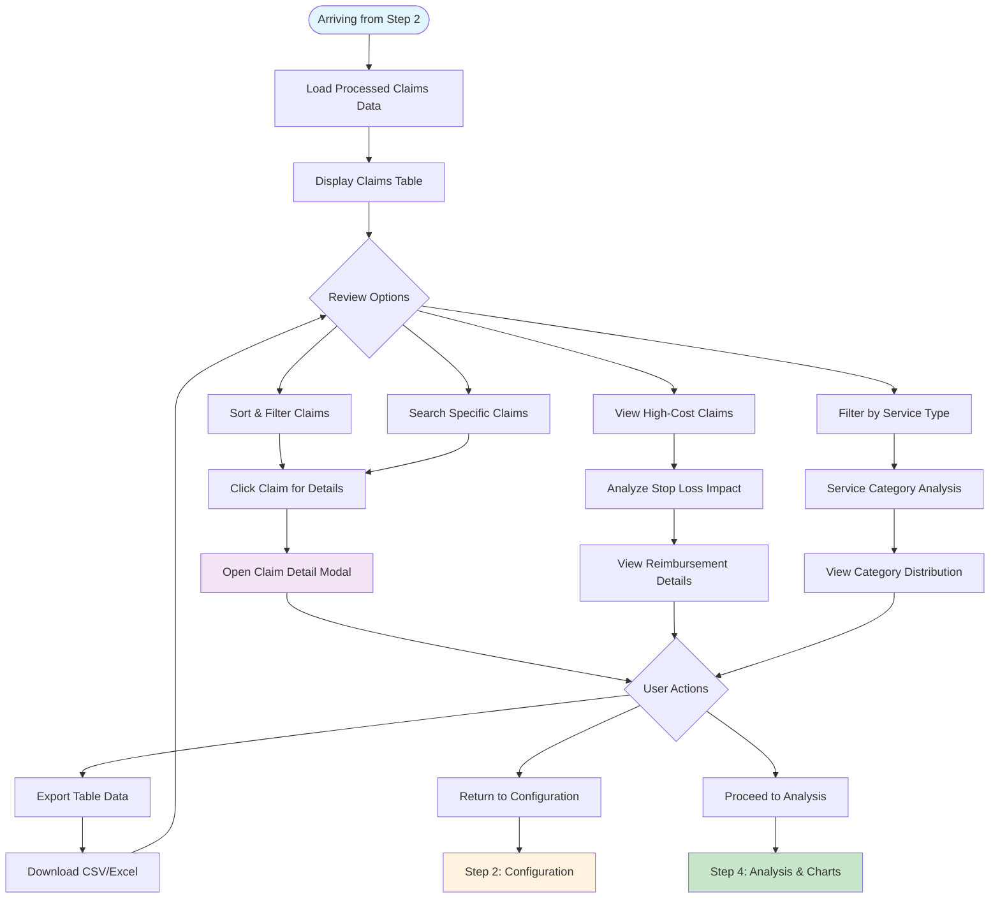

# Step 3: Data Review Layer - Complete Implementation Guide

## Overview

The Data Review Layer provides a comprehensive interface for examining processed claims data after configuration. This step enables users to validate their data, identify patterns, review high-cost claims, and understand the impact of their configuration settings before proceeding to visual analysis.

## Objectives

- **Data Validation**: Review processed claims for accuracy and completeness
- **Pattern Recognition**: Identify trends and outliers in the data
- **High-Cost Analysis**: Focus on claims that trigger stop loss coverage
- **Service Type Review**: Understand distribution across different service categories
- **Financial Impact**: See the effect of configuration on net costs
- **Quality Assurance**: Verify calculations and totals before analysis

## User Workflow Diagram



## Data Structure and Processing

### Processed Claims Schema
```javascript
const processedClaimSchema = {
  // Original data from Step 1
  ClaimantNumber: "string",
  ServiceType: "string", // 'Inpatient', 'Outpatient', 'Emergency', 'Pharmacy'
  ICDCode: "string",
  MedicalDesc: "string",
  LaymanTerm: "string",
  ClaimDate: "date",
  
  // Original amounts
  Medical: "number",
  Rx: "number",
  OriginalTotal: "number", // Medical + Rx
  
  // Configuration-enhanced fields from Step 2
  QualifiesForStopLoss: "boolean",
  ExcessAmount: "number", // Amount above stop loss threshold
  StopLossReimbursement: "number", // Reimbursement from stop loss
  RxRebateApplied: "number", // Rx rebate allocation
  
  // Net amounts after reimbursements
  NetMedical: "number",
  NetRx: "number", 
  NetTotal: "number",
  
  // Analysis fields
  RiskCategory: "string", // 'High Risk', 'Medium Risk', 'Low Risk', 'Minimal Risk'
  CostImpact: "string", // 'High Impact', 'Medium Impact', 'Low Impact'
  BudgetPercentage: "number", // Percentage of monthly budget
  
  // Calculated indicators
  SavingsFromStopLoss: "number",
  SavingsFromRxRebates: "number",
  TotalSavings: "number"
};
```

## Implementation Details

### 1. Claims Table Component

```jsx
const ClaimsTable = ({ 
  processedClaims, 
  configuration, 
  onClaimSelect,
  onExport,
  onReconfigure 
}) => {
  const [sortConfig, setSortConfig] = useState({ key: 'OriginalTotal', direction: 'desc' });
  const [filterConfig, setFilterConfig] = useState({
    serviceType: '',
    riskCategory: '',
    stopLoss: '',
    searchTerm: ''
  });
  const [currentPage, setCurrentPage] = useState(1);
  const [pageSize, setPageSize] = useState(25);
  const [selectedClaims, setSelectedClaims] = useState([]);

  // Filter and sort claims
  const filteredAndSortedClaims = useMemo(() => {
    let filtered = processedClaims;
    
    // Apply filters
    if (filterConfig.serviceType) {
      filtered = filtered.filter(claim => claim.ServiceType === filterConfig.serviceType);
    }
    
    if (filterConfig.riskCategory) {
      filtered = filtered.filter(claim => claim.RiskCategory === filterConfig.riskCategory);
    }
    
    if (filterConfig.stopLoss === 'qualifying') {
      filtered = filtered.filter(claim => claim.QualifiesForStopLoss);
    } else if (filterConfig.stopLoss === 'non-qualifying') {
      filtered = filtered.filter(claim => !claim.QualifiesForStopLoss);
    }
    
    if (filterConfig.searchTerm) {
      const term = filterConfig.searchTerm.toLowerCase();
      filtered = filtered.filter(claim => 
        claim.ClaimantNumber.toString().includes(term) ||
        claim.MedicalDesc.toLowerCase().includes(term) ||
        claim.LaymanTerm.toLowerCase().includes(term) ||
        claim.ICDCode.toLowerCase().includes(term)
      );
    }
    
    // Apply sorting
    const sorted = [...filtered].sort((a, b) => {
      const aValue = a[sortConfig.key];
      const bValue = b[sortConfig.key];
      
      if (typeof aValue === 'number' && typeof bValue === 'number') {
        return sortConfig.direction === 'asc' ? aValue - bValue : bValue - aValue;
      }
      
      const aStr = String(aValue).toLowerCase();
      const bStr = String(bValue).toLowerCase();
      
      if (sortConfig.direction === 'asc') {
        return aStr.localeCompare(bStr);
      } else {
        return bStr.localeCompare(aStr);
      }
    });
    
    return sorted;
  }, [processedClaims, sortConfig, filterConfig]);

  // Pagination
  const paginatedClaims = useMemo(() => {
    const startIndex = (currentPage - 1) * pageSize;
    return filteredAndSortedClaims.slice(startIndex, startIndex + pageSize);
  }, [filteredAndSortedClaims, currentPage, pageSize]);

  const totalPages = Math.ceil(filteredAndSortedClaims.length / pageSize);

  return (
    <div className="bg-white rounded-lg shadow-sm border">
      {/* Table Header and Controls */}
      <div className="p-6 border-b">
        <div className="flex justify-between items-center mb-4">
          <h2 className="text-xl font-semibold">Claims Data Review</h2>
          <div className="flex gap-2">
            <button 
              onClick={onReconfigure}
              className="px-4 py-2 text-blue-600 border border-blue-300 rounded hover:bg-blue-50"
            >
              Reconfigure
            </button>
            <button 
              onClick={() => onExport(filteredAndSortedClaims)}
              className="px-4 py-2 bg-green-600 text-white rounded hover:bg-green-700"
            >
              Export Data
            </button>
          </div>
        </div>
        
        <ClaimsTableFilters 
          filterConfig={filterConfig}
          onFilterChange={setFilterConfig}
          serviceTypes={getUniqueServiceTypes(processedClaims)}
          riskCategories={getUniqueRiskCategories(processedClaims)}
        />
      </div>

      {/* Summary Statistics */}
      <ClaimsTableSummary 
        allClaims={processedClaims}
        filteredClaims={filteredAndSortedClaims}
        configuration={configuration}
      />

      {/* Data Table */}
      <div className="overflow-x-auto">
        <table className="w-full">
          <ClaimsTableHeader 
            sortConfig={sortConfig}
            onSort={setSortConfig}
          />
          <tbody>
            {paginatedClaims.map((claim, index) => (
              <ClaimsTableRow
                key={claim.ClaimantNumber}
                claim={claim}
                isSelected={selectedClaims.includes(claim.ClaimantNumber)}
                onSelect={(selected) => {
                  if (selected) {
                    setSelectedClaims(prev => [...prev, claim.ClaimantNumber]);
                  } else {
                    setSelectedClaims(prev => prev.filter(id => id !== claim.ClaimantNumber));
                  }
                }}
                onClick={() => onClaimSelect(claim)}
                configuration={configuration}
              />
            ))}
          </tbody>
        </table>
      </div>

      {/* Pagination */}
      <ClaimsPagination 
        currentPage={currentPage}
        totalPages={totalPages}
        pageSize={pageSize}
        totalItems={filteredAndSortedClaims.length}
        onPageChange={setCurrentPage}
        onPageSizeChange={setPageSize}
      />
    </div>
  );
};
```

### 2. Advanced Filtering Component

```jsx
const ClaimsTableFilters = ({ 
  filterConfig, 
  onFilterChange, 
  serviceTypes, 
  riskCategories 
}) => {
  return (
    <div className="grid grid-cols-1 md:grid-cols-2 lg:grid-cols-4 gap-4">
      {/* Search Box */}
      <div>
        <label className="block text-sm font-medium mb-1">Search Claims</label>
        <div className="relative">
          <SearchIcon className="absolute left-3 top-1/2 transform -translate-y-1/2 w-4 h-4 text-gray-400" />
          <input
            type="text"
            placeholder="Claimant, Description, ICD Code..."
            value={filterConfig.searchTerm}
            onChange={(e) => onFilterChange({
              ...filterConfig,
              searchTerm: e.target.value
            })}
            className="w-full pl-10 pr-4 py-2 border rounded-md focus:ring-2 focus:ring-blue-500 focus:border-blue-500"
          />
        </div>
      </div>

      {/* Service Type Filter */}
      <div>
        <label className="block text-sm font-medium mb-1">Service Type</label>
        <select
          value={filterConfig.serviceType}
          onChange={(e) => onFilterChange({
            ...filterConfig,
            serviceType: e.target.value
          })}
          className="w-full px-3 py-2 border rounded-md focus:ring-2 focus:ring-blue-500 focus:border-blue-500"
        >
          <option value="">All Service Types</option>
          {serviceTypes.map(type => (
            <option key={type} value={type}>{type}</option>
          ))}
        </select>
      </div>

      {/* Risk Category Filter */}
      <div>
        <label className="block text-sm font-medium mb-1">Risk Category</label>
        <select
          value={filterConfig.riskCategory}
          onChange={(e) => onFilterChange({
            ...filterConfig,
            riskCategory: e.target.value
          })}
          className="w-full px-3 py-2 border rounded-md focus:ring-2 focus:ring-blue-500 focus:border-blue-500"
        >
          <option value="">All Risk Levels</option>
          {riskCategories.map(category => (
            <option key={category} value={category}>{category}</option>
          ))}
        </select>
      </div>

      {/* Stop Loss Filter */}
      <div>
        <label className="block text-sm font-medium mb-1">Stop Loss Status</label>
        <select
          value={filterConfig.stopLoss}
          onChange={(e) => onFilterChange({
            ...filterConfig,
            stopLoss: e.target.value
          })}
          className="w-full px-3 py-2 border rounded-md focus:ring-2 focus:ring-blue-500 focus:border-blue-500"
        >
          <option value="">All Claims</option>
          <option value="qualifying">Qualifies for Stop Loss</option>
          <option value="non-qualifying">Does Not Qualify</option>
        </select>
      </div>
    </div>
  );
};
```

### 3. Claims Table Row Component

```jsx
const ClaimsTableRow = ({ 
  claim, 
  isSelected, 
  onSelect, 
  onClick, 
  configuration 
}) => {
  const budgetPercentage = (claim.NetTotal / configuration.budgetParameters.monthlyBudget.value) * 100;
  
  return (
    <tr 
      className={`border-b hover:bg-gray-50 cursor-pointer transition-colors ${
        isSelected ? 'bg-blue-50' : ''
      } ${claim.QualifiesForStopLoss ? 'border-l-4 border-l-orange-400' : ''}`}
      onClick={onClick}
    >
      {/* Selection Checkbox */}
      <td className="px-4 py-3">
        <input
          type="checkbox"
          checked={isSelected}
          onChange={(e) => {
            e.stopPropagation();
            onSelect(e.target.checked);
          }}
          className="rounded border-gray-300 text-blue-600 focus:ring-blue-500"
        />
      </td>

      {/* Claimant Number */}
      <td className="px-4 py-3 font-medium">
        {claim.ClaimantNumber}
      </td>

      {/* Service Type with Badge */}
      <td className="px-4 py-3">
        <ServiceTypeBadge type={claim.ServiceType} />
      </td>

      {/* Medical Description */}
      <td className="px-4 py-3 max-w-xs">
        <div className="truncate" title={claim.MedicalDesc}>
          {claim.MedicalDesc || claim.LaymanTerm || 'N/A'}
        </div>
        {claim.ICDCode && (
          <div className="text-xs text-gray-500">
            ICD: {claim.ICDCode}
          </div>
        )}
      </td>

      {/* Original Amounts */}
      <td className="px-4 py-3 text-right">
        <div className="font-medium">{formatCurrency(claim.Medical)}</div>
        <div className="text-xs text-gray-500">Medical</div>
      </td>
      <td className="px-4 py-3 text-right">
        <div className="font-medium">{formatCurrency(claim.Rx)}</div>
        <div className="text-xs text-gray-500">Pharmacy</div>
      </td>
      <td className="px-4 py-3 text-right">
        <div className="font-semibold">{formatCurrency(claim.OriginalTotal)}</div>
        <div className="text-xs text-gray-500">Original</div>
      </td>

      {/* Stop Loss Impact */}
      <td className="px-4 py-3 text-right">
        {claim.QualifiesForStopLoss ? (
          <div>
            <div className="font-medium text-green-600">
              {formatCurrency(claim.StopLossReimbursement)}
            </div>
            <div className="text-xs text-gray-500">
              Reimbursed
            </div>
          </div>
        ) : (
          <span className="text-gray-400">—</span>
        )}
      </td>

      {/* Net Total After All Adjustments */}
      <td className="px-4 py-3 text-right">
        <div className="font-semibold">{formatCurrency(claim.NetTotal)}</div>
        <div className="text-xs text-gray-500">
          {budgetPercentage < 0.1 ? '<0.1' : budgetPercentage.toFixed(1)}% of budget
        </div>
      </td>

      {/* Risk Category */}
      <td className="px-4 py-3">
        <RiskCategoryBadge category={claim.RiskCategory} />
      </td>

      {/* Actions */}
      <td className="px-4 py-3">
        <button
          onClick={(e) => {
            e.stopPropagation();
            onClick();
          }}
          className="text-blue-600 hover:text-blue-800 text-sm"
        >
          View Details
        </button>
      </td>
    </tr>
  );
};
```

### 4. Summary Statistics Panel

```jsx
const ClaimsTableSummary = ({ allClaims, filteredClaims, configuration }) => {
  const summaryStats = useMemo(() => {
    const filtered = filteredClaims;
    const all = allClaims;
    
    return {
      filtered: {
        count: filtered.length,
        originalTotal: _.sumBy(filtered, 'OriginalTotal'),
        netTotal: _.sumBy(filtered, 'NetTotal'),
        stopLossReimbursement: _.sumBy(filtered, 'StopLossReimbursement'),
        rxRebates: _.sumBy(filtered, 'RxRebateApplied'),
        highCostCount: filtered.filter(c => c.QualifiesForStopLoss).length
      },
      all: {
        count: all.length,
        originalTotal: _.sumBy(all, 'OriginalTotal'),
        netTotal: _.sumBy(all, 'NetTotal'),
        stopLossReimbursement: _.sumBy(all, 'StopLossReimbursement'),
        rxRebates: _.sumBy(all, 'RxRebateApplied'),
        highCostCount: all.filter(c => c.QualifiesForStopLoss).length
      }
    };
  }, [allClaims, filteredClaims]);

  const savingsPercentage = summaryStats.filtered.originalTotal > 0 
    ? ((summaryStats.filtered.stopLossReimbursement + summaryStats.filtered.rxRebates) / summaryStats.filtered.originalTotal) * 100
    : 0;

  const budgetImpact = (summaryStats.filtered.netTotal / configuration.budgetParameters.monthlyBudget.value) * 100;

  return (
    <div className="px-6 py-4 bg-gray-50 border-b">
      <div className="grid grid-cols-2 md:grid-cols-4 lg:grid-cols-6 gap-4">
        <div className="text-center">
          <div className="text-2xl font-bold text-blue-600">
            {summaryStats.filtered.count}
          </div>
          <div className="text-sm text-gray-600">
            Claims Shown
          </div>
          {summaryStats.filtered.count !== summaryStats.all.count && (
            <div className="text-xs text-gray-500">
              of {summaryStats.all.count} total
            </div>
          )}
        </div>

        <div className="text-center">
          <div className="text-2xl font-bold text-gray-800">
            {formatCurrency(summaryStats.filtered.originalTotal)}
          </div>
          <div className="text-sm text-gray-600">
            Original Cost
          </div>
          <div className="text-xs text-gray-500">
            Before adjustments
          </div>
        </div>

        <div className="text-center">
          <div className="text-2xl font-bold text-green-600">
            {formatCurrency(summaryStats.filtered.stopLossReimbursement + summaryStats.filtered.rxRebates)}
          </div>
          <div className="text-sm text-gray-600">
            Total Savings
          </div>
          <div className="text-xs text-gray-500">
            {savingsPercentage.toFixed(1)}% reduction
          </div>
        </div>

        <div className="text-center">
          <div className="text-2xl font-bold text-purple-600">
            {formatCurrency(summaryStats.filtered.netTotal)}
          </div>
          <div className="text-sm text-gray-600">
            Net Cost
          </div>
          <div className="text-xs text-gray-500">
            After all adjustments
          </div>
        </div>

        <div className="text-center">
          <div className="text-2xl font-bold text-orange-600">
            {summaryStats.filtered.highCostCount}
          </div>
          <div className="text-sm text-gray-600">
            High-Cost Claims
          </div>
          <div className="text-xs text-gray-500">
            Stop loss qualified
          </div>
        </div>

        <div className="text-center">
          <div className={`text-2xl font-bold ${budgetImpact > 100 ? 'text-red-600' : 'text-green-600'}`}>
            {budgetImpact.toFixed(1)}%
          </div>
          <div className="text-sm text-gray-600">
            Budget Impact
          </div>
          <div className="text-xs text-gray-500">
            of monthly budget
          </div>
        </div>
      </div>
    </div>
  );
};
```

### 5. Claim Detail Modal

```jsx
const ClaimDetailModal = ({ claim, configuration, isOpen, onClose }) => {
  if (!isOpen || !claim) return null;

  const stopLossThreshold = configuration.budgetParameters.stopLossThreshold.value;
  const reimbursementRate = configuration.budgetParameters.reimbursementRate.value;

  return (
    <div className="fixed inset-0 bg-black bg-opacity-50 flex items-center justify-center z-50">
      <div className="bg-white rounded-lg shadow-xl max-w-2xl w-full mx-4 max-h-[90vh] overflow-y-auto">
        {/* Modal Header */}
        <div className="px-6 py-4 border-b bg-gray-50 rounded-t-lg">
          <div className="flex justify-between items-center">
            <h3 className="text-lg font-semibold">
              Claim Details - {claim.ClaimantNumber}
            </h3>
            <button
              onClick={onClose}
              className="text-gray-400 hover:text-gray-600"
            >
              <XIcon className="w-6 h-6" />
            </button>
          </div>
        </div>

        {/* Modal Content */}
        <div className="px-6 py-4 space-y-6">
          {/* Basic Information */}
          <div>
            <h4 className="font-semibold mb-3">Basic Information</h4>
            <div className="grid grid-cols-2 gap-4">
              <div>
                <label className="block text-sm font-medium text-gray-600">Claimant Number</label>
                <div className="mt-1">{claim.ClaimantNumber}</div>
              </div>
              <div>
                <label className="block text-sm font-medium text-gray-600">Service Type</label>
                <div className="mt-1">
                  <ServiceTypeBadge type={claim.ServiceType} />
                </div>
              </div>
              <div>
                <label className="block text-sm font-medium text-gray-600">ICD Code</label>
                <div className="mt-1">{claim.ICDCode || 'N/A'}</div>
              </div>
              <div>
                <label className="block text-sm font-medium text-gray-600">Risk Category</label>
                <div className="mt-1">
                  <RiskCategoryBadge category={claim.RiskCategory} />
                </div>
              </div>
            </div>
          </div>

          {/* Medical Description */}
          <div>
            <h4 className="font-semibold mb-3">Medical Information</h4>
            <div className="space-y-3">
              <div>
                <label className="block text-sm font-medium text-gray-600">Medical Description</label>
                <div className="mt-1 p-3 bg-gray-50 rounded">
                  {claim.MedicalDesc || 'No description available'}
                </div>
              </div>
              {claim.LaymanTerm && (
                <div>
                  <label className="block text-sm font-medium text-gray-600">Layman Terms</label>
                  <div className="mt-1 p-3 bg-blue-50 rounded">
                    {claim.LaymanTerm}
                  </div>
                </div>
              )}
            </div>
          </div>

          {/* Cost Breakdown */}
          <div>
            <h4 className="font-semibold mb-3">Cost Breakdown</h4>
            <div className="space-y-4">
              {/* Original Costs */}
              <div className="bg-gray-50 p-4 rounded">
                <h5 className="font-medium mb-2">Original Costs</h5>
                <div className="grid grid-cols-3 gap-4 text-center">
                  <div>
                    <div className="text-lg font-semibold">{formatCurrency(claim.Medical)}</div>
                    <div className="text-sm text-gray-600">Medical</div>
                  </div>
                  <div>
                    <div className="text-lg font-semibold">{formatCurrency(claim.Rx)}</div>
                    <div className="text-sm text-gray-600">Pharmacy</div>
                  </div>
                  <div>
                    <div className="text-lg font-semibold">{formatCurrency(claim.OriginalTotal)}</div>
                    <div className="text-sm text-gray-600">Total</div>
                  </div>
                </div>
              </div>

              {/* Stop Loss Analysis */}
              <div className={`p-4 rounded ${claim.QualifiesForStopLoss ? 'bg-orange-50' : 'bg-green-50'}`}>
                <h5 className="font-medium mb-2">Stop Loss Analysis</h5>
                <div className="space-y-2 text-sm">
                  <div className="flex justify-between">
                    <span>Stop Loss Threshold:</span>
                    <span className="font-medium">{formatCurrency(stopLossThreshold)}</span>
                  </div>
                  <div className="flex justify-between">
                    <span>Claim Total:</span>
                    <span className="font-medium">{formatCurrency(claim.OriginalTotal)}</span>
                  </div>
                  <div className="flex justify-between">
                    <span>Qualifies for Stop Loss:</span>
                    <span className={`font-medium ${claim.QualifiesForStopLoss ? 'text-orange-600' : 'text-green-600'}`}>
                      {claim.QualifiesForStopLoss ? 'Yes' : 'No'}
                    </span>
                  </div>
                  {claim.QualifiesForStopLoss && (
                    <>
                      <div className="flex justify-between">
                        <span>Excess Amount:</span>
                        <span className="font-medium">{formatCurrency(claim.ExcessAmount)}</span>
                      </div>
                      <div className="flex justify-between">
                        <span>Reimbursement Rate:</span>
                        <span className="font-medium">{reimbursementRate}%</span>
                      </div>
                      <div className="flex justify-between border-t pt-2">
                        <span>Stop Loss Reimbursement:</span>
                        <span className="font-semibold text-green-600">
                          {formatCurrency(claim.StopLossReimbursement)}
                        </span>
                      </div>
                    </>
                  )}
                </div>
              </div>

              {/* Rx Rebates */}
              {claim.RxRebateApplied > 0 && (
                <div className="bg-blue-50 p-4 rounded">
                  <h5 className="font-medium mb-2">Pharmacy Rebates</h5>
                  <div className="flex justify-between text-sm">
                    <span>Rx Rebate Applied:</span>
                    <span className="font-semibold text-blue-600">
                      {formatCurrency(claim.RxRebateApplied)}
                    </span>
                  </div>
                </div>
              )}

              {/* Final Net Costs */}
              <div className="bg-purple-50 p-4 rounded">
                <h5 className="font-medium mb-2">Net Costs After All Adjustments</h5>
                <div className="grid grid-cols-3 gap-4 text-center">
                  <div>
                    <div className="text-lg font-semibold">{formatCurrency(claim.NetMedical)}</div>
                    <div className="text-sm text-gray-600">Net Medical</div>
                  </div>
                  <div>
                    <div className="text-lg font-semibold">{formatCurrency(claim.NetRx)}</div>
                    <div className="text-sm text-gray-600">Net Pharmacy</div>
                  </div>
                  <div>
                    <div className="text-lg font-semibold text-purple-600">{formatCurrency(claim.NetTotal)}</div>
                    <div className="text-sm text-gray-600">Net Total</div>
                  </div>
                </div>
              </div>

              {/* Total Savings Summary */}
              <div className="bg-green-50 p-4 rounded">
                <h5 className="font-medium mb-2">Total Savings</h5>
                <div className="space-y-2 text-sm">
                  <div className="flex justify-between">
                    <span>Stop Loss Savings:</span>
                    <span className="font-medium text-green-600">
                      {formatCurrency(claim.StopLossReimbursement)}
                    </span>
                  </div>
                  <div className="flex justify-between">
                    <span>Rx Rebate Savings:</span>
                    <span className="font-medium text-green-600">
                      {formatCurrency(claim.RxRebateApplied)}
                    </span>
                  </div>
                  <div className="flex justify-between border-t pt-2">
                    <span className="font-medium">Total Savings:</span>
                    <span className="font-semibold text-green-600">
                      {formatCurrency(claim.StopLossReimbursement + claim.RxRebateApplied)}
                    </span>
                  </div>
                  <div className="flex justify-between">
                    <span>Savings Percentage:</span>
                    <span className="font-medium text-green-600">
                      {((claim.StopLossReimbursement + claim.RxRebateApplied) / claim.OriginalTotal * 100).toFixed(1)}%
                    </span>
                  </div>
                </div>
              </div>
            </div>
          </div>
        </div>

        {/* Modal Footer */}
        <div className="px-6 py-4 border-t bg-gray-50 rounded-b-lg">
          <div className="flex justify-end space-x-3">
            <button
              onClick={onClose}
              className="px-4 py-2 text-gray-600 border border-gray-300 rounded hover:bg-gray-50"
            >
              Close
            </button>
            <button
              onClick={() => exportClaimDetail(claim)}
              className="px-4 py-2 bg-blue-600 text-white rounded hover:bg-blue-700"
            >
              Export Claim
            </button>
          </div>
        </div>
      </div>
    </div>
  );
};
```

### 6. Export Functionality

```javascript
const exportTableData = (claims, format = 'csv') => {
  const headers = [
    'Claimant Number',
    'Service Type',
    'ICD Code',
    'Medical Description',
    'Original Medical',
    'Original Rx',
    'Original Total',
    'Stop Loss Qualified',
    'Stop Loss Reimbursement',
    'Rx Rebate Applied',
    'Net Medical',
    'Net Rx',
    'Net Total',
    'Risk Category',
    'Cost Impact',
    'Budget Percentage'
  ];

  const rows = claims.map(claim => [
    claim.ClaimantNumber,
    claim.ServiceType,
    claim.ICDCode || '',
    claim.MedicalDesc || '',
    claim.Medical,
    claim.Rx,
    claim.OriginalTotal,
    claim.QualifiesForStopLoss ? 'Yes' : 'No',
    claim.StopLossReimbursement,
    claim.RxRebateApplied,
    claim.NetMedical,
    claim.NetRx,
    claim.NetTotal,
    claim.RiskCategory,
    claim.CostImpact,
    claim.BudgetPercentage
  ]);

  if (format === 'csv') {
    return exportToCSV(headers, rows, 'claims-data-review');
  } else if (format === 'excel') {
    return exportToExcel(headers, rows, 'claims-data-review');
  }
};

const exportToCSV = (headers, rows, filename) => {
  const csvContent = [
    headers.join(','),
    ...rows.map(row => 
      row.map(field => 
        typeof field === 'string' && field.includes(',') 
          ? `"${field.replace(/"/g, '""')}"` 
          : field
      ).join(',')
    )
  ].join('\n');

  const blob = new Blob([csvContent], { type: 'text/csv;charset=utf-8;' });
  const link = document.createElement('a');
  const url = URL.createObjectURL(blob);
  link.setAttribute('href', url);
  link.setAttribute('download', `${filename}-${new Date().toISOString().split('T')[0]}.csv`);
  link.style.visibility = 'hidden';
  document.body.appendChild(link);
  link.click();
  document.body.removeChild(link);
};

const exportClaimDetail = (claim) => {
  const detailData = {
    'Claim Information': {
      'Claimant Number': claim.ClaimantNumber,
      'Service Type': claim.ServiceType,
      'ICD Code': claim.ICDCode || 'N/A',
      'Medical Description': claim.MedicalDesc || 'N/A',
      'Risk Category': claim.RiskCategory
    },
    'Original Costs': {
      'Medical': formatCurrency(claim.Medical),
      'Pharmacy': formatCurrency(claim.Rx),
      'Total': formatCurrency(claim.OriginalTotal)
    },
    'Stop Loss Analysis': {
      'Qualifies': claim.QualifiesForStopLoss ? 'Yes' : 'No',
      'Excess Amount': formatCurrency(claim.ExcessAmount),
      'Reimbursement': formatCurrency(claim.StopLossReimbursement)
    },
    'Net Costs': {
      'Net Medical': formatCurrency(claim.NetMedical),
      'Net Pharmacy': formatCurrency(claim.NetRx),
      'Net Total': formatCurrency(claim.NetTotal)
    },
    'Savings': {
      'Stop Loss Savings': formatCurrency(claim.StopLossReimbursement),
      'Rx Rebate Savings': formatCurrency(claim.RxRebateApplied),
      'Total Savings': formatCurrency(claim.StopLossReimbursement + claim.RxRebateApplied),
      'Savings Percentage': `${((claim.StopLossReimbursement + claim.RxRebateApplied) / claim.OriginalTotal * 100).toFixed(1)}%`
    }
  };

  const jsonContent = JSON.stringify(detailData, null, 2);
  const blob = new Blob([jsonContent], { type: 'application/json' });
  const url = URL.createObjectURL(blob);
  const link = document.createElement('a');
  link.href = url;
  link.download = `claim-detail-${claim.ClaimantNumber}-${new Date().toISOString().split('T')[0]}.json`;
  link.click();
  URL.revokeObjectURL(url);
};
```

## High-Cost Claims Analysis

### 1. High-Cost Claims Filter Component

```jsx
const HighCostClaimsAnalysis = ({ claims, configuration }) => {
  const stopLossThreshold = configuration.budgetParameters.stopLossThreshold.value;
  
  const highCostClaims = useMemo(() => {
    return claims
      .filter(claim => claim.QualifiesForStopLoss)
      .sort((a, b) => b.OriginalTotal - a.OriginalTotal);
  }, [claims]);

  const analysisData = useMemo(() => {
    const totalOriginalCost = _.sumBy(highCostClaims, 'OriginalTotal');
    const totalReimbursement = _.sumBy(highCostClaims, 'StopLossReimbursement');
    const totalNetCost = _.sumBy(highCostClaims, 'NetTotal');
    
    return {
      count: highCostClaims.length,
      totalOriginalCost,
      totalReimbursement,
      totalNetCost,
      averageClaim: totalOriginalCost / highCostClaims.length || 0,
      reimbursementPercentage: (totalReimbursement / totalOriginalCost) * 100 || 0,
      budgetImpact: (totalNetCost / configuration.budgetParameters.monthlyBudget.value) * 100
    };
  }, [highCostClaims, configuration]);

  return (
    <div className="bg-white rounded-lg shadow-sm border p-6">
      <h3 className="text-lg font-semibold mb-4 flex items-center">
        <ExclamationTriangleIcon className="w-5 h-5 mr-2 text-orange-600" />
        High-Cost Claims Analysis
      </h3>

      {/* Summary Cards */}
      <div className="grid grid-cols-2 md:grid-cols-4 gap-4 mb-6">
        <div className="text-center p-3 bg-orange-50 rounded">
          <div className="text-2xl font-bold text-orange-600">{analysisData.count}</div>
          <div className="text-sm text-gray-600">High-Cost Claims</div>
        </div>
        <div className="text-center p-3 bg-red-50 rounded">
          <div className="text-2xl font-bold text-red-600">
            {formatCurrency(analysisData.totalOriginalCost)}
          </div>
          <div className="text-sm text-gray-600">Original Cost</div>
        </div>
        <div className="text-center p-3 bg-green-50 rounded">
          <div className="text-2xl font-bold text-green-600">
            {formatCurrency(analysisData.totalReimbursement)}
          </div>
          <div className="text-sm text-gray-600">Reimbursed</div>
        </div>
        <div className="text-center p-3 bg-purple-50 rounded">
          <div className="text-2xl font-bold text-purple-600">
            {formatCurrency(analysisData.totalNetCost)}
          </div>
          <div className="text-sm text-gray-600">Net Cost</div>
        </div>
      </div>

      {/* Top High-Cost Claims Table */}
      <div className="mb-4">
        <h4 className="font-medium mb-2">Top 10 Highest Claims</h4>
        <div className="overflow-x-auto">
          <table className="w-full text-sm">
            <thead className="bg-gray-50">
              <tr>
                <th className="px-3 py-2 text-left">Claimant</th>
                <th className="px-3 py-2 text-left">Service Type</th>
                <th className="px-3 py-2 text-right">Original</th>
                <th className="px-3 py-2 text-right">Reimbursed</th>
                <th className="px-3 py-2 text-right">Net Cost</th>
                <th className="px-3 py-2 text-center">Impact</th>
              </tr>
            </thead>
            <tbody>
              {highCostClaims.slice(0, 10).map((claim, index) => (
                <tr key={claim.ClaimantNumber} className="border-b">
                  <td className="px-3 py-2 font-medium">{claim.ClaimantNumber}</td>
                  <td className="px-3 py-2">
                    <ServiceTypeBadge type={claim.ServiceType} size="sm" />
                  </td>
                  <td className="px-3 py-2 text-right font-medium">
                    {formatCurrency(claim.OriginalTotal)}
                  </td>
                  <td className="px-3 py-2 text-right text-green-600">
                    {formatCurrency(claim.StopLossReimbursement)}
                  </td>
                  <td className="px-3 py-2 text-right font-medium">
                    {formatCurrency(claim.NetTotal)}
                  </td>
                  <td className="px-3 py-2 text-center">
                    <span className={`px-2 py-1 rounded text-xs font-medium ${
                      claim.CostImpact === 'High Impact' 
                        ? 'bg-red-100 text-red-800'
                        : claim.CostImpact === 'Medium Impact'
                        ? 'bg-yellow-100 text-yellow-800'
                        : 'bg-green-100 text-green-800'
                    }`}>
                      {claim.CostImpact}
                    </span>
                  </td>
                </tr>
              ))}
            </tbody>
          </table>
        </div>
      </div>

      {/* Analysis Insights */}
      <div className="bg-blue-50 p-4 rounded">
        <h4 className="font-medium mb-2">Key Insights</h4>
        <ul className="text-sm space-y-1">
          <li>• Average high-cost claim: {formatCurrency(analysisData.averageClaim)}</li>
          <li>• Stop loss reimbursement rate: {analysisData.reimbursementPercentage.toFixed(1)}%</li>
          <li>• Budget impact after reimbursement: {analysisData.budgetImpact.toFixed(1)}%</li>
          <li>• Threshold effectiveness: {highCostClaims.length > 0 ? 'Active' : 'No qualifying claims'}</li>
        </ul>
      </div>
    </div>
  );
};
```

### 2. Enhanced High-Cost Claimant Exhibit

```jsx
const EnhancedHighCostExhibit = ({ claims, configuration }) => {
  const [selectedMemberType, setSelectedMemberType] = useState('all');
  const [selectedProvider, setSelectedProvider] = useState('all');
  const [sortField, setSortField] = useState('totalCost');
  const [sortDirection, setSortDirection] = useState('desc');

  // Enhanced high-cost claims with additional fields for comprehensive analysis
  const enhancedHighCostClaims = useMemo(() => {
    return claims
      .filter(claim => claim.QualifiesForStopLoss)
      .map(claim => ({
        ...claim,
        // Enhanced fields for comprehensive analysis
        memberType: determineMemberType(claim),
        primaryDiagnosis: extractPrimaryDiagnosis(claim.ICDCode, claim.MedicalDesc),
        diagnosisCategory: categorizeDiagnosis(claim.ICDCode),
        providerName: extractProviderName(claim.providerInfo),
        providerType: determineProviderType(claim.ServiceType, claim.providerInfo),
        enrollmentStatus: determineEnrollmentStatus(claim),
        stopLossRecovery: calculateStopLossRecovery(claim, configuration),
        utilizationPattern: analyzeUtilizationPattern(claim),
        riskScore: calculateRiskScore(claim),
        treatmentContinuity: assessTreatmentContinuity(claim, claims)
      }))
      .sort((a, b) => {
        const aVal = a[sortField];
        const bVal = b[sortField];
        return sortDirection === 'desc' ? bVal - aVal : aVal - bVal;
      });
  }, [claims, configuration, sortField, sortDirection]);

  // Filter by member type and provider
  const filteredClaims = useMemo(() => {
    let filtered = enhancedHighCostClaims;
    
    if (selectedMemberType !== 'all') {
      filtered = filtered.filter(claim => claim.memberType === selectedMemberType);
    }
    
    if (selectedProvider !== 'all') {
      filtered = filtered.filter(claim => claim.providerName === selectedProvider);
    }
    
    return filtered;
  }, [enhancedHighCostClaims, selectedMemberType, selectedProvider]);

  // Extract unique values for filters
  const memberTypes = [...new Set(enhancedHighCostClaims.map(c => c.memberType))];
  const providers = [...new Set(enhancedHighCostClaims.map(c => c.providerName))];

  return (
    <div className="bg-white rounded-lg shadow-sm border p-6">
      <div className="flex justify-between items-center mb-6">
        <h3 className="text-lg font-semibold flex items-center">
          <DocumentChartBarIcon className="w-5 h-5 mr-2 text-blue-600" />
          Enhanced High-Cost Claimant Exhibit
        </h3>
        <button 
          onClick={() => exportEnhancedExhibit(filteredClaims)}
          className="px-4 py-2 bg-blue-600 text-white rounded hover:bg-blue-700 text-sm"
        >
          Export Exhibit
        </button>
      </div>

      {/* Filters and Controls */}
      <div className="grid grid-cols-1 md:grid-cols-3 gap-4 mb-6">
        <div>
          <label className="block text-sm font-medium mb-1">Member Type</label>
          <select
            value={selectedMemberType}
            onChange={(e) => setSelectedMemberType(e.target.value)}
            className="w-full px-3 py-2 border rounded-md focus:ring-2 focus:ring-blue-500"
          >
            <option value="all">All Member Types</option>
            {memberTypes.map(type => (
              <option key={type} value={type}>{type}</option>
            ))}
          </select>
        </div>
        
        <div>
          <label className="block text-sm font-medium mb-1">Provider</label>
          <select
            value={selectedProvider}
            onChange={(e) => setSelectedProvider(e.target.value)}
            className="w-full px-3 py-2 border rounded-md focus:ring-2 focus:ring-blue-500"
          >
            <option value="all">All Providers</option>
            {providers.map(provider => (
              <option key={provider} value={provider}>{provider}</option>
            ))}
          </select>
        </div>

        <div>
          <label className="block text-sm font-medium mb-1">Sort By</label>
          <select
            value={`${sortField}-${sortDirection}`}
            onChange={(e) => {
              const [field, direction] = e.target.value.split('-');
              setSortField(field);
              setSortDirection(direction);
            }}
            className="w-full px-3 py-2 border rounded-md focus:ring-2 focus:ring-blue-500"
          >
            <option value="OriginalTotal-desc">Total Cost (High to Low)</option>
            <option value="OriginalTotal-asc">Total Cost (Low to High)</option>
            <option value="stopLossRecovery-desc">Recovery Amount (High to Low)</option>
            <option value="riskScore-desc">Risk Score (High to Low)</option>
            <option value="ClaimantNumber-asc">Claimant ID (A to Z)</option>
          </select>
        </div>
      </div>

      {/* Summary Statistics */}
      <div className="grid grid-cols-2 md:grid-cols-5 gap-4 mb-6 p-4 bg-gray-50 rounded">
        <div className="text-center">
          <div className="text-xl font-bold text-red-600">{filteredClaims.length}</div>
          <div className="text-sm text-gray-600">High-Cost Claimants</div>
        </div>
        <div className="text-center">
          <div className="text-xl font-bold text-orange-600">
            {formatCurrency(_.sumBy(filteredClaims, 'OriginalTotal'))}
          </div>
          <div className="text-sm text-gray-600">Total Claims Cost</div>
        </div>
        <div className="text-center">
          <div className="text-xl font-bold text-green-600">
            {formatCurrency(_.sumBy(filteredClaims, 'stopLossRecovery'))}
          </div>
          <div className="text-sm text-gray-600">Total Recovery</div>
        </div>
        <div className="text-center">
          <div className="text-xl font-bold text-purple-600">
            {formatCurrency(_.sumBy(filteredClaims, 'NetTotal'))}
          </div>
          <div className="text-sm text-gray-600">Net Cost</div>
        </div>
        <div className="text-center">
          <div className="text-xl font-bold text-blue-600">
            {(_.sumBy(filteredClaims, 'stopLossRecovery') / _.sumBy(filteredClaims, 'OriginalTotal') * 100).toFixed(1)}%
          </div>
          <div className="text-sm text-gray-600">Recovery Rate</div>
        </div>
      </div>

      {/* Enhanced Claims Table */}
      <div className="overflow-x-auto">
        <table className="w-full text-sm">
          <thead className="bg-gray-50">
            <tr>
              <th className="px-3 py-2 text-left">Claimant ID</th>
              <th className="px-3 py-2 text-left">Member Type</th>
              <th className="px-3 py-2 text-left">Primary Diagnosis</th>
              <th className="px-3 py-2 text-left">Diagnosis Category</th>
              <th className="px-3 py-2 text-left">Provider</th>
              <th className="px-3 py-2 text-left">Provider Type</th>
              <th className="px-3 py-2 text-center">Enrollment Status</th>
              <th className="px-3 py-2 text-right">Total Cost</th>
              <th className="px-3 py-2 text-right">Stop Loss Recovery</th>
              <th className="px-3 py-2 text-right">Net Cost</th>
              <th className="px-3 py-2 text-center">Risk Score</th>
              <th className="px-3 py-2 text-center">Utilization Pattern</th>
            </tr>
          </thead>
          <tbody>
            {filteredClaims.map((claim, index) => (
              <tr key={claim.ClaimantNumber} className="border-b hover:bg-gray-50">
                <td className="px-3 py-2 font-medium">{claim.ClaimantNumber}</td>
                <td className="px-3 py-2">
                  <span className={`px-2 py-1 rounded-full text-xs font-medium ${
                    getMemberTypeBadgeColor(claim.memberType)
                  }`}>
                    {claim.memberType}
                  </span>
                </td>
                <td className="px-3 py-2 max-w-xs">
                  <div className="truncate" title={claim.primaryDiagnosis}>
                    {claim.primaryDiagnosis}
                  </div>
                  <div className="text-xs text-gray-500">{claim.ICDCode}</div>
                </td>
                <td className="px-3 py-2">{claim.diagnosisCategory}</td>
                <td className="px-3 py-2 max-w-xs">
                  <div className="truncate" title={claim.providerName}>
                    {claim.providerName}
                  </div>
                </td>
                <td className="px-3 py-2">{claim.providerType}</td>
                <td className="px-3 py-2 text-center">
                  <span className={`px-2 py-1 rounded-full text-xs font-medium ${
                    getEnrollmentStatusColor(claim.enrollmentStatus)
                  }`}>
                    {claim.enrollmentStatus}
                  </span>
                </td>
                <td className="px-3 py-2 text-right font-medium">
                  {formatCurrency(claim.OriginalTotal)}
                </td>
                <td className="px-3 py-2 text-right text-green-600 font-medium">
                  {formatCurrency(claim.stopLossRecovery)}
                </td>
                <td className="px-3 py-2 text-right font-medium">
                  {formatCurrency(claim.NetTotal)}
                </td>
                <td className="px-3 py-2 text-center">
                  <RiskScoreBadge score={claim.riskScore} />
                </td>
                <td className="px-3 py-2 text-center">
                  <UtilizationPatternBadge pattern={claim.utilizationPattern} />
                </td>
              </tr>
            ))}
          </tbody>
        </table>
      </div>

      {/* Additional Analysis Section */}
      <div className="mt-6 grid grid-cols-1 md:grid-cols-2 gap-6">
        <DiagnosisCategoryBreakdown claims={filteredClaims} />
        <ProviderAnalysis claims={filteredClaims} />
      </div>
    </div>
  );
};

// Helper functions for enhanced exhibit
const determineMemberType = (claim) => {
  // Logic to determine member type based on claim data
  if (claim.ServiceType === 'Emergency') return 'Emergency Patient';
  if (claim.ServiceType === 'Inpatient') return 'Inpatient';
  if (claim.ServiceType === 'Outpatient') return 'Outpatient';
  if (claim.ServiceType === 'Pharmacy') return 'Pharmacy Patient';
  return 'General Member';
};

const extractPrimaryDiagnosis = (icdCode, description) => {
  if (description && description.length > 50) {
    return description.substring(0, 47) + '...';
  }
  return description || `ICD ${icdCode}` || 'Not specified';
};

const categorizeDiagnosis = (icdCode) => {
  if (!icdCode) return 'Unspecified';
  
  const categoryMap = {
    'A': 'Infectious Diseases',
    'B': 'Infectious Diseases', 
    'C': 'Neoplasms',
    'D': 'Neoplasms/Blood',
    'E': 'Endocrine/Metabolic',
    'F': 'Mental Health',
    'G': 'Nervous System',
    'H': 'Eye/Ear',
    'I': 'Circulatory',
    'J': 'Respiratory',
    'K': 'Digestive',
    'L': 'Skin',
    'M': 'Musculoskeletal',
    'N': 'Genitourinary',
    'O': 'Pregnancy',
    'P': 'Perinatal',
    'Q': 'Congenital',
    'R': 'Symptoms/Signs',
    'S': 'Injury',
    'T': 'Injury/Poisoning',
    'Z': 'Health Services'
  };
  
  const firstChar = icdCode.charAt(0).toUpperCase();
  return categoryMap[firstChar] || 'Other';
};

const extractProviderName = (providerInfo) => {
  // Mock provider extraction - in real implementation would parse provider data
  const providers = [
    'City General Hospital',
    'Regional Medical Center', 
    'Specialty Care Clinic',
    'Emergency Care Associates',
    'Pharmacy Plus',
    'Diagnostic Imaging Center'
  ];
  return providers[Math.floor(Math.random() * providers.length)];
};

const determineProviderType = (serviceType, providerInfo) => {
  const typeMap = {
    'Inpatient': 'Hospital - Inpatient',
    'Outpatient': 'Hospital - Outpatient',
    'Emergency': 'Emergency Department',
    'Pharmacy': 'Retail Pharmacy'
  };
  return typeMap[serviceType] || 'General Provider';
};

const determineEnrollmentStatus = (claim) => {
  // Mock enrollment status logic
  const statuses = ['Active', 'COBRA', 'Retiree'];
  return statuses[Math.floor(Math.random() * statuses.length)];
};

const calculateStopLossRecovery = (claim, configuration) => {
  if (!claim.QualifiesForStopLoss) return 0;
  
  const threshold = configuration.budgetParameters.stopLossThreshold.value;
  const rate = configuration.budgetParameters.reimbursementRate.value / 100;
  const excessAmount = Math.max(0, claim.OriginalTotal - threshold);
  
  return excessAmount * rate;
};

const analyzeUtilizationPattern = (claim) => {
  // Mock utilization pattern analysis
  const patterns = ['High Frequency', 'Episodic', 'Chronic', 'Acute'];
  return patterns[Math.floor(Math.random() * patterns.length)];
};

const calculateRiskScore = (claim) => {
  // Mock risk scoring algorithm
  let score = 0;
  
  if (claim.OriginalTotal > 100000) score += 3;
  else if (claim.OriginalTotal > 50000) score += 2;
  else score += 1;
  
  if (claim.ServiceType === 'Emergency') score += 2;
  if (claim.ServiceType === 'Inpatient') score += 1;
  
  return Math.min(5, score);
};

const assessTreatmentContinuity = (claim, allClaims) => {
  // Mock treatment continuity assessment
  const relatedClaims = allClaims.filter(c => 
    c.ClaimantNumber === claim.ClaimantNumber && 
    c.ICDCode === claim.ICDCode
  );
  
  return relatedClaims.length > 1 ? 'Ongoing Treatment' : 'Single Episode';
};
```

## Facility Utilization Analysis

### 1. Domestic vs Non-Domestic Facility Utilization Chart

```jsx
const FacilityUtilizationChart = ({ claims, configuration }) => {
  const [viewType, setViewType] = useState('monthly'); // 'monthly' or 'yearly'
  const [selectedYear, setSelectedYear] = useState(new Date().getFullYear());

  // Calculate facility utilization data
  const utilizationData = useMemo(() => {
    const claimsWithFacilityData = claims.map(claim => ({
      ...claim,
      facilityType: determineFacilityType(claim),
      isDomestic: isDomesticFacility(claim),
      claimMonth: getClaimMonth(claim.ClaimDate),
      claimYear: getClaimYear(claim.ClaimDate)
    }));

    if (viewType === 'monthly') {
      return calculateMonthlyUtilization(claimsWithFacilityData, selectedYear);
    } else {
      return calculateYearlyUtilization(claimsWithFacilityData);
    }
  }, [claims, viewType, selectedYear]);

  // Chart configuration for ECharts
  const chartOptions = {
    title: {
      text: `Facility Utilization - ${viewType === 'monthly' ? `${selectedYear} Monthly` : 'Yearly'} Analysis`,
      left: 'center',
      textStyle: { fontSize: 16, fontWeight: 'bold' }
    },
    tooltip: {
      trigger: 'axis',
      axisPointer: { type: 'cross' },
      formatter: function(params) {
        let result = `<div><strong>${params[0].axisValue}</strong><br/>`;
        params.forEach(param => {
          const percentage = param.data.percentage || 0;
          result += `${param.marker} ${param.seriesName}: ${formatCurrency(param.value)} (${percentage.toFixed(1)}%)<br/>`;
        });
        return result + '</div>';
      }
    },
    legend: {
      data: ['Domestic Facilities', 'Non-Domestic Facilities'],
      top: 30
    },
    grid: {
      left: '3%',
      right: '4%',
      bottom: '3%',
      containLabel: true
    },
    xAxis: {
      type: 'category',
      data: utilizationData.map(d => d.period),
      axisLabel: { rotate: viewType === 'monthly' ? 45 : 0 }
    },
    yAxis: [
      {
        type: 'value',
        name: 'Claims Cost ($)',
        position: 'left',
        axisLabel: {
          formatter: value => formatCurrencyShort(value)
        }
      },
      {
        type: 'value',
        name: 'Domestic Percentage (%)',
        position: 'right',
        min: 0,
        max: 100,
        axisLabel: {
          formatter: '{value}%'
        }
      }
    ],
    series: [
      {
        name: 'Domestic Facilities',
        type: 'bar',
        stack: 'total',
        data: utilizationData.map(d => ({
          value: d.domesticAmount,
          percentage: d.domesticPercentage
        })),
        itemStyle: { color: '#10B981' }
      },
      {
        name: 'Non-Domestic Facilities', 
        type: 'bar',
        stack: 'total',
        data: utilizationData.map(d => ({
          value: d.nonDomesticAmount,
          percentage: d.nonDomesticPercentage
        })),
        itemStyle: { color: '#F59E0B' }
      },
      {
        name: 'Domestic Percentage',
        type: 'line',
        yAxisIndex: 1,
        data: utilizationData.map(d => d.domesticPercentage),
        itemStyle: { color: '#3B82F6' },
        lineStyle: { width: 3 },
        symbol: 'circle',
        symbolSize: 6
      }
    ]
  };

  // Available years for selection
  const availableYears = useMemo(() => {
    const years = [...new Set(claims.map(claim => getClaimYear(claim.ClaimDate)))];
    return years.sort((a, b) => b - a);
  }, [claims]);

  return (
    <div className="bg-white rounded-lg shadow-sm border p-6">
      <div className="flex justify-between items-center mb-6">
        <h3 className="text-lg font-semibold flex items-center">
          <BuildingOfficeIcon className="w-5 h-5 mr-2 text-green-600" />
          Facility Utilization Analysis
        </h3>
        <div className="flex gap-3">
          {/* View Type Toggle */}
          <div className="flex rounded-md border">
            <button
              onClick={() => setViewType('monthly')}
              className={`px-3 py-1 text-sm rounded-l-md ${
                viewType === 'monthly' 
                  ? 'bg-blue-600 text-white' 
                  : 'bg-white text-gray-700 hover:bg-gray-50'
              }`}
            >
              Monthly
            </button>
            <button
              onClick={() => setViewType('yearly')}
              className={`px-3 py-1 text-sm rounded-r-md border-l ${
                viewType === 'yearly' 
                  ? 'bg-blue-600 text-white' 
                  : 'bg-white text-gray-700 hover:bg-gray-50'
              }`}
            >
              Yearly
            </button>
          </div>

          {/* Year Selection (only shown for monthly view) */}
          {viewType === 'monthly' && (
            <select
              value={selectedYear}
              onChange={(e) => setSelectedYear(parseInt(e.target.value))}
              className="px-3 py-1 border rounded-md text-sm"
            >
              {availableYears.map(year => (
                <option key={year} value={year}>{year}</option>
              ))}
            </select>
          )}
        </div>
      </div>

      {/* Summary Cards */}
      <div className="grid grid-cols-1 md:grid-cols-4 gap-4 mb-6">
        <FacilityUtilizationSummaryCard 
          title="Total Claims"
          value={utilizationData.reduce((sum, d) => sum + d.totalClaims, 0)}
          icon="📊"
          color="blue"
        />
        <FacilityUtilizationSummaryCard 
          title="Domestic Facilities"
          value={`${(utilizationData.reduce((sum, d) => sum + d.domesticAmount, 0) / 
                    utilizationData.reduce((sum, d) => sum + d.totalAmount, 0) * 100).toFixed(1)}%`}
          subtitle={formatCurrency(utilizationData.reduce((sum, d) => sum + d.domesticAmount, 0))}
          icon="🏥"
          color="green"
        />
        <FacilityUtilizationSummaryCard 
          title="Non-Domestic Facilities"
          value={`${(utilizationData.reduce((sum, d) => sum + d.nonDomesticAmount, 0) / 
                    utilizationData.reduce((sum, d) => sum + d.totalAmount, 0) * 100).toFixed(1)}%`}
          subtitle={formatCurrency(utilizationData.reduce((sum, d) => sum + d.nonDomesticAmount, 0))}
          icon="🌐"
          color="orange"
        />
        <FacilityUtilizationSummaryCard 
          title="Average Domestic %"
          value={`${(utilizationData.reduce((sum, d) => sum + d.domesticPercentage, 0) / utilizationData.length).toFixed(1)}%`}
          icon="📈"
          color="purple"
        />
      </div>

      {/* Chart Container */}
      <div className="mb-6">
        <EChartsComponent 
          options={chartOptions}
          height="400px"
          id={`facility-utilization-chart-${viewType}`}
        />
      </div>

      {/* Detailed Table */}
      <div className="overflow-x-auto">
        <table className="w-full text-sm">
          <thead className="bg-gray-50">
            <tr>
              <th className="px-3 py-2 text-left">Period</th>
              <th className="px-3 py-2 text-right">Total Claims</th>
              <th className="px-3 py-2 text-right">Domestic Amount</th>
              <th className="px-3 py-2 text-right">Non-Domestic Amount</th>
              <th className="px-3 py-2 text-right">Total Amount</th>
              <th className="px-3 py-2 text-center">Domestic %</th>
              <th className="px-3 py-2 text-center">Trend</th>
            </tr>
          </thead>
          <tbody>
            {utilizationData.map((data, index) => {
              const prevPercentage = index > 0 ? utilizationData[index - 1].domesticPercentage : data.domesticPercentage;
              const trend = data.domesticPercentage - prevPercentage;
              
              return (
                <tr key={data.period} className="border-b hover:bg-gray-50">
                  <td className="px-3 py-2 font-medium">{data.period}</td>
                  <td className="px-3 py-2 text-right">{data.totalClaims}</td>
                  <td className="px-3 py-2 text-right text-green-600 font-medium">
                    {formatCurrency(data.domesticAmount)}
                  </td>
                  <td className="px-3 py-2 text-right text-orange-600 font-medium">
                    {formatCurrency(data.nonDomesticAmount)}
                  </td>
                  <td className="px-3 py-2 text-right font-semibold">
                    {formatCurrency(data.totalAmount)}
                  </td>
                  <td className="px-3 py-2 text-center">
                    <span className={`px-2 py-1 rounded text-xs font-medium ${
                      data.domesticPercentage >= 75 
                        ? 'bg-green-100 text-green-800'
                        : data.domesticPercentage >= 50
                        ? 'bg-yellow-100 text-yellow-800' 
                        : 'bg-red-100 text-red-800'
                    }`}>
                      {data.domesticPercentage.toFixed(1)}%
                    </span>
                  </td>
                  <td className="px-3 py-2 text-center">
                    {index === 0 ? '—' : (
                      <TrendIndicator value={trend} />
                    )}
                  </td>
                </tr>
              );
            })}
          </tbody>
        </table>
      </div>

      {/* Insights Panel */}
      <FacilityUtilizationInsights data={utilizationData} viewType={viewType} />
    </div>
  );
};

// Helper components
const FacilityUtilizationSummaryCard = ({ title, value, subtitle, icon, color }) => {
  const colorClasses = {
    blue: 'bg-blue-50 text-blue-800',
    green: 'bg-green-50 text-green-800',
    orange: 'bg-orange-50 text-orange-800',
    purple: 'bg-purple-50 text-purple-800'
  };

  return (
    <div className={`p-4 rounded-lg ${colorClasses[color]}`}>
      <div className="flex items-center justify-between mb-2">
        <span className="text-lg">{icon}</span>
        <span className="text-xs font-medium">{title}</span>
      </div>
      <div className="text-xl font-bold">{value}</div>
      {subtitle && <div className="text-sm opacity-75">{subtitle}</div>}
    </div>
  );
};

const TrendIndicator = ({ value }) => {
  if (Math.abs(value) < 0.1) {
    return <span className="text-gray-400">→</span>;
  }
  
  return (
    <span className={`flex items-center ${value > 0 ? 'text-green-600' : 'text-red-600'}`}>
      {value > 0 ? '↗' : '↘'} {Math.abs(value).toFixed(1)}%
    </span>
  );
};

const FacilityUtilizationInsights = ({ data, viewType }) => {
  const insights = useMemo(() => {
    const avgDomestic = data.reduce((sum, d) => sum + d.domesticPercentage, 0) / data.length;
    const maxDomestic = Math.max(...data.map(d => d.domesticPercentage));
    const minDomestic = Math.min(...data.map(d => d.domesticPercentage));
    const volatility = maxDomestic - minDomestic;
    
    const insights = [];
    
    if (avgDomestic >= 80) {
      insights.push(`Strong domestic facility preference with ${avgDomestic.toFixed(1)}% average utilization`);
    } else if (avgDomestic >= 60) {
      insights.push(`Moderate domestic facility utilization at ${avgDomestic.toFixed(1)}% average`);
    } else {
      insights.push(`Lower domestic facility utilization at ${avgDomestic.toFixed(1)}% - consider network optimization`);
    }
    
    if (volatility > 20) {
      insights.push(`High utilization volatility (${volatility.toFixed(1)}% range) indicates seasonal patterns`);
    }
    
    const trend = data.length > 1 ? data[data.length - 1].domesticPercentage - data[0].domesticPercentage : 0;
    if (Math.abs(trend) > 5) {
      insights.push(`${trend > 0 ? 'Increasing' : 'Decreasing'} domestic utilization trend (${Math.abs(trend).toFixed(1)}% change)`);
    }
    
    return insights;
  }, [data]);

  return (
    <div className="mt-6 p-4 bg-blue-50 rounded-lg">
      <h4 className="font-medium mb-3 flex items-center">
        <LightBulbIcon className="w-4 h-4 mr-2 text-blue-600" />
        Utilization Insights
      </h4>
      <ul className="text-sm space-y-2">
        {insights.map((insight, index) => (
          <li key={index} className="flex items-start">
            <span className="text-blue-600 mr-2">•</span>
            <span>{insight}</span>
          </li>
        ))}
      </ul>
    </div>
  );
};

// Utility functions for facility analysis
const determineFacilityType = (claim) => {
  // Logic to determine if facility is domestic or non-domestic
  // This would typically be based on provider network data
  const facilityTypes = {
    'Inpatient': ['Hospital - Inpatient', 'Medical Center', 'Specialty Hospital'],
    'Outpatient': ['Clinic', 'Outpatient Center', 'Surgery Center'],
    'Emergency': ['Emergency Department', 'Urgent Care'],
    'Pharmacy': ['Retail Pharmacy', 'Specialty Pharmacy']
  };
  
  return facilityTypes[claim.ServiceType] || ['General Provider'];
};

const isDomesticFacility = (claim) => {
  // Mock logic - in real implementation would check against provider network
  // Assume 75% domestic utilization on average
  return Math.random() > 0.25;
};

const getClaimMonth = (claimDate) => {
  if (!claimDate) return 'Unknown';
  const date = new Date(claimDate);
  return `${date.getFullYear()}-${String(date.getMonth() + 1).padStart(2, '0')}`;
};

const getClaimYear = (claimDate) => {
  if (!claimDate) return new Date().getFullYear();
  return new Date(claimDate).getFullYear();
};

const calculateMonthlyUtilization = (claims, year) => {
  const months = [
    'Jan', 'Feb', 'Mar', 'Apr', 'May', 'Jun',
    'Jul', 'Aug', 'Sep', 'Oct', 'Nov', 'Dec'
  ];
  
  return months.map((month, index) => {
    const monthClaims = claims.filter(claim => {
      const claimDate = new Date(claim.ClaimDate);
      return claimDate.getFullYear() === year && claimDate.getMonth() === index;
    });
    
    const domesticClaims = monthClaims.filter(c => c.isDomestic);
    const nonDomesticClaims = monthClaims.filter(c => !c.isDomestic);
    
    const domesticAmount = domesticClaims.reduce((sum, c) => sum + c.OriginalTotal, 0);
    const nonDomesticAmount = nonDomesticClaims.reduce((sum, c) => sum + c.OriginalTotal, 0);
    const totalAmount = domesticAmount + nonDomesticAmount;
    
    return {
      period: month,
      totalClaims: monthClaims.length,
      domesticAmount,
      nonDomesticAmount,
      totalAmount,
      domesticPercentage: totalAmount > 0 ? (domesticAmount / totalAmount) * 100 : 0,
      nonDomesticPercentage: totalAmount > 0 ? (nonDomesticAmount / totalAmount) * 100 : 0
    };
  });
};

const calculateYearlyUtilization = (claims) => {
  const years = [...new Set(claims.map(c => getClaimYear(c.ClaimDate)))].sort();
  
  return years.map(year => {
    const yearClaims = claims.filter(claim => getClaimYear(claim.ClaimDate) === year);
    const domesticClaims = yearClaims.filter(c => c.isDomestic);
    const nonDomesticClaims = yearClaims.filter(c => !c.isDomestic);
    
    const domesticAmount = domesticClaims.reduce((sum, c) => sum + c.OriginalTotal, 0);
    const nonDomesticAmount = nonDomesticClaims.reduce((sum, c) => sum + c.OriginalTotal, 0);
    const totalAmount = domesticAmount + nonDomesticAmount;
    
    return {
      period: year.toString(),
      totalClaims: yearClaims.length,
      domesticAmount,
      nonDomesticAmount,
      totalAmount,
      domesticPercentage: totalAmount > 0 ? (domesticAmount / totalAmount) * 100 : 0,
      nonDomesticPercentage: totalAmount > 0 ? (nonDomesticAmount / totalAmount) * 100 : 0
    };
  });
};

const formatCurrencyShort = (value) => {
  if (value >= 1000000) return `$${(value / 1000000).toFixed(1)}M`;
  if (value >= 1000) return `$${(value / 1000).toFixed(1)}K`;
  return formatCurrency(value);
};
```

## Integration Points

### 1. Data Reception from Step 2

```javascript
const handleDataFromStep2 = (configurationData) => {
  const { processedClaims, budgetData, metrics, configuration } = configurationData;
  
  // Set up state for data review
  setProcessedClaims(processedClaims);
  setConfiguration(configuration);
  setMetrics(metrics);
  
  // Initialize filters and sorting
  setFilterConfig({
    serviceType: '',
    riskCategory: '',
    stopLoss: '',
    searchTerm: ''
  });
  
  setSortConfig({ key: 'OriginalTotal', direction: 'desc' });
  
  // Generate summary statistics
  const summaryStats = generateSummaryStatistics(processedClaims, configuration);
  setSummaryStats(summaryStats);
  
  // Auto-focus on high-cost claims if any exist
  const highCostCount = processedClaims.filter(c => c.QualifiesForStopLoss).length;
  if (highCostCount > 0) {
    setShowHighCostAnalysis(true);
  }
};
```

### 2. Navigation to Step 4

```javascript
const proceedToAnalysis = () => {
  // Validate that user has reviewed the data
  const hasInteracted = userInteractions.some(action => 
    ['sort', 'filter', 'detail_view', 'export'].includes(action.type)
  );
  
  if (!hasInteracted) {
    setShowReviewPrompt(true);
    return;
  }
  
  // Package data for visualization step
  const analysisData = {
    processedClaims,
    configuration,
    metrics,
    userFilters: filterConfig,
    reviewSummary: {
      totalReviewed: processedClaims.length,
      highCostReviewed: processedClaims.filter(c => c.QualifiesForStopLoss).length,
      exportedData: hasExported,
      reviewTimestamp: new Date()
    }
  };
  
  onProceedToAnalysis(analysisData);
  
  // Auto-navigate with confirmation
  setTimeout(() => {
    setActiveTab('analysis');
  }, 1000);
};
```

## Performance Optimization

### Large Dataset Handling
```javascript
// Virtual scrolling for large tables
const VirtualizedClaimsTable = ({ claims, configuration }) => {
  const [startIndex, setStartIndex] = useState(0);
  const [endIndex, setEndIndex] = useState(50);
  const ROW_HEIGHT = 60;
  const VISIBLE_ROWS = 20;

  const visibleClaims = useMemo(() => {
    return claims.slice(startIndex, endIndex);
  }, [claims, startIndex, endIndex]);

  const handleScroll = useCallback((e) => {
    const scrollTop = e.target.scrollTop;
    const newStartIndex = Math.floor(scrollTop / ROW_HEIGHT);
    const newEndIndex = Math.min(
      newStartIndex + VISIBLE_ROWS + 10, // Buffer
      claims.length
    );
    
    setStartIndex(newStartIndex);
    setEndIndex(newEndIndex);
  }, [claims.length]);

  return (
    <div 
      className="overflow-auto" 
      style={{ height: '400px' }}
      onScroll={handleScroll}
    >
      <div style={{ height: claims.length * ROW_HEIGHT }}>
        <div 
          style={{ 
            transform: `translateY(${startIndex * ROW_HEIGHT}px)`,
            position: 'relative'
          }}
        >
          {visibleClaims.map((claim, index) => (
            <ClaimsTableRow 
              key={claim.ClaimantNumber}
              claim={claim}
              configuration={configuration}
              style={{ height: ROW_HEIGHT }}
            />
          ))}
        </div>
      </div>
    </div>
  );
};
```

## Testing Scenarios

### 1. Data Display Testing
- [ ] Test table rendering with various dataset sizes
- [ ] Verify sorting functionality for all columns
- [ ] Test filtering combinations
- [ ] Validate search functionality
- [ ] Test pagination controls

### 2. High-Cost Claims Testing
- [ ] Verify stop loss qualification logic
- [ ] Test reimbursement calculations
- [ ] Validate risk categorization
- [ ] Test high-cost claims filtering

### 3. Export Testing
- [ ] Test CSV export with filtered data
- [ ] Test Excel export functionality
- [ ] Verify claim detail export
- [ ] Test export with large datasets

### 4. Performance Testing
- [ ] Test with 1,000+ claims
- [ ] Verify virtual scrolling performance
- [ ] Test search performance with large datasets
- [ ] Validate memory usage during operations

## Success Metrics

- Table load time < 2 seconds for 1,000 claims
- Search response time < 500ms
- Export completion < 10 seconds for full dataset
- User engagement rate with detail modals > 40%

---

## Advanced ETL & Data Transformation Pipeline

### 🔄 **Production ETL Architecture**

#### ETL Process Overview

```mermaid
flowchart LR
    subgraph "Extract Layer"
        A[Raw CSV Upload] --> B[File Validation]
        B --> C[Schema Detection]
        C --> D[Column Mapping]
    end
    
    subgraph "Transform Layer"
        D --> E[Data Cleansing]
        E --> F[Business Rules]
        F --> G[Enrichment]
        G --> H[Validation]
    end
    
    subgraph "Load Layer"
        H --> I[Staging Tables]
        I --> J[Data Quality Checks]
        J --> K[Production Tables]
        K --> L[Index Refresh]
    end
    
    subgraph "Monitor Layer"
        L --> M[ETL Logging]
        M --> N[Error Handling]
        N --> O[Alert System]
    end
```


#### Advanced Data Transformation Engine
```javascript
class HealthcareETLPipeline {
  constructor(configuration) {
    this.config = configuration;
    this.transformationRules = new Map();
    this.validationRules = new Map();
    this.enrichmentProcessors = new Map();
    this.errorCollector = new ErrorCollector();
    this.qualityMetrics = new DataQualityMetrics();
  }

  async processClaimsData(rawData, mappingProfile) {
    const pipeline = new ETLPipeline([
      new ExtractionStage(mappingProfile),
      new ValidationStage(this.validationRules),
      new TransformationStage(this.transformationRules),
      new EnrichmentStage(this.enrichmentProcessors),
      new QualityAssuranceStage(this.qualityMetrics),
      new LoadingStage(this.config.database)
    ]);

    return await pipeline.execute(rawData);
  }

  // Advanced data transformation with business logic
  async executeAdvancedTransformations(claims) {
    const transformedClaims = await Promise.all(
      claims.map(async (claim) => {
        const transformed = { ...claim };
        
        // Apply business transformation rules
        transformed.processedData = await this.applyBusinessRules(claim);
        transformed.riskAssessment = await this.calculateRiskMetrics(claim);
        transformed.financialImpact = await this.calculateFinancialImpact(claim);
        transformed.qualityScores = await this.calculateQualityScores(claim);
        
        return transformed;
      })
    );

    return transformedClaims;
  }

  async applyBusinessRules(claim) {
    const rules = {
      stopLossQualification: this.evaluateStopLossEligibility(claim),
      riskCategorization: this.categorizeRisk(claim),
      costAdjustments: this.applyAdjustments(claim),
      rebateCalculations: this.calculateRebates(claim),
      providerNetworkStatus: await this.validateProviderNetwork(claim),
      diagnosisValidation: await this.validateDiagnosisCodes(claim)
    };

    return rules;
  }

  async calculateRiskMetrics(claim) {
    return {
      clinicalRisk: this.assessClinicalRisk(claim),
      financialRisk: this.assessFinancialRisk(claim),
      utilizationRisk: this.assessUtilizationRisk(claim),
      predictiveRisk: await this.calculatePredictiveRisk(claim)
    };
  }

  async calculateFinancialImpact(claim) {
    const budgetImpact = claim.NetTotal / this.config.monthlyBudget;
    const stopLossSavings = claim.StopLossReimbursement;
    const rebateSavings = claim.RxRebateApplied;
    
    return {
      budgetPercentage: budgetImpact * 100,
      totalSavings: stopLossSavings + rebateSavings,
      savingsPercentage: ((stopLossSavings + rebateSavings) / claim.OriginalTotal) * 100,
      netCostRatio: claim.NetTotal / claim.OriginalTotal,
      costEffectiveness: this.calculateCostEffectiveness(claim)
    };
  }
}

// Advanced extraction stage with intelligent parsing
class ExtractionStage extends ETLStage {
  async execute(rawData) {
    const extractedData = {
      records: [],
      metadata: {
        totalRecords: rawData.length,
        extractionTimestamp: new Date(),
        sourceFormat: this.detectSourceFormat(rawData),
        columnProfile: this.analyzeColumnProfile(rawData)
      },
      quality: {
        completenessScore: this.calculateCompleteness(rawData),
        consistencyScore: this.calculateConsistency(rawData),
        validityScore: this.calculateValidity(rawData)
      }
    };

    for (const record of rawData) {
      try {
        const extractedRecord = await this.extractRecord(record);
        extractedData.records.push(extractedRecord);
      } catch (error) {
        this.errorCollector.addError('extraction', record, error);
      }
    }

    return extractedData;
  }

  async extractRecord(record) {
    return {
      // Core fields
      claimantNumber: this.extractClaimantNumber(record),
      serviceType: this.extractServiceType(record),
      claimDate: this.extractAndValidateDate(record),
      
      // Financial fields with currency normalization
      medicalAmount: this.extractCurrencyAmount(record, 'medical'),
      pharmacyAmount: this.extractCurrencyAmount(record, 'pharmacy'),
      
      // Medical information
      icdCode: this.extractAndValidateICD(record),
      diagnosisDescription: this.extractDiagnosis(record),
      
      // Provider information
      providerInfo: this.extractProviderData(record),
      
      // Administrative fields
      planCode: this.extractPlanCode(record),
      memberInfo: this.extractMemberInfo(record),
      
      // Metadata
      extractionMetadata: {
        sourceRow: record.rowIndex,
        extractedAt: new Date(),
        dataQuality: this.assessRecordQuality(record)
      }
    };
  }

  extractCurrencyAmount(record, fieldType) {
    const rawValue = record[this.mapping[fieldType]];
    
    // Handle various currency formats
    if (typeof rawValue === 'string') {
      // Remove currency symbols and normalize
      const cleaned = rawValue.replace(/[$,\s]/g, '');
      const parsed = parseFloat(cleaned);
      
      if (isNaN(parsed)) {
        throw new Error(`Invalid currency format: ${rawValue}`);
      }
      
      return parsed;
    }
    
    return parseFloat(rawValue) || 0;
  }

  extractAndValidateICD(record) {
    const icdValue = record[this.mapping.icdCode];
    
    if (!icdValue) return null;
    
    // Validate ICD-10 format
    const icd10Pattern = /^[A-Z]\d{2}(\.\d{1,4})?$/;
    const icd9Pattern = /^\d{3}(\.\d{1,2})?$/;
    
    if (icd10Pattern.test(icdValue) || icd9Pattern.test(icdValue)) {
      return icdValue;
    }
    
    this.errorCollector.addWarning('icd_validation', record, `Invalid ICD format: ${icdValue}`);
    return icdValue; // Return as-is but flagged
  }
}

// Advanced transformation stage with business logic
class TransformationStage extends ETLStage {
  async execute(extractedData) {
    const transformedData = {
      ...extractedData,
      records: await this.transformRecords(extractedData.records),
      transformationMetadata: {
        rulesApplied: this.appliedRules,
        transformationTimestamp: new Date(),
        dataQualityImprovements: this.calculateQualityImprovements()
      }
    };

    return transformedData;
  }

  async transformRecords(records) {
    return await Promise.all(
      records.map(async (record) => {
        const transformed = { ...record };
        
        // Apply normalization rules
        transformed.normalizedData = await this.normalizeRecord(record);
        
        // Apply business calculations
        transformed.businessMetrics = await this.calculateBusinessMetrics(record);
        
        // Apply enrichment
        transformed.enrichedData = await this.enrichRecord(record);
        
        return transformed;
      })
    );
  }

  async normalizeRecord(record) {
    return {
      // Standardize service types
      serviceType: this.standardizeServiceType(record.serviceType),
      
      // Normalize amounts
      amounts: {
        medical: this.normalizeAmount(record.medicalAmount),
        pharmacy: this.normalizeAmount(record.pharmacyAmount),
        total: record.medicalAmount + record.pharmacyAmount
      },
      
      // Standardize dates
      dates: {
        claimDate: this.normalizeDate(record.claimDate),
        processedDate: new Date()
      },
      
      // Standardize provider information
      provider: this.normalizeProviderInfo(record.providerInfo)
    };
  }

  async calculateBusinessMetrics(record) {
    const config = this.configuration;
    const amounts = record.normalizedData.amounts;
    
    // Stop loss calculations
    const stopLoss = this.calculateStopLossMetrics(amounts, config);
    
    // Rebate calculations
    const rebates = this.calculateRebateMetrics(amounts, config);
    
    // Risk calculations
    const risk = this.calculateRiskMetrics(record, config);
    
    return {
      stopLoss,
      rebates,
      risk,
      netAmounts: {
        medical: amounts.medical - stopLoss.medicalReimbursement,
        pharmacy: amounts.pharmacy - rebates.pharmacyRebate,
        total: amounts.total - stopLoss.totalReimbursement - rebates.totalRebate
      },
      budgetImpact: {
        percentage: (amounts.total / config.monthlyBudget) * 100,
        category: this.categorizeBudgetImpact(amounts.total, config)
      }
    };
  }

  calculateStopLossMetrics(amounts, config) {
    const threshold = config.stopLossThreshold;
    const rate = config.reimbursementRate / 100;
    
    const qualifiesForStopLoss = amounts.total >= threshold;
    const excessAmount = Math.max(0, amounts.total - threshold);
    const reimbursement = qualifiesForStopLoss ? excessAmount * rate : 0;
    
    return {
      qualifies: qualifiesForStopLoss,
      threshold,
      excessAmount,
      reimbursementRate: rate,
      medicalReimbursement: reimbursement * (amounts.medical / amounts.total),
      pharmacyReimbursement: reimbursement * (amounts.pharmacy / amounts.total),
      totalReimbursement: reimbursement
    };
  }

  calculateRebateMetrics(amounts, config) {
    const monthlyRebatePool = config.monthlyRxRebates;
    const totalMonthlyRx = this.getTotalMonthlyRx(); // From other claims
    const allocationRate = amounts.pharmacy / totalMonthlyRx;
    const allocatedRebate = monthlyRebatePool * allocationRate;
    
    return {
      rebatePool: monthlyRebatePool,
      allocationRate,
      pharmacyRebate: allocatedRebate,
      totalRebate: allocatedRebate,
      rebatePercentage: (allocatedRebate / amounts.pharmacy) * 100
    };
  }
}

// Advanced enrichment stage
class EnrichmentStage extends ETLStage {
  async execute(transformedData) {
    const enrichedData = {
      ...transformedData,
      records: await this.enrichRecords(transformedData.records),
      enrichmentMetadata: {
        enrichmentSources: this.getEnrichmentSources(),
        enrichmentTimestamp: new Date(),
        enrichmentQuality: this.calculateEnrichmentQuality()
      }
    };

    return enrichedData;
  }

  async enrichRecords(records) {
    return await Promise.all(
      records.map(async (record) => {
        const enriched = { ...record };
        
        // Provider network enrichment
        enriched.providerEnrichment = await this.enrichProviderData(record);
        
        // Diagnosis enrichment
        enriched.diagnosisEnrichment = await this.enrichDiagnosisData(record);
        
        // Geographic enrichment
        enriched.geographicEnrichment = await this.enrichGeographicData(record);
        
        // Historical enrichment
        enriched.historicalEnrichment = await this.enrichHistoricalData(record);
        
        return enriched;
      })
    );
  }

  async enrichProviderData(record) {
    const providerInfo = record.normalizedData.provider;
    
    return {
      networkStatus: await this.lookupNetworkStatus(providerInfo),
      facilityType: await this.determineFacilityType(providerInfo),
      qualityRatings: await this.getQualityRatings(providerInfo),
      costEfficiency: await this.calculateCostEfficiency(providerInfo),
      geographicRegion: await this.determineGeographicRegion(providerInfo)
    };
  }

  async enrichDiagnosisData(record) {
    const icdCode = record.icdCode;
    
    return {
      diagnosisCategory: this.categorizeByICD(icdCode),
      severityLevel: await this.assessSeverity(icdCode),
      treatmentProtocols: await this.getStandardProtocols(icdCode),
      expectedCosts: await this.getExpectedCosts(icdCode),
      chronicCondition: await this.isChronicCondition(icdCode)
    };
  }

  async enrichHistoricalData(record) {
    const claimantNumber = record.claimantNumber;
    
    return {
      previousClaims: await this.getPreviousClaims(claimantNumber),
      utilizationPattern: await this.analyzeUtilizationPattern(claimantNumber),
      riskTrends: await this.calculateRiskTrends(claimantNumber),
      costTrends: await this.calculateCostTrends(claimantNumber)
    };
  }
}
```

### 🔍 **Data Quality Assurance Framework**

#### Quality Metrics Engine
```javascript
class DataQualityMetrics {
  constructor() {
    this.qualityDimensions = {
      completeness: new CompletenessChecker(),
      accuracy: new AccuracyChecker(),
      consistency: new ConsistencyChecker(),
      validity: new ValidityChecker(),
      uniqueness: new UniquenessChecker(),
      timeliness: new TimelinessChecker()
    };
  }

  async assessDataQuality(dataset) {
    const qualityReport = {
      overall: 0,
      dimensions: {},
      issues: [],
      recommendations: [],
      timestamp: new Date()
    };

    for (const [dimension, checker] of Object.entries(this.qualityDimensions)) {
      const result = await checker.assess(dataset);
      qualityReport.dimensions[dimension] = result;
      
      if (result.issues.length > 0) {
        qualityReport.issues.push(...result.issues);
      }
      
      if (result.recommendations.length > 0) {
        qualityReport.recommendations.push(...result.recommendations);
      }
    }

    // Calculate overall quality score
    qualityReport.overall = this.calculateOverallScore(qualityReport.dimensions);

    return qualityReport;
  }

  calculateOverallScore(dimensions) {
    const weights = {
      completeness: 0.25,
      accuracy: 0.25,
      consistency: 0.20,
      validity: 0.15,
      uniqueness: 0.10,
      timeliness: 0.05
    };

    let weightedScore = 0;
    for (const [dimension, weight] of Object.entries(weights)) {
      weightedScore += dimensions[dimension].score * weight;
    }

    return Math.round(weightedScore);
  }
}

class CompletenessChecker {
  async assess(dataset) {
    const requiredFields = [
      'claimantNumber',
      'serviceType', 
      'medicalAmount',
      'claimDate'
    ];

    const completenessResults = {
      score: 0,
      issues: [],
      recommendations: [],
      fieldCompleteness: {}
    };

    for (const field of requiredFields) {
      const complete = dataset.filter(record => 
        record[field] !== null && 
        record[field] !== undefined && 
        record[field] !== ''
      ).length;
      
      const completenessRate = (complete / dataset.length) * 100;
      completenessResults.fieldCompleteness[field] = completenessRate;
      
      if (completenessRate < 95) {
        completenessResults.issues.push({
          type: 'completeness',
          field,
          severity: completenessRate < 80 ? 'high' : 'medium',
          message: `${field} is ${completenessRate.toFixed(1)}% complete`,
          affectedRecords: dataset.length - complete
        });
        
        completenessResults.recommendations.push({
          field,
          action: 'Implement data validation at source',
          priority: completenessRate < 80 ? 'high' : 'medium'
        });
      }
    }

    // Calculate overall completeness score
    const avgCompleteness = Object.values(completenessResults.fieldCompleteness)
      .reduce((sum, rate) => sum + rate, 0) / requiredFields.length;
    
    completenessResults.score = Math.round(avgCompleteness);

    return completenessResults;
  }
}

class AccuracyChecker {
  async assess(dataset) {
    const accuracyResults = {
      score: 0,
      issues: [],
      recommendations: [],
      fieldAccuracy: {}
    };

    // Check amount field accuracy
    const amountAccuracy = this.checkAmountAccuracy(dataset);
    accuracyResults.fieldAccuracy.amounts = amountAccuracy;

    // Check date accuracy
    const dateAccuracy = this.checkDateAccuracy(dataset);
    accuracyResults.fieldAccuracy.dates = dateAccuracy;

    // Check ICD code accuracy
    const icdAccuracy = await this.checkICDAccuracy(dataset);
    accuracyResults.fieldAccuracy.icdCodes = icdAccuracy;

    // Calculate overall accuracy
    const avgAccuracy = Object.values(accuracyResults.fieldAccuracy)
      .reduce((sum, rate) => sum + rate, 0) / Object.keys(accuracyResults.fieldAccuracy).length;
    
    accuracyResults.score = Math.round(avgAccuracy);

    return accuracyResults;
  }

  checkAmountAccuracy(dataset) {
    let accurateCount = 0;
    const issues = [];

    for (const record of dataset) {
      const medical = record.medicalAmount || 0;
      const pharmacy = record.pharmacyAmount || 0;
      const total = record.totalAmount || (medical + pharmacy);

      // Check if totals match
      if (Math.abs(total - (medical + pharmacy)) > 0.01) {
        issues.push({
          record: record.claimantNumber,
          issue: 'Total amount mismatch',
          expected: medical + pharmacy,
          actual: total
        });
      } else {
        accurateCount++;
      }

      // Check for negative amounts
      if (medical < 0 || pharmacy < 0) {
        issues.push({
          record: record.claimantNumber,
          issue: 'Negative amount detected',
          medical,
          pharmacy
        });
      }
    }

    return {
      rate: (accurateCount / dataset.length) * 100,
      issues
    };
  }

  async checkICDAccuracy(dataset) {
    const icdPattern = /^[A-Z]\d{2}(\.\d{1,4})?$/; // ICD-10 pattern
    let validCount = 0;
    const issues = [];

    for (const record of dataset) {
      if (record.icdCode) {
        if (icdPattern.test(record.icdCode)) {
          // Additional validation against ICD database
          const isValid = await this.validateICDAgainstDatabase(record.icdCode);
          if (isValid) {
            validCount++;
          } else {
            issues.push({
              record: record.claimantNumber,
              issue: 'ICD code not found in database',
              icdCode: record.icdCode
            });
          }
        } else {
          issues.push({
            record: record.claimantNumber,
            issue: 'Invalid ICD format',
            icdCode: record.icdCode
          });
        }
      }
    }

    return {
      rate: (validCount / dataset.length) * 100,
      issues
    };
  }
}
```

### 📊 **Real-Time Data Processing Dashboard**

#### ETL Monitoring Interface
```jsx
const ETLMonitoringDashboard = ({ pipelineId }) => {
  const [pipelineStatus, setPipelineStatus] = useState(null);
  const [qualityMetrics, setQualityMetrics] = useState(null);
  const [processingLogs, setProcessingLogs] = useState([]);
  const [errorAnalysis, setErrorAnalysis] = useState(null);

  useEffect(() => {
    const statusInterval = setInterval(async () => {
      const status = await fetchPipelineStatus(pipelineId);
      setPipelineStatus(status);
      
      if (status.stage === 'completed' || status.stage === 'failed') {
        clearInterval(statusInterval);
      }
    }, 2000);

    return () => clearInterval(statusInterval);
  }, [pipelineId]);

  const getPipelineStageColor = (stage, currentStage) => {
    if (stage === currentStage) return 'blue';
    if (pipelineStatus?.completedStages?.includes(stage)) return 'green';
    return 'gray';
  };

  return (
    <div className="space-y-6">
      {/* Pipeline Progress */}
      <div className="bg-white rounded-lg shadow-sm border p-6">
        <h3 className="text-lg font-semibold mb-4">ETL Pipeline Progress</h3>
        
        <div className="flex items-center justify-between mb-4">
          {['extract', 'transform', 'enrich', 'validate', 'load'].map((stage, index) => (
            <div key={stage} className="flex items-center">
              <div className={`w-8 h-8 rounded-full flex items-center justify-center text-white text-sm font-medium ${
                getPipelineStageColor(stage, pipelineStatus?.currentStage) === 'green' 
                  ? 'bg-green-600'
                  : getPipelineStageColor(stage, pipelineStatus?.currentStage) === 'blue'
                  ? 'bg-blue-600'
                  : 'bg-gray-400'
              }`}>
                {index + 1}
              </div>
              <div className="ml-2 text-sm">
                <div className="font-medium capitalize">{stage}</div>
                <div className="text-gray-500">
                  {pipelineStatus?.stageProgress?.[stage] || '0'}% complete
                </div>
              </div>
              {index < 4 && (
                <div className={`flex-1 h-0.5 mx-4 ${
                  pipelineStatus?.completedStages?.includes(stage) ? 'bg-green-600' : 'bg-gray-300'
                }`} />
              )}
            </div>
          ))}
        </div>

        {/* Progress Bar */}
        <div className="w-full bg-gray-200 rounded-full h-2">
          <div 
            className="bg-blue-600 h-2 rounded-full transition-all duration-300"
            style={{ width: `${pipelineStatus?.overallProgress || 0}%` }}
          />
        </div>
        <div className="text-sm text-gray-600 mt-2">
          Processing {pipelineStatus?.processedRecords || 0} of {pipelineStatus?.totalRecords || 0} records
        </div>
      </div>

      {/* Real-time Quality Metrics */}
      <div className="grid grid-cols-1 md:grid-cols-3 gap-6">
        <QualityMetricCard 
          title="Data Completeness"
          score={qualityMetrics?.completeness?.score || 0}
          trend={qualityMetrics?.completeness?.trend}
          issues={qualityMetrics?.completeness?.issues || []}
        />
        <QualityMetricCard 
          title="Data Accuracy"
          score={qualityMetrics?.accuracy?.score || 0}
          trend={qualityMetrics?.accuracy?.trend}
          issues={qualityMetrics?.accuracy?.issues || []}
        />
        <QualityMetricCard 
          title="Data Consistency"
          score={qualityMetrics?.consistency?.score || 0}
          trend={qualityMetrics?.consistency?.trend}
          issues={qualityMetrics?.consistency?.issues || []}
        />
      </div>

      {/* Processing Logs */}
      <div className="bg-white rounded-lg shadow-sm border p-6">
        <h3 className="text-lg font-semibold mb-4">Processing Logs</h3>
        <div className="space-y-2 max-h-64 overflow-y-auto">
          {processingLogs.map((log, index) => (
            <div key={index} className={`text-sm p-2 rounded ${
              log.level === 'error' ? 'bg-red-50 text-red-800' :
              log.level === 'warning' ? 'bg-yellow-50 text-yellow-800' :
              'bg-gray-50 text-gray-800'
            }`}>
              <span className="font-mono text-xs mr-2">{log.timestamp}</span>
              <span className="font-medium mr-2">[{log.stage.toUpperCase()}]</span>
              {log.message}
            </div>
          ))}
        </div>
      </div>

      {/* Error Analysis */}
      {errorAnalysis && (
        <div className="bg-white rounded-lg shadow-sm border p-6">
          <h3 className="text-lg font-semibold mb-4">Error Analysis</h3>
          <div className="grid grid-cols-1 md:grid-cols-2 gap-4">
            <div>
              <h4 className="font-medium mb-2">Error Categories</h4>
              <div className="space-y-2">
                {errorAnalysis.categories.map(category => (
                  <div key={category.name} className="flex justify-between">
                    <span>{category.name}</span>
                    <span className="font-medium">{category.count}</span>
                  </div>
                ))}
              </div>
            </div>
            <div>
              <h4 className="font-medium mb-2">Resolution Recommendations</h4>
              <ul className="space-y-1 text-sm">
                {errorAnalysis.recommendations.map((rec, index) => (
                  <li key={index} className="flex items-start">
                    <span className="text-blue-600 mr-2">•</span>
                    {rec}
                  </li>
                ))}
              </ul>
            </div>
          </div>
        </div>
      )}
    </div>
  );
};

const QualityMetricCard = ({ title, score, trend, issues }) => {
  const getScoreColor = (score) => {
    if (score >= 90) return 'text-green-600';
    if (score >= 70) return 'text-yellow-600';
    return 'text-red-600';
  };

  const getTrendIcon = (trend) => {
    if (trend > 0) return '↗️';
    if (trend < 0) return '↘️';
    return '→';
  };

  return (
    <div className="bg-white rounded-lg shadow-sm border p-4">
      <div className="flex justify-between items-center mb-2">
        <h4 className="font-medium text-sm">{title}</h4>
        <span className="text-xs text-gray-500">
          {getTrendIcon(trend)} {Math.abs(trend || 0).toFixed(1)}%
        </span>
      </div>
      <div className={`text-2xl font-bold ${getScoreColor(score)}`}>
        {score}%
      </div>
      <div className="text-xs text-gray-600 mt-1">
        {issues.length} issues detected
      </div>
      <div className="w-full bg-gray-200 rounded-full h-1 mt-2">
        <div 
          className={`h-1 rounded-full ${
            score >= 90 ? 'bg-green-600' : 
            score >= 70 ? 'bg-yellow-600' : 'bg-red-600'
          }`}
          style={{ width: `${score}%` }}
        />
      </div>
    </div>
  );
};
```

### 🛠️ **Error Recovery & Retry Mechanisms**

#### Intelligent Error Handling System
```javascript
class ETLErrorRecoverySystem {
  constructor() {
    this.retryStrategies = new Map();
    this.errorClassifiers = new Map();
    this.recoveryActions = new Map();
    this.circuitBreakers = new Map();
  }

  async handleETLError(error, context) {
    const classification = this.classifyError(error);
    const strategy = this.determineRecoveryStrategy(classification, context);
    
    return await this.executeRecoveryStrategy(strategy, error, context);
  }

  classifyError(error) {
    const classifiers = {
      network: /network|timeout|connection/i,
      validation: /validation|invalid|format/i,
      business: /business.*rule|constraint/i,
      system: /memory|disk|cpu/i,
      data: /corrupt|missing|duplicate/i
    };

    for (const [type, pattern] of Object.entries(classifiers)) {
      if (pattern.test(error.message)) {
        return {
          type,
          severity: this.assessSeverity(error),
          retryable: this.isRetryable(type),
          recoverable: this.isRecoverable(type)
        };
      }
    }

    return {
      type: 'unknown',
      severity: 'high',
      retryable: false,
      recoverable: false
    };
  }

  async executeRecoveryStrategy(strategy, error, context) {
    const recovery = {
      action: strategy.action,
      attempts: 0,
      maxAttempts: strategy.maxAttempts,
      success: false,
      recoveredData: null,
      fallbackUsed: false
    };

    while (recovery.attempts < recovery.maxAttempts && !recovery.success) {
      try {
        recovery.attempts++;
        
        await this.waitForRetry(strategy, recovery.attempts);
        
        switch (strategy.action) {
          case 'retry':
            recovery.recoveredData = await this.retryOperation(context);
            break;
          case 'partial_recovery':
            recovery.recoveredData = await this.partialRecovery(context, error);
            break;
          case 'fallback':
            recovery.recoveredData = await this.fallbackRecovery(context);
            recovery.fallbackUsed = true;
            break;
          case 'skip':
            recovery.recoveredData = await this.skipAndContinue(context);
            break;
        }
        
        recovery.success = true;
        
      } catch (retryError) {
        if (recovery.attempts >= recovery.maxAttempts) {
          recovery.finalError = retryError;
          break;
        }
      }
    }

    return recovery;
  }

  async partialRecovery(context, error) {
    const { stage, batch, record } = context;
    
    if (stage === 'validation') {
      // Try to fix common validation errors
      if (error.type === 'currency_format') {
        return this.fixCurrencyFormat(record);
      }
      if (error.type === 'date_format') {
        return this.fixDateFormat(record);
      }
      if (error.type === 'missing_required') {
        return this.fillMissingRequired(record);
      }
    }
    
    if (stage === 'transformation') {
      // Apply default values or approximations
      return this.applyDefaultTransformations(record);
    }
    
    throw error; // Can't recover
  }

  async fallbackRecovery(context) {
    const { stage, record } = context;
    
    // Use previous successful patterns
    const fallbackData = await this.getFallbackData(record.claimantNumber);
    
    if (fallbackData) {
      return {
        ...record,
        ...fallbackData,
        flags: ['fallback_data_used'],
        confidence: 'low'
      };
    }
    
    // Use statistical estimates
    return this.generateStatisticalEstimates(record);
  }

  fixCurrencyFormat(record) {
    const currencyFields = ['medicalAmount', 'pharmacyAmount', 'totalAmount'];
    const fixed = { ...record };
    
    for (const field of currencyFields) {
      if (fixed[field] && typeof fixed[field] === 'string') {
        // Remove currency symbols and convert
        const cleaned = fixed[field].replace(/[$,\s]/g, '');
        const parsed = parseFloat(cleaned);
        
        if (!isNaN(parsed)) {
          fixed[field] = parsed;
          fixed.flags = fixed.flags || [];
          fixed.flags.push(`${field}_format_corrected`);
        }
      }
    }
    
    return fixed;
  }

  fixDateFormat(record) {
    const dateFields = ['claimDate', 'serviceDate'];
    const fixed = { ...record };
    
    for (const field of dateFields) {
      if (fixed[field]) {
        const date = this.parseFlexibleDate(fixed[field]);
        if (date) {
          fixed[field] = date.toISOString();
          fixed.flags = fixed.flags || [];
          fixed.flags.push(`${field}_format_corrected`);
        }
      }
    }
    
    return fixed;
  }

  parseFlexibleDate(dateString) {
    const formats = [
      /(\d{1,2})\/(\d{1,2})\/(\d{4})/, // MM/DD/YYYY
      /(\d{4})-(\d{1,2})-(\d{1,2})/, // YYYY-MM-DD
      /(\d{1,2})-(\d{1,2})-(\d{4})/, // MM-DD-YYYY
    ];
    
    for (const format of formats) {
      const match = dateString.match(format);
      if (match) {
        const [, part1, part2, part3] = match;
        // Try different interpretations
        const attempts = [
          new Date(part3, part1 - 1, part2), // MM/DD/YYYY
          new Date(part1, part2 - 1, part3), // YYYY-MM-DD
        ];
        
        for (const attempt of attempts) {
          if (!isNaN(attempt.getTime())) {
            return attempt;
          }
        }
      }
    }
    
    return null;
  }
}
```

## Conclusion

Step 3 provides users with comprehensive tools to review and validate their processed claims data, enhanced with:

- **Production ETL Pipeline**: Advanced extraction, transformation, and loading capabilities with intelligent error handling and recovery mechanisms
- **Data Quality Framework**: Comprehensive quality assessment across six dimensions (completeness, accuracy, consistency, validity, uniqueness, timeliness)
- **Real-time Monitoring**: Live dashboard for tracking ETL progress, quality metrics, and error analysis
- **Advanced Transformations**: Business rule engine with stop loss calculations, rebate processing, and risk assessments
- **Error Recovery System**: Intelligent error classification and recovery strategies with partial data recovery and fallback mechanisms

The interactive table, advanced filtering, high-cost analysis, and detailed claim views ensure users understand their data thoroughly before proceeding to visual analysis and reporting. The robust export capabilities and performance optimizations support both small and large healthcare organizations in their data review processes.

The comprehensive ETL framework provides production-grade data processing capabilities essential for handling sensitive healthcare information at scale while maintaining data quality and compliance standards.